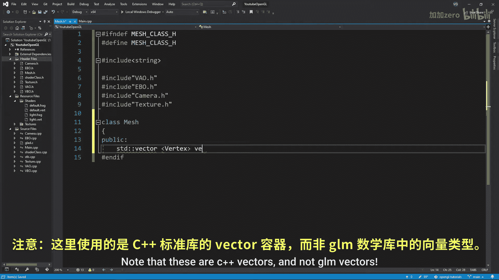
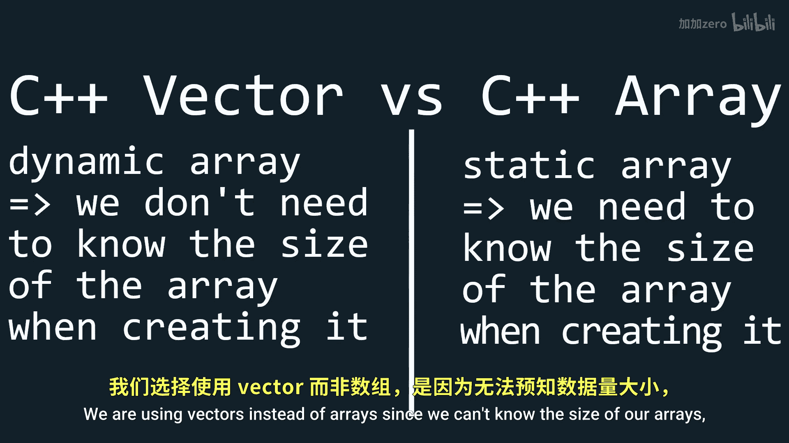
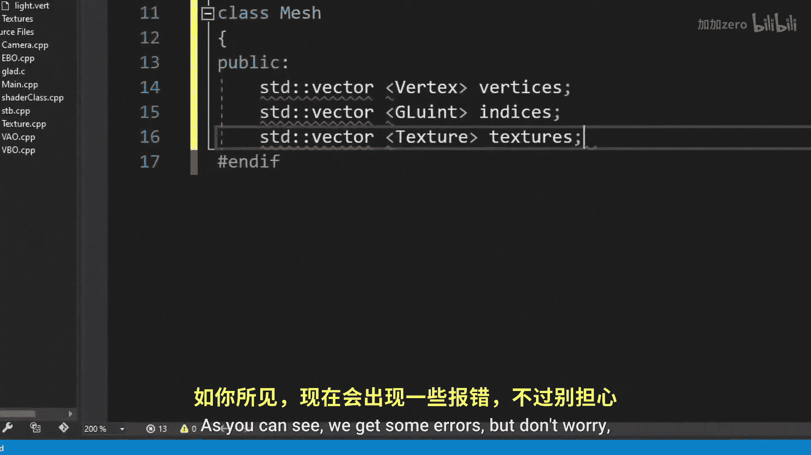
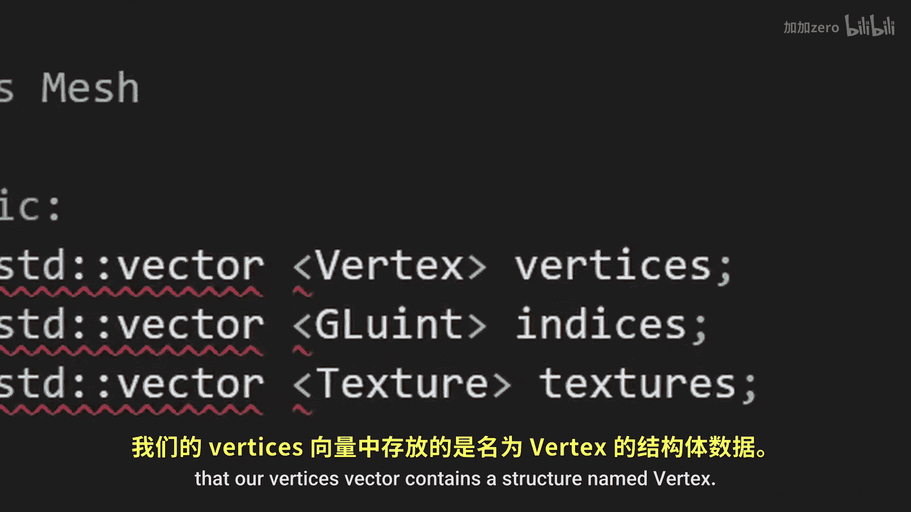
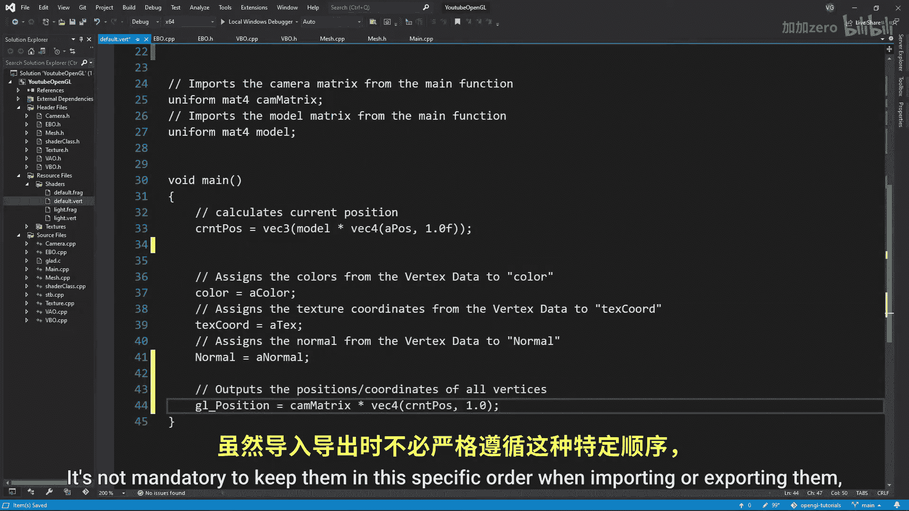

# Victor Gordan【中英⚡OpenGL教程｜OpenGL Tutorial】 p13 P13 Mesh Class -BV1kkvTz8Egh_p13-

In this tutorial， we'll wrap up all the classes we've made till now and a big part of the coding domain function into a mesh class that will also serve as a stepping stone for importing models in a future tutorial。

 First， a rough definition of a mesh。 A mesh is a data set at almost always contains vertices often contains indices and sometimes contains textures as well。

 And they are generally used to create 3D models。 So let's create a header file for the class。 First。

 we want to include a string library。 and then the VO EBO camera and texture classes since we want the three of our classes。

 dependencies to look like this。 Now for the class itself， I'll the three vectors named vertices。

 indices and textures。 note that these are C plus plus vectors and not GM vectors。

 We are using vectors instead of array since we can't know the size of our。

So it's best to keep things flexible in terms of storage as you can see we get some errors。

 but don't worry we'll fix those after we finish writing everything in here。 next。

 we also want to store our VO since we'll be initializing it using this class then for the construct we'll simply input the vertices indicees and textures and lastly we'll make a function draw that will take in a shader and a camera Now for the errors。

 let's go to the VBO class。 If you've been paying attention。

 you probably would have noticed that our vertices vector contains a structure named vertex but we don't have one so far so let's create one right here I'll simply name the structure vertex and give it three vectories for the position normal and color and then a vector2 for the texture coordinates Having our data packed in such a structure is nicer than simply having all the data in one array at least in my opinion Don't forget to also include the。

Library though now we need to patch up the VBO class constructor to accept the vector of vertexstructs instead of an array so let's also include the C++ vector and since we're using vectors instead of array we can now also get rid of the size input since we can calculate that inside the class So in the VBO that cP file we can replace the size by vertices do size times size of vertex and for the data we just write vertices do if you return to the mesh class you should have no more errors Now let's do what we did for the VBO class to the EBO class as well replacing the array with a vector Now for the main part let's create a mesh that c file and writing the functions for this class let's start with the constructor by simply assigning the inputs to the variables of the class then copy paste the initialization of the VO from the main function and modify the variables names slightly and also。

the attributes are stored we want the position first then the normals then the colors and finally the texture coordinates since we've modified these we should go to the vertex shader and rearrange the new order of the vertices sections properly and then do the same thing in the fragment shader as well it's not mandatory to keep them in this specific order when importing or exporting them but it just looks nicer to have them in the same order。

