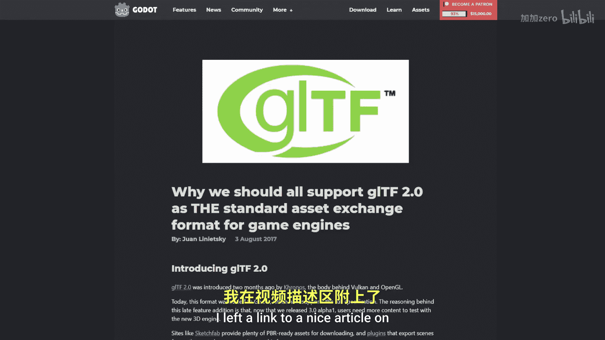

# Victor Gordan【中英⚡OpenGL教程｜OpenGL Tutorial】 p14 P14 Model Loading -BV1kkvTz8Egh_p14-

In this tutorial I'll show you how to import 3D models into your opengelL application by building a very basic importer This tutorial will also be longer than usual and only have visible results at the end so please have patients and pay attention to what I'm doing otherwise you might end up with a chain of errors by the end a small note first As you may know when it comes to storing images the industry is pretty standardized with the use of PGs and GPs but when it comes to 3D models there are dozens upon dozens of file formats。

 many of which are proprietary this diversity of file formats makes it a lot more difficult to export and import models from one program to another in the spirit of standardization I will use the GLT of file format for this tutorial as it is made by the same people who've made openGL the Chronos group and it seems to be a promising file format that will become the standard in the future I left a link to an nice article on this by the developers of the Gooddo engine in the description。

Now for the actual tutorial GLTF makeses of the JSON file structure so the first thing we'll need to do is to install Neil Slooughman's JSN library from Github to be able to parse JSON files that does it for the libraries now we can create a header file for our model class model being a group of meshes then we' make a constructor that will take in the name of a file and a draw function that will take in a shader and a camera in the private section will want to store the name of our file a vector of pointss with all the data of the model and a JSON object which I'll explain more about in a moment Now for the model that CP file let's read the GLTF file in the constructor using the same function we use to read the shaders then we parse the text and store it in the JSON variable so JSON files work like dictionaries within dictionaries dictionaries have keys and values associated to those keys if you give a dictionary a key it will point you to a certain value this JSON object abstract。

The G file into such structures。 So let's just store our file and then equate our data variable to a function get data。

 We want this function to get us a vector of from an external binary data file So let's rate a string name by text to hold a raw text to get a location of the file we can look at a buffer key which will point us to an array where we want to look at the first element。

 which will again be a dictionary so we again want to use a key This time the U key this U gives us the name of a dot bin file which contains the binary data then we just get the text put it in a vector and return it so now that you have your first taste of the file let's take a closer look at it The file has dictionaries which contain a of other dictionaries making it a sort of three but it's not a very nice Since many branches will contain inds that well point us to other branches so things will get entangled pretty。

In order to avoid confusion in such a situation， I like to start from the leaves and work my way down to the root of the tree Keep in mind that I will be taking some shortcuts in the GLTF file since otherwise this importer would become too complicated with that out of the way is a simplified view of one of the main branches of the tree and the one we care most above at the top we have our data that's stored in the buffers but to know which parts of it we should read we need to take a look。

