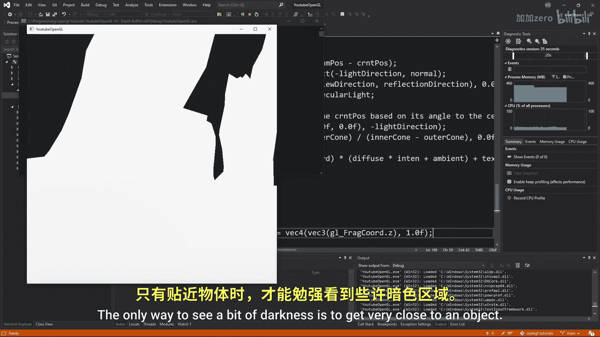
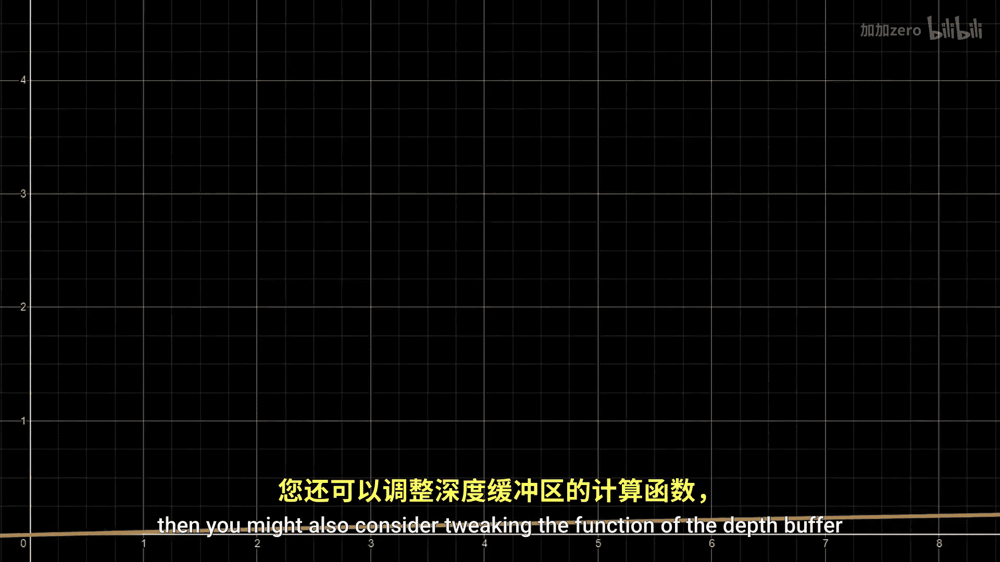

# Victor Gordan【中英⚡OpenGL教程｜OpenGL Tutorial】 p15 P15 Depth Buffer -BV1kkvTz8Egh_p15-

In this tutorial， we'll have a look at the depth buffers in open gel and also see how we can make use of them for a little graphical effect。

 You might remember that we've already made use of the depth buffer in the going 3D tutorial in order to fix a weird issue we had。

 Since the buffer is turned off by default， we want to make sure we have it enabled and that we clear it each frame just like the color buffer。

 Now， what is buffer basically does， is that it source depth values that represent how far away from the near plane of the projection matrix a certain fragment is a depth value of0。

 meaning that it's right on the near plane and of one， meaning that it's on the far plane。

 using this depth information， we can assess which object should be in front of which other object。

 we can do this by using the gel depth function and inserting one of the following inputs by default。

 Open gel chooses gel less， which means that if the depth value of。

An object is less than that of the current depth value then the first value replaces the second in most circumstances。

 you should use GLs， but I suppose you could also choose one of the others if you want your game or application to be mindbending。

 Now the cool part。 let's visualize the depth buffer。

 we can easily do this by going to the fragment shader and outputting G frac coordinates that Z as the frac holder。

 The problem is that as soon as we press run， you'll notice that the screen is mostly pure white。

 The only way to see a bit of darkness is to get very close to an object。

 This is due to the fact that the depth in open G is not linear。 if the depth was linear。

 then we would have the same amount of precision for depth at a close distance as we would at a far away distance。

 Since we almost always focus on things that are close to us we want to make the precision be very high near us and low away。

This is achieved by using this formula Don't worry we don't have to implement it since Opengel does it automatically Sometimes though you won't use another formula so in order to do that we must first get the Z value by linearizing the depth function which can be done using this function Now using this function we get the z value which keep in mind is not normalized this value is simply the distance from the near plane so let's clear the near and far constants of our first stem and divide a linear depth by the far length to quickly normalized it just to see what the results look like。

Now let's just look at a quick problem you can get and then I'll show you the cool effect we can achieve with depth buffers So the main issue that arises from depth buffers is called Z fighting and it occurs because two or more triangles have the same depth buffer and does the depth function can decide which one is closer than the other and thus it keeps changing between them constantly an easy fix to this is usually to make sure you don't have triangles that are too close to one another and parallel if Z fighting appears at a faraway distance。

 then you might also consider tweaking the function of the depth buffer so that you have more precision at that distance and the final trick is to use a bigger integer for the depth buffer usually by default it uses 24 bit。

