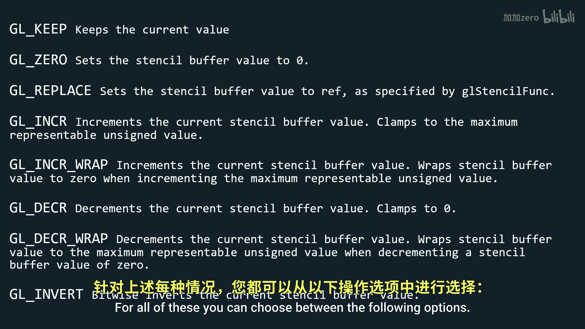

# Victor Gordan【中英⚡OpenGL教程｜OpenGL Tutorial】 p16 P16 Stencil Buffer & Outlining -BV1kkvTz8Egh_p16-

In this tutorial we'll take a look at the stencil buffer and how we can use it to create useful effects such as outlining a model。

 So the stencil buffer， just like the depth buffer holds value for each pixel you can see these values being used for image masking in general Unlike the depth buffer though where each pixel holds between two and4 by of data for the stencil buffer each pixel holds one by of data。

 so values from0 to 255。 but you'll mainly only use the values of0 and1。

 So let's look at how we can work with this new buffer。 First of all。

 we have the function geo stencil mask that allows us to choose which parts of the stencil buffer we want to be able to modify。

 It simply takes a pixel from the mask and the corresponding pixel from the stencil buffer and applies a bitwise and comparison on them。

 Keep in mind each pixel has a by of data， so8 bits。

A bitwise and operation compares each bit with its corresponding counterpart and only outputs one if they are both one。

 there if we input0 x00 into geostencil mask which means that we have8 bits equal to0 then all the comparisons will fail and the stencil buffer won't change at all but if we input 0 xFF into gelstencil mask。

 then all the bits of the mask will be1 since0 xFF is equal to8 once and so we'll be able to modify any part of the stencil buffer Now let's look at two more functions we can make use of geos stencil funk and gel stencil O stencil funk allows us to control how the stencil buffer passes a test or fails a test while geos stencil O allows us to dictate what happens when the stencil test fails when the stencil test passes but the depth test fails and when both pass。

A deeper look at G stencil functionk It takes in three arguments， a function。

 a reference value and a mask。 The function can be one of these by default being set to G always so that test always passes the reference value is simply the value we used to compare in the function notice how before comparing the stencil value with the reference value we apply a bit ways and operation to both using the mask this means that if we want to compare the numerical value of the two accurately you will want your mask to be0 XFF so that nothing changes Now for GL stencil O it has three arguments as fail Dp fail and Dp pass this stands for stencil fail the fail and depth pass for all of these you can choose between the following options by default they all have GL keep which basically means that nothing changes There is not really much more to say about these functions so if you want to know more about them look them up。

In the documentation the stencil buffer can be used for many things such as portals。

 mirrors and more， but an easy feature to implement is outlining of models。

 so let's take a look at that we first want to render our object like we normally do and update a stencil buffer with once everywhere we have a fragment from our object in0 everywhere we do not have a fragment from our object this will essentially create a figure like this then we want to disable writing to the。

