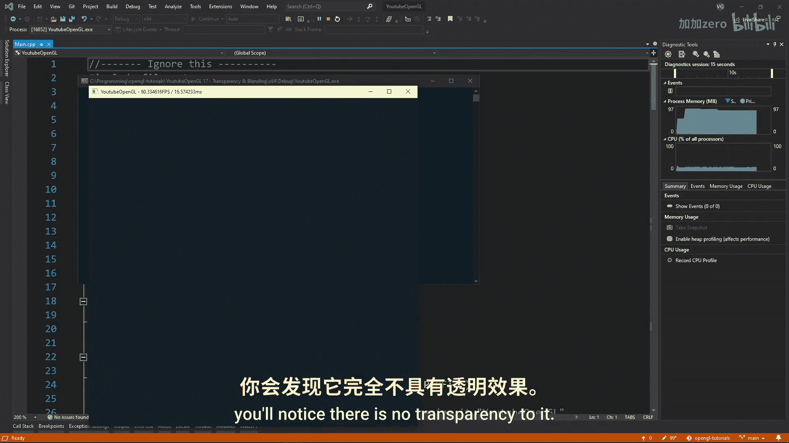
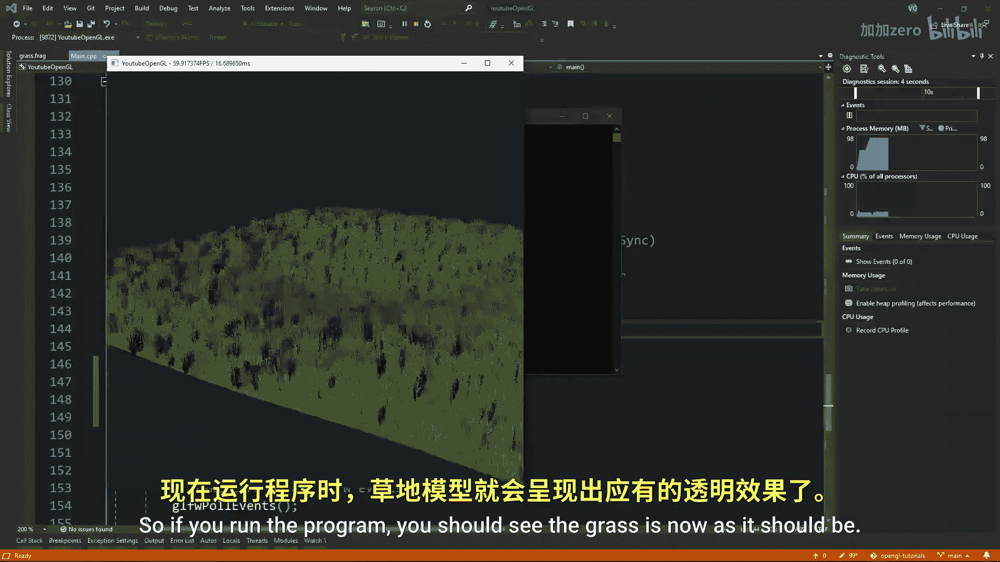
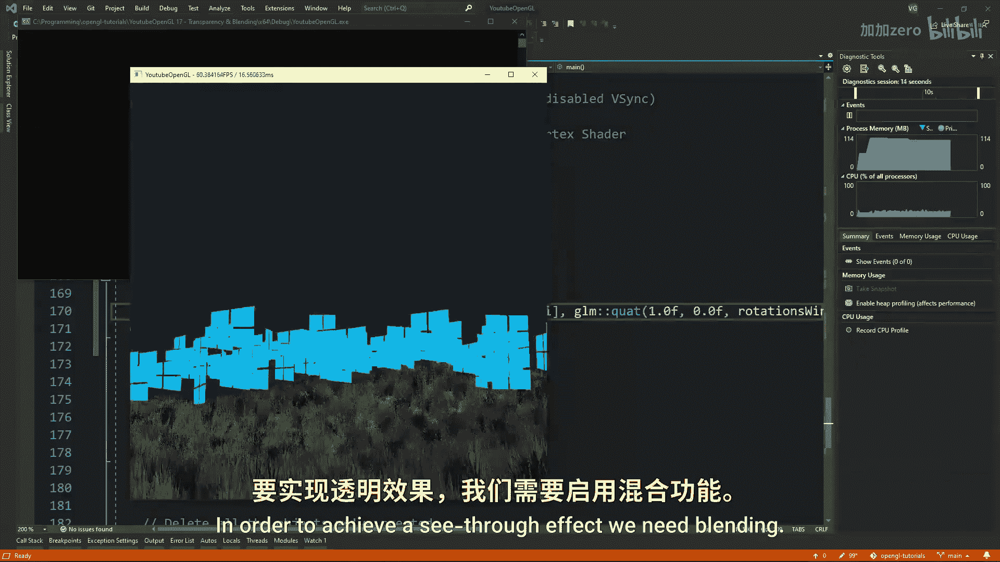
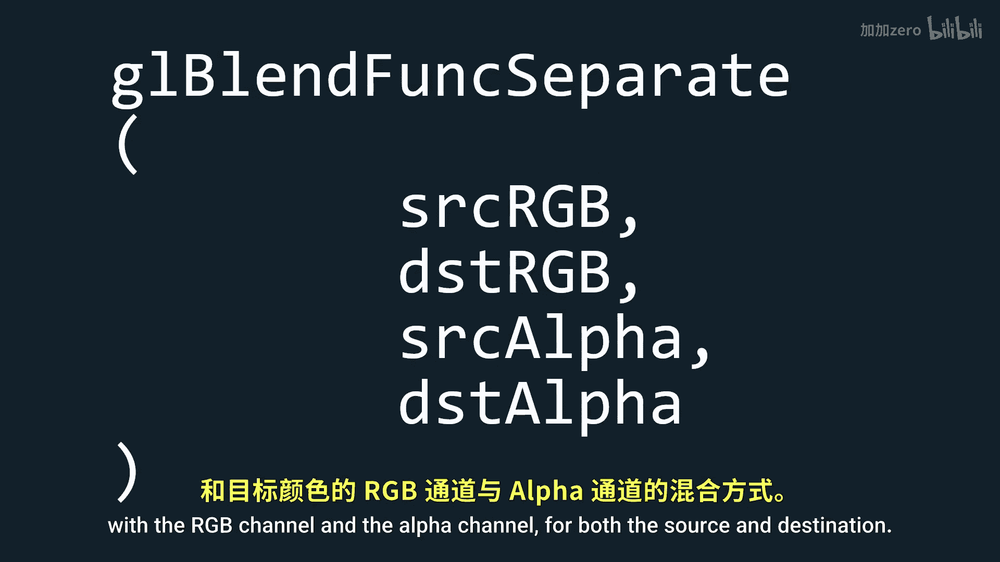
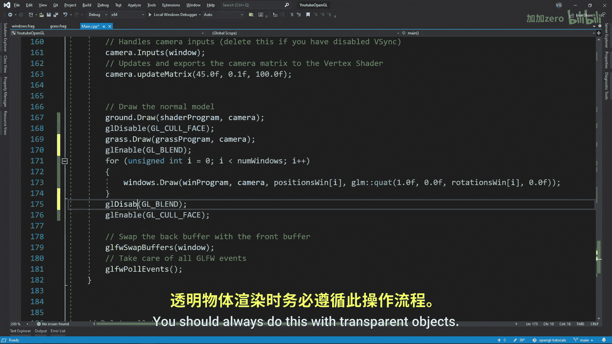

# Victor Gordan【中英⚡OpenGL教程｜OpenGL Tutorial】 p18 P18 Transparency & Blending -BV1kkvTz8Egh_p18-

In this tutorial also show you how to quickly get transparency turned on and also how to make use of the blending feature in openGL。

 So as you might have noticed， all the pictures we've been using so far had for components red green blue and alpha RGB the first three of these give color to our scene while the last one controls the level of transparency different objects have Now if you look at this grass model I have imported。

 you'll notice that there is no transparency to it to enable that we simply have to create a new fragment shader which will be identical to our normal fragment shader but we'll check if the alpha value is smaller than a certain threshold and if it is we'll discard that fragment don't forget to also make a new shader program for this new fragment shader So if you run the program you should see the grass is known as it should be Now I'll just add a bunch of randomly placed transparent windows Since the code here is not relevant。

to open GL I won't be explaining it。 The shader I use for this is a very basic shader that just displays the textures without any lighting。

 So now as you can see， there are a bunch of windows but even though in my texture they are C through here they are not in order to achieve a C through effect we need blending Now for a bit of theory This is the formula open GL uses for blending different colors together all the C terms stand for color while the t terms stand for transparency which in case you did a no or forgot and alpha value of0 is fully transparent and an alpha value of one is fully opaque and then the source color is the color in the fragment shader while the destination color is the color in the color buffer these transparencyencies can have different formulas the most common one is that in which the source it is transparency value from。

The alpha part of the source color while the destination's transparency is one minus the alpha value of the source So now let's tell openGL we want to use this configuration using GL blend function specifying the source and destination functions Here is a list of some functions you might want to use for one reason or another then if you want to you can also use GL blend equation with one of these arguments in order to specify how you want the previous colors to interact basically changing the default equation and lastly you can use the GL blend function separate function to choose how to interact with the RGB channel and the alpha channel for both the source and destination keep in mind that you can't specify a function for each RGB value only for all of them together at this point we just have to enable blending using GL enable GL blend right before our windows and then disable it right after we are done right。

them so that we don't accidentally affect anything else。

 You should always do this with transparent objects After that。

 just compile and you should see that the windows are transparent but there is one problem The blending is all messed up It just doesn't look right And for that we have our friend the fifth buffer to blame since the windows are drawn in random or windows that are drawn behind already existing onces。

