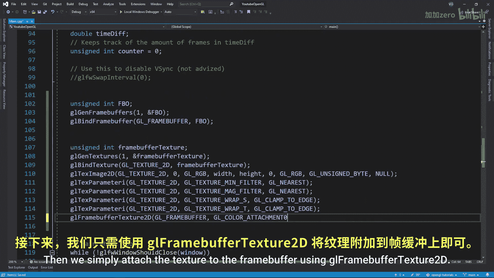
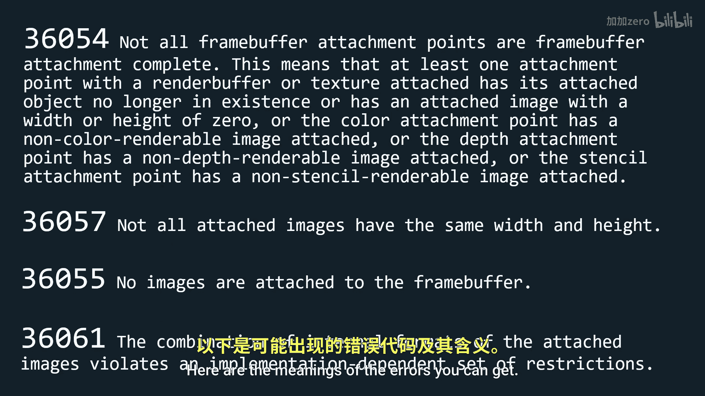
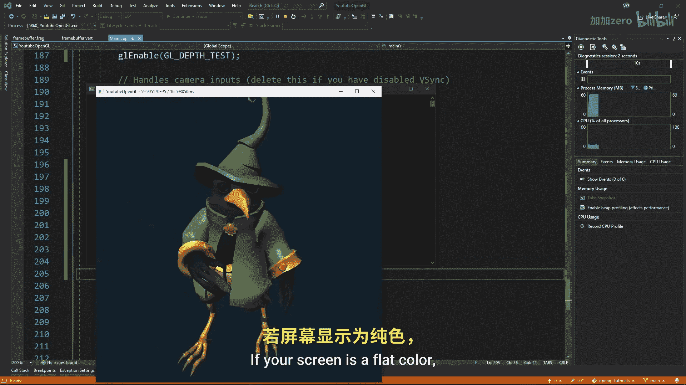

# Victor Gordan【中英⚡OpenGL教程｜OpenGL Tutorial】 p19 P19 Framebuffer & Post-processing -BV1kkvTz8Egh_p19-

In this tutorial， I'll show you how to implement a custom frame buffer into your open gel application and how you can use the frame buffer to achieve post processing effects。

 So， first of all， what is a frame buffer。 Well， you can think of a frame buffer as a collection of multiple buffers that result in the final image you see on your screen。

 So it contains a color buffer， a depth buffer and a stencil buffer。 Now。

 why would you want to use one。 Well， if we create our own frame buffer。

 then we can display on a rectangle that covers the whole screen and then using shaders modify the pixels displayed on the rectangle to achieve different effects。

 This is called postproces because you process the pixels after all the rendering has already been done。

 Okay， now let's implement a frame buffer。 just like any open gel object。

 we create an unsigned integer， we generate the frame buffer using gel gen frame buffers and we bind it。

 That was it for the frame buffer。 Now we need to add a color。

for it to be of any use。 So we'll create a texture， just like in the texture tutorial。

 making sure we clamp the texture to the edges， Since otherwise certain effects will ble from one side of the screen to the other due to the default repetition of the texture。

 Then we simply attach the texture to the frame buffer using gel frame buffer texture2 Keep in mind we store our color in a texture。

 therefore we can access it from a shader which we want to do。 but in the case of the depth buffer。

 we don't really care about reading it in a shader for this tutorial So instead of using a texture。

 we can use a render buffer object which is much faster but has the disadvantage that you can't read it directly in a shader。

 we create it using gel render buffers and then we configure its storage using gel render buffer storage plugging in gel render buffer gel24 stencil 8 and with n height。

 we use gel D 24 stencil8。

So that we can store in it， both the stencil buffer and the buffer。

 Also be very careful that all the frame buffers components have the same width and height。

 Otherwise you might get an error。 Then we just attach it to the frame buffer using gel frame buffer render buffer and for a bit of error checking just write this。

 sadly， the errors are not very specific。 They just give you a number。

 Here are the meanings of the errors you can get。 Now that we have our frame buffer object we can make our rectangle which will always cover the whole screen and so we don't want to apply any sort of transformations to it。

 Now let's read two very basic shaders from the frame buffer。

 make them into a shader program and then send the unit of our texture0 since it's the only texture in this shader。

 Now let's handle the drawing part。 First， we make sure to bind the frame buffer before we draw anything including the background make sure your buffers are cleared and that you。

testing enabled after thatThen after we are done drawing everything in the scene。

 we want to switch back to our default frame buffer by binding0 and draw a rectangle which displays the frame buffer we've just unbinded Just make sure to disable the testing so that the rectangle doesn't fill the test Now if you run the program you should be seeing whatever you were seeing before without any difference If your screen is a flat color then first check that you don't have any errors in your cD like window。

