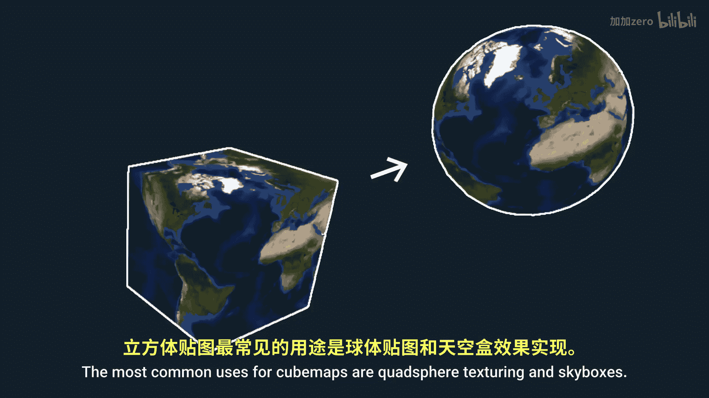
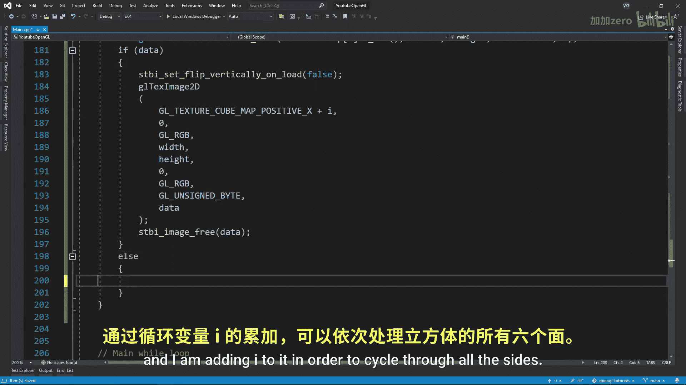
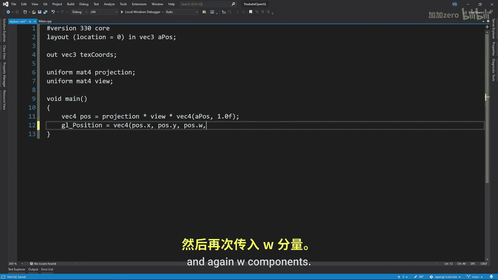
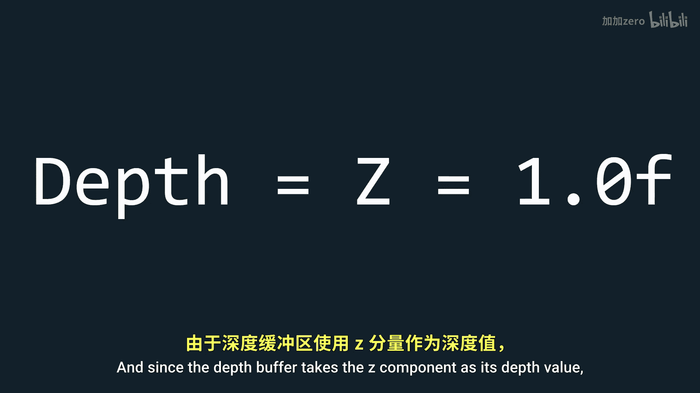

# Victor Gordan【中英⚡OpenGL教程｜OpenGL Tutorial】 p20 P20 Cubemaps & Skyboxes -BV1kkvTz8Egh_p20-

In this tutorial， I'll show you what cube mapps are in open gel and how you can use them to create sky boxeses。

 So what are cubebemaps。 Well， there are simply another type of texture which holds six2D textures one for each side of a cube when sampling a cube map is specify a 3D vector instead of a 2D1 this allows you to easily sample between all six sides of the cube and since the coordinates of the cube correspond to the sampling vectors。

 there is no need for Uvs。 the most common uses for cube mapps are whatpher texturing and skyboxes So now let's code it in the first thing you need to do is to write out the cube vertices and indices。

 then we'll want to create a VO VBO and EBO， just like in the first tutorials Now let's create an array with six strings that will hold the past to the six images we' be using for the skybox then we want to create a cubeubmap texture itself just like any other texture except that where we put gel。

2D before we now put gelL texture cube map make sure to clamp the texture in all three directions since the texture is a cube therefore 3D this clamping should prevent any seams from showing up and now we'll go over all six textures and read them using the SDB library putting them in the cube texture once we read them notice how I disable the vertical flipping This is because unlike most textures in open GL cube mapps are expected to start in the top left corner。

 not the bottom left corner。 Also notice how I add I to gelL texture cube mapap positive X this represents the side of the cube I am currently assigning a texture and I am adding I to it in order to cycle through all the sides Here is the order of the sides which you can find in the open gelL dos and here is the order we wrote the pos in notice something weird well normally in open GL the front。

I in the negative Z direction， but for cube maps， the front is in the positive Z direction。

 That means that cube maps work in a lefthanded system while most of open GL works in a right- handeded system this can be very confusing and I honestly have no idea way they chose to do this but oh well keep in mind you will likely get small bugs because of this if you're not careful In my case。

 my right texture kept being displayed upside down for some reason to fix that I just flick the texture in an image editor So be prepared for these sort of stuff since from what I've heard it can happen pretty often with skybox Okay back to the tutorial well now need to create two shaders for the skybox the vertex shader will take in the coordinates output texture coordinates and also take in uniforms for matrix transformations in the main function create a V。

which holds the final transformed coordinates Now since these coordinates are now in screen space we'll do something a bit weird instead of fitting gel position the coordinates as they are we'll give you the X YW and again W component this will result in the Z component always being one after the perspective division and since the depth buffer takes the Z component acid depth value the Skybox will always have a depth value of one so。

