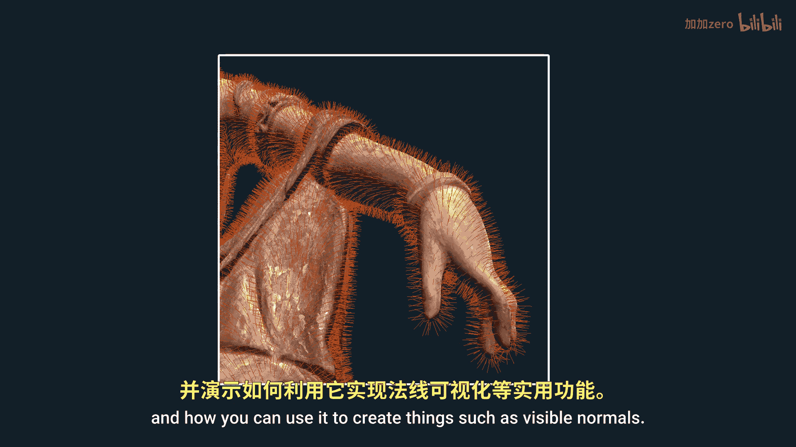
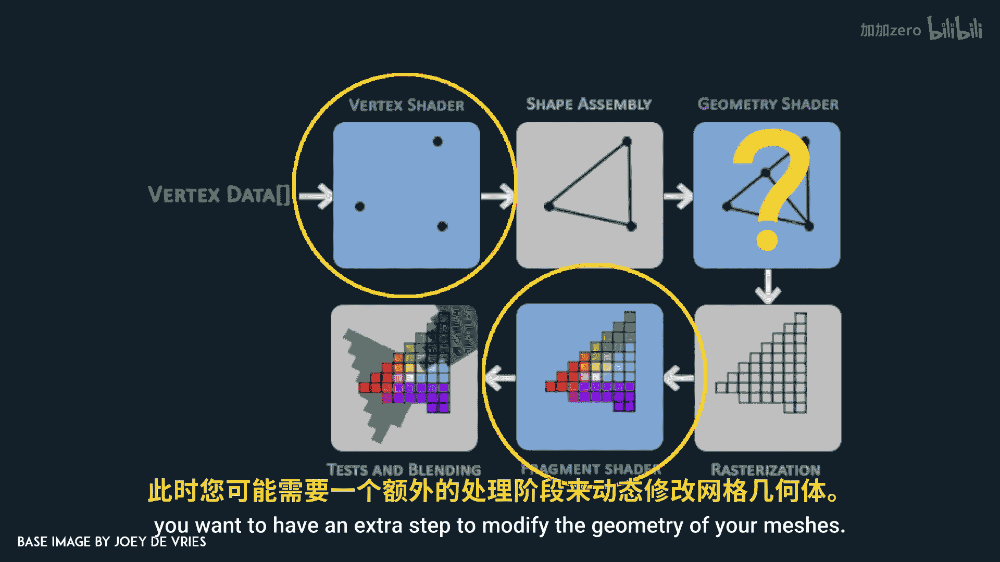
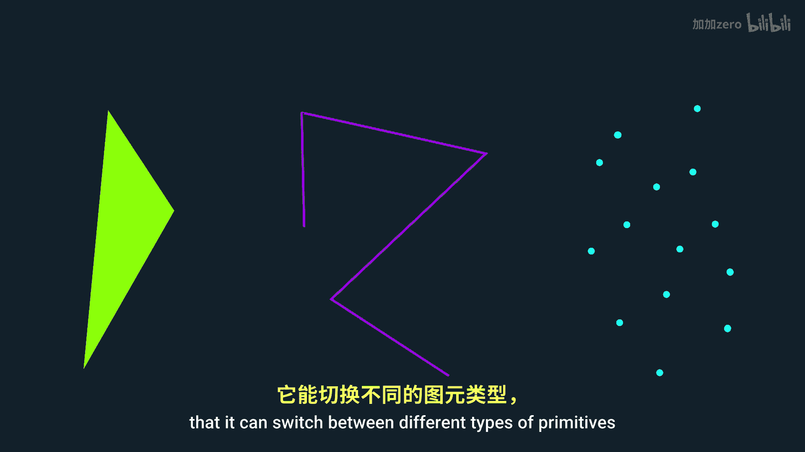
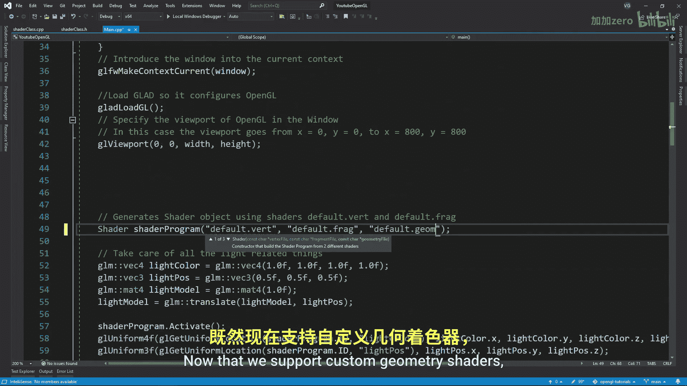
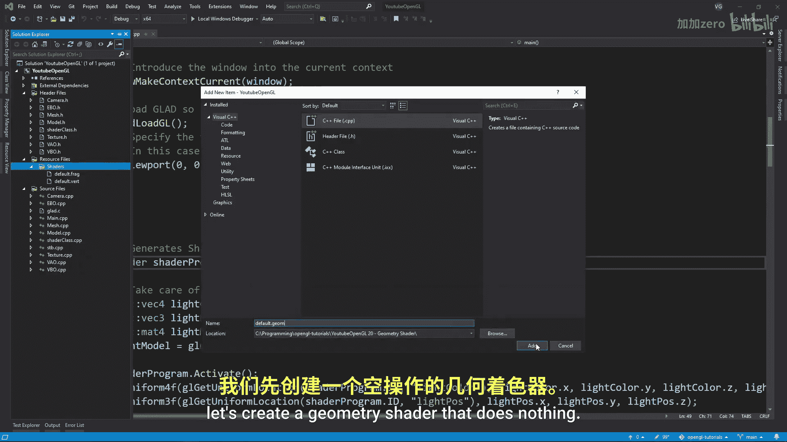
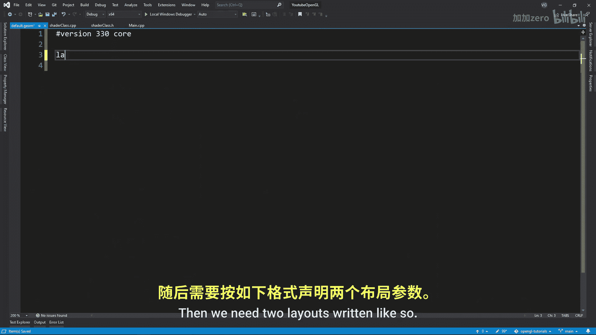
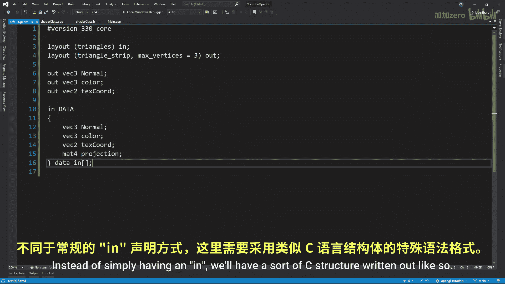
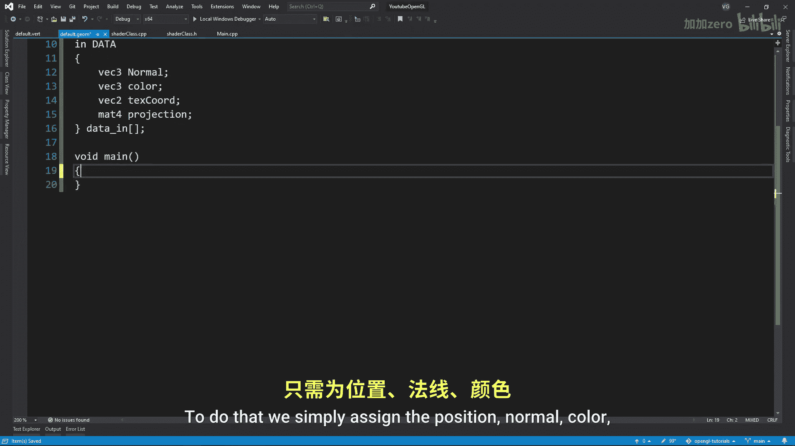
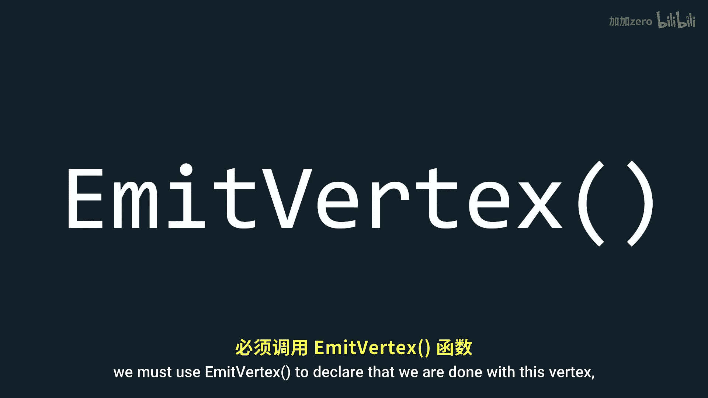
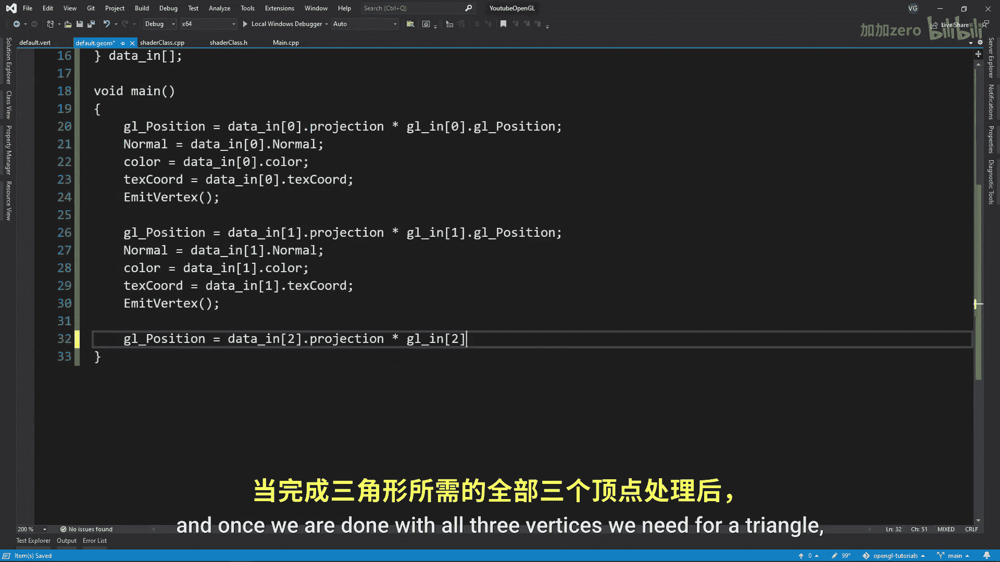

# Victor Gordan【中英⚡OpenGL教程｜OpenGL Tutorial】 p21 P21 Geometry Shader -BV1kkvTz8Egh_p21-

In this tutorial， I'll show you what the geometry shader is and how you can use it to create things such as visible normals。

 so far we've only used the vertex shader and the fragment shader。

 which suffice in most situations but sometimes between the vertex and fragment shaders you want to have an extra step to modify the geometry of your meshes。

 even though it might seem like you can do that in the vertex shader。

 you can only do things to individual vertices。 if you wanted to modify a whole triangle So a group of vertices。

 then you would need to use the geometry shader。 The second advantage of the geometry shader is that it can switch between different types of primitives and so can create or delete vertices。

 So let's begin by adding the geometry shader to our shader class。

 Notice why I'm doing the exact same thing as for the other two shaders except that I use geoge shader。

n that we support custom geometry shaders， let's create a geometry shader that does nothing just like in any other shader we'll begin with a version。

 then we need two layouts written like so the first layout signifies what type of primitive we receive。

 which can be one of the following。

While the second layout shows what type of primitive we are outputting which can be one of the following in this case we want to receive a triangle and export a triangle then we have our outputs to the fragment shader keep in mind you should pass data from the vertex shader to the geometry shader and then to the fragment shader Now for importing data into the geometry shader we need to do something a bit different instead of simply having an in we'll have a sort of C structure written out like so notice that we don't have to include the position in this because it is already built into a default structure just like this one called GL in Now we need to go back to the vertex shader and replace all the outgoing data with the exact same structure except for the last part and out instead of in make sure that everything else from the structure is identical to its counterpart in the geometry shader notice how。

Also we included the projection matrix That is because we only want to apply the projection matrix after we modify our geometry Now to assign data to these outgoing values。

 we simply write the name we give them plus a dot and the name of the variable we want to assign data to very similar to a C or C++ structure Now in the geometry shader we have all the data we need so all that's left to do is to assemble these data together to do that we simply assign the position normal color and texture coordinates their data notice how here I also have an index besides the name of the part of the structure I want to access that's because we are in the geometry shader and thus we essentially have an array of such structures each with different values for a specific vertex once we're done assigning the values of a vertex we must use a vertex to declare that we're done with this vertex vertex vertex vertex vertex。

We can do the same thing with the other two vertices and once we're done with all three vertices we need for a triangle。

 we declare that our primitive is complete using and primitive。

