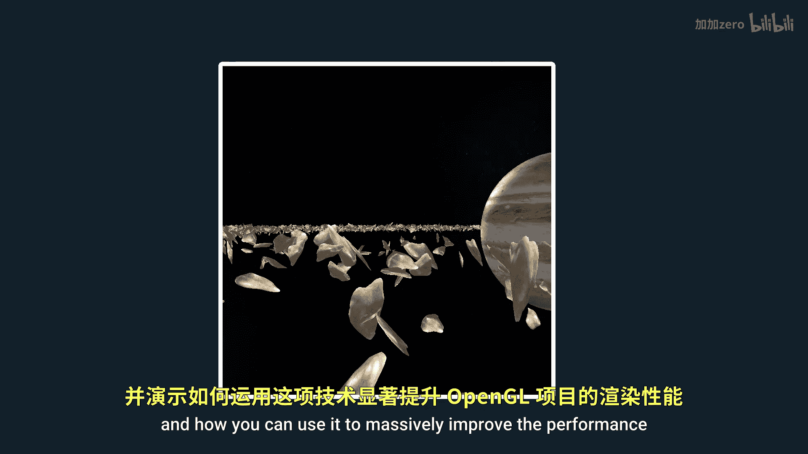
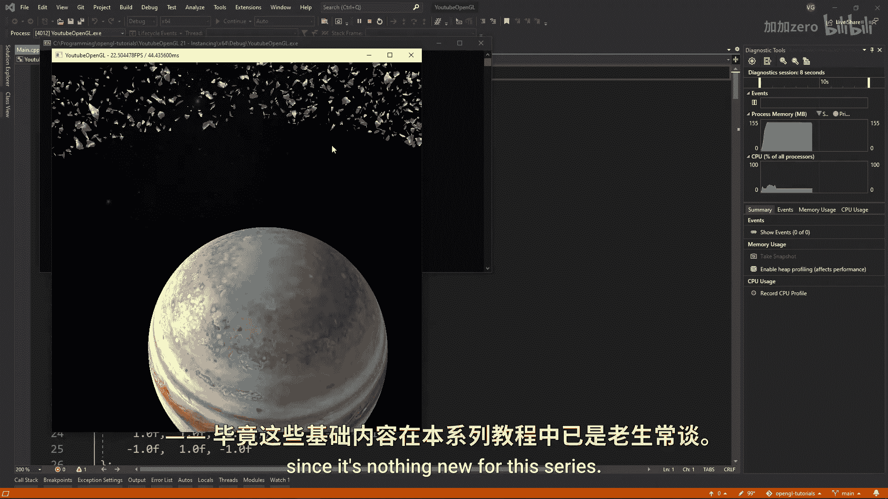
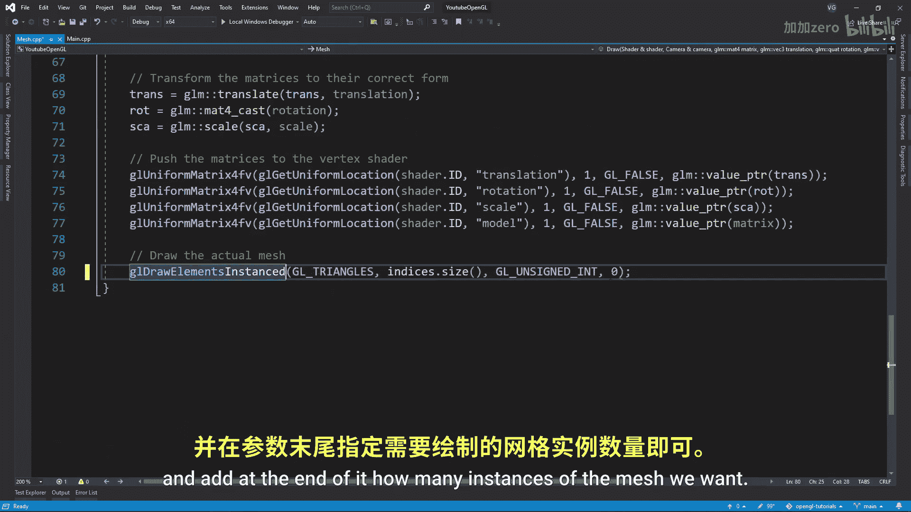
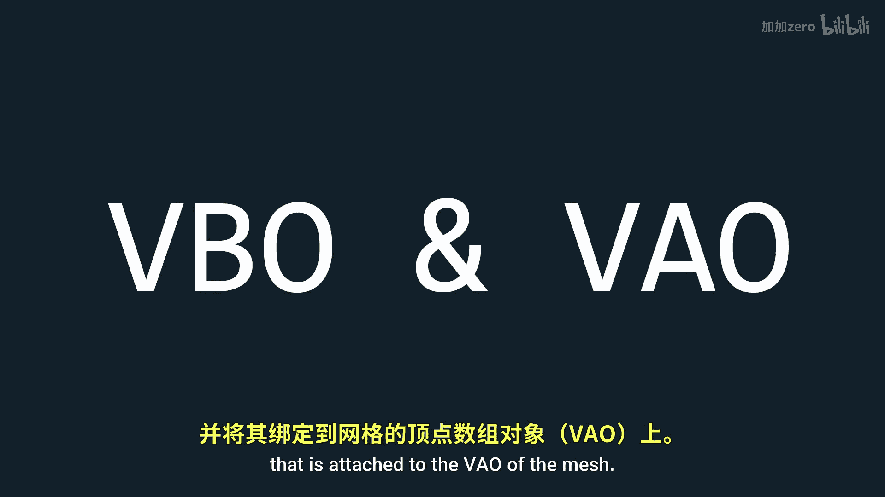
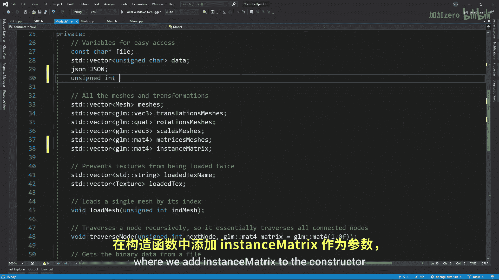

# Victor Gordan【中英⚡OpenGL教程｜OpenGL Tutorial】 p22 P22 Instancing -BV1kkvTz8Egh_p22-

In this tutorial， I'll show you what intancing is and how you can use it to massively improve the performance and looks of your open gel project。

 So intancing is simply a feature that allows you to draw a mesh multiple times in a single dropal。

 Now why would you want this。 Well consider these scenarios where I have a built of asteroids all made out of a single asteroid mesh that is deformed in the vertex shader to give some variety in the scenario on the left。

 I simply have a loop that draws each asteroid individually So that means that each asteroid has a dropcol。

 Now in the scenario on the right， I draw all the asteroids together So that means that I only have a single dropal。

 If you look at a performance difference， you'll see it is massive。 Now let's go it in。

 I'll start with a code already written for the first scenario since it's nothing new for this series。

 So in order to enable intancing all we have to do？

I to use gel draw elements instant instead of geor elements and add at the end of it how many instances of the mesh we want the only problem is that this will draw all the meshes in the exact same positions so it is useless There are multiple ways you could move each mesh to a unique position though you could have code that does that in the vertex shader for example。

 using gel instance ID you'll get the index of the instance you are currently drawing and so you can use that for a controlled random number generation alternatively you could have a uniform with all the transformations and retrieve the correct transformation for a specific instance using gel instance ID but the problem with this is that uniforms can't store that much data so the best way to have a lot of transformations and not have the generation inside a vertex shader is to store the transformations inside the vertex buffer that is attached to the VO of the。

MeSo let's start by creating a VBO constructor which takes a vector of math4 Then we want to add an unsigned integer public variable to the mesh class that will signify the amount of instances we desire and of course we also need to add it to the constructor to easily change it Also in the constructor we should added the vector of matrix transformations for the instances so that we can plug it into the vertex buffer Now in the mesh that CPP file we want to create a VBO for the instances and then link its attributes to the VAO only if we are drawing more than one mesh make sure to link the matrix as four different V4 since otherwise your program won't work and at the end use gel vertex attribute div plugging in the layout number of each V4 and one This one means that the V4 will be used for a whole instance if it were zero then the V4 would be used for。

Vertex and then the next V4 will be used for the next vertex which we for sure do not want and just to make it clear if it were two it would be used for two instances before switching to the next Vig4 Now let's also limit the use of J elements instance only for multiple instances for the model class we need to do the exact same thing as for the mesh class where we add instance matrix to the constructor and as a variable and instancetancing as a variable。

