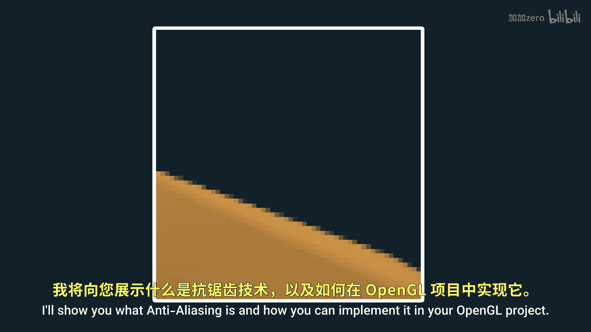
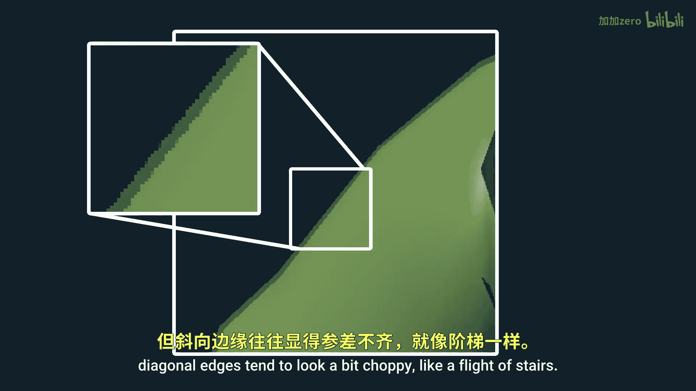
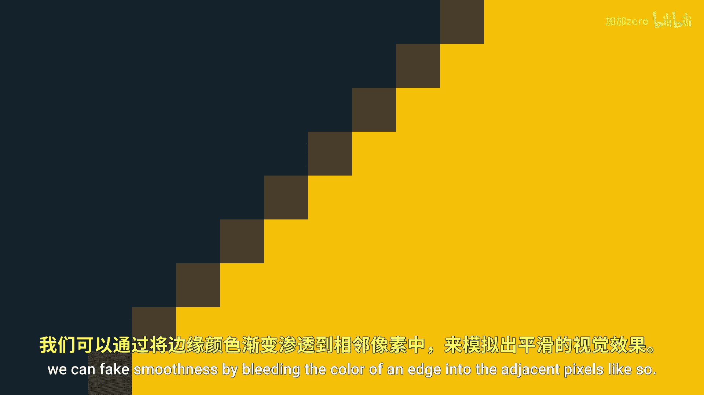
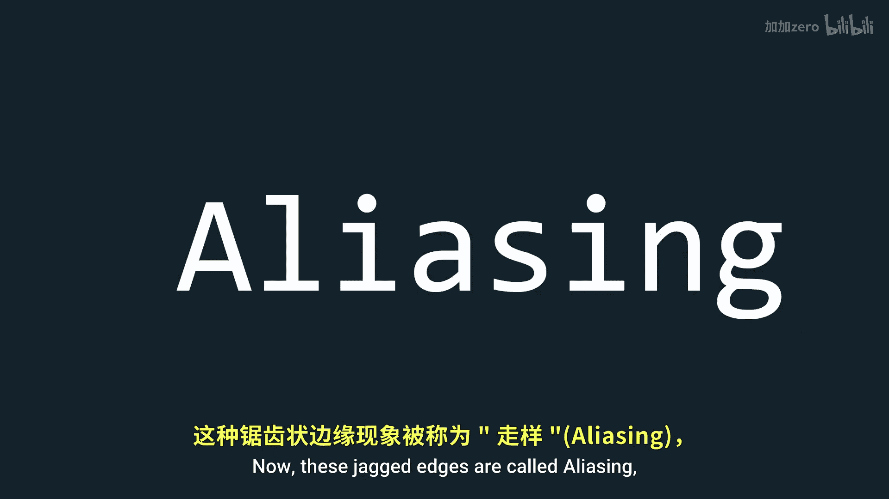
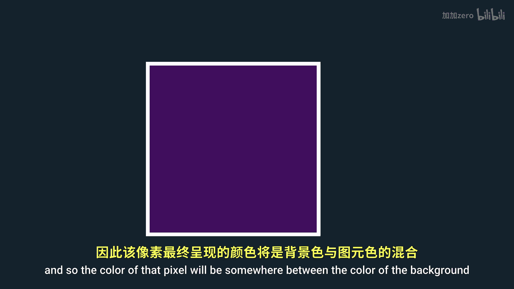
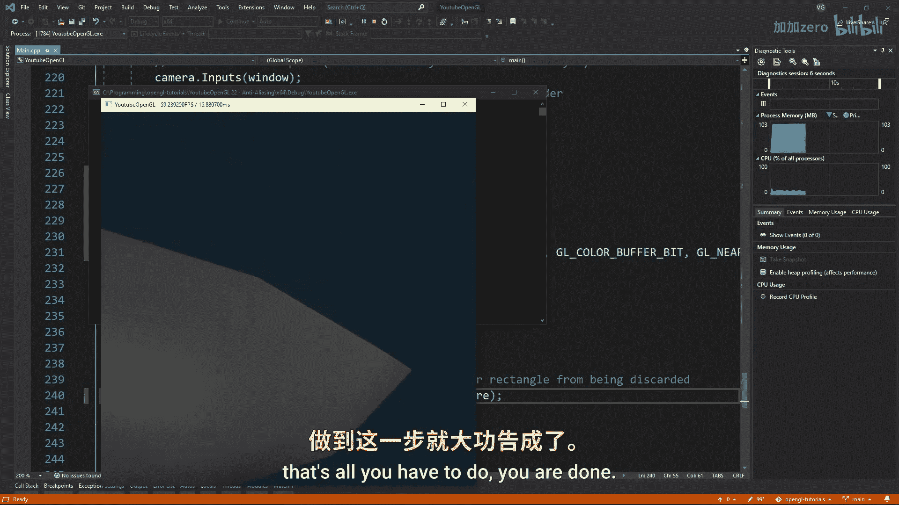
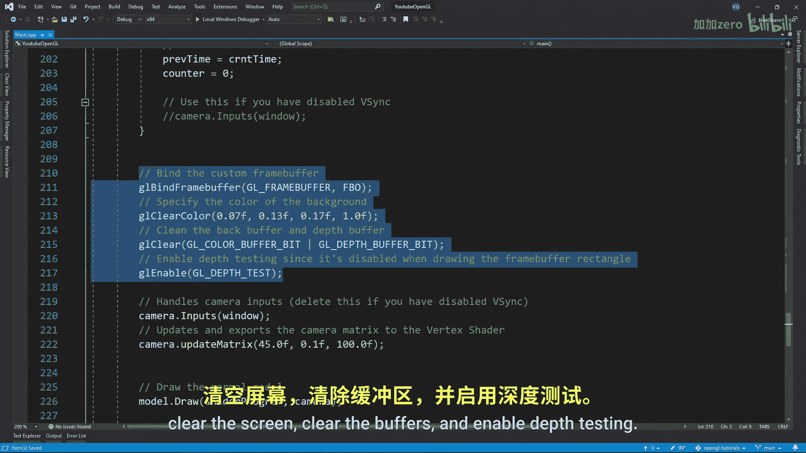

# Victor Gordan【中英⚡OpenGL教程｜OpenGL Tutorial】 p23 P23 Anti-Aliasing (MSAA) -BV1kkvTz8Egh_p23-

In this tutorial， I'll show you what antialliasing is and how you can implement it in your opengel project。

 So you might have noticed that while horizontal and vertical edges look extremely crisp。

 Diagonal edges tend to look a bit choppy like a flight of stairs。

 This is due to how we display images on our screens。

 since our displays are made out of a bunch of tiny squares aka pixels。

 it is impossible to have a smooth line on the diagonal。

 but thankfully we can fake smoothness by bleeding the color of an edge into the adjacent pixels like so Now these jagged edges are called aliasing and an antialliasing technique is what helps us get better edges。

 there are multiple techniques for antialliasing each with their advantages and disadvantages。

 but today I'll focus on MSa which stands for multi samplingling antialliasing。 So what is。

This multisling refer to Well in the raization part of the pipeline primitives are filled in the way it is decided which pixels should be given a color and which should not is by checking if the sample point of a pixel which is normally in the center of it is inside the shape of the primitive This means that if the sample point is even just slightly outside the triangle it won't be sample even though you would think it should at least do so partially Well that is where MSAA comes in As you might have guessed。

 this technique simply adds multiple sampling points so that a more accurate result can be reached here for example two of the four sampling points are inside the triangle and so the color of that pixel will be somewhere between the color of the background and the color of the primitive Now let's actually implement this let's start off by creating a variable where we specify how many samples we design。

Now if you don't have a frame buffer， then you can just give a window hint to gelLFW saying you want GLFW samples and then the number of samples you want and then activate gelL multisle that was it for this tutorial as I'm joking but for real though if you don't have a frame buffer then that's all you have to do you are done if you do have a frame buffer。

 then you'll want to delete the GLFW part instead you need to go to your frame buffer and replace all gelL texture 2D with gel texture to the multisle then replace gelL text image2D with gelL text image2 the multisles plug in the type of texture the number of samples the color format the width the height and whether or not you want all samples being the exact sameposition in the pixels then for the render buffer object we need to change from gel render buffer storage to gel render buffer storage multisample and at the number of。

the problem is that we can't do any sort of post processing on this frame buffer anymore since it has multisling enabled so to get around that we'll need a normal frame buffer which we can post process This is just like the one I made in a frame buffer tutorial Now in the main function we want to make sure we first bind the multisling FBO clear the screen clear the buffers and enable depth testing then we draw everything we want to draw after that。

