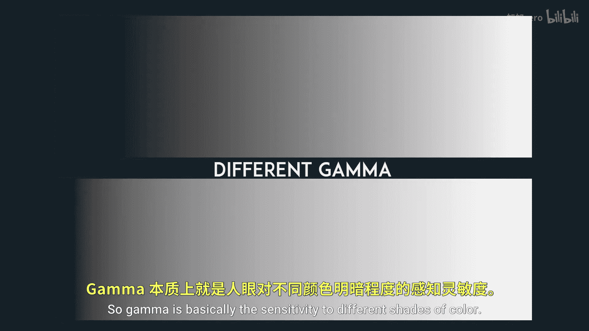
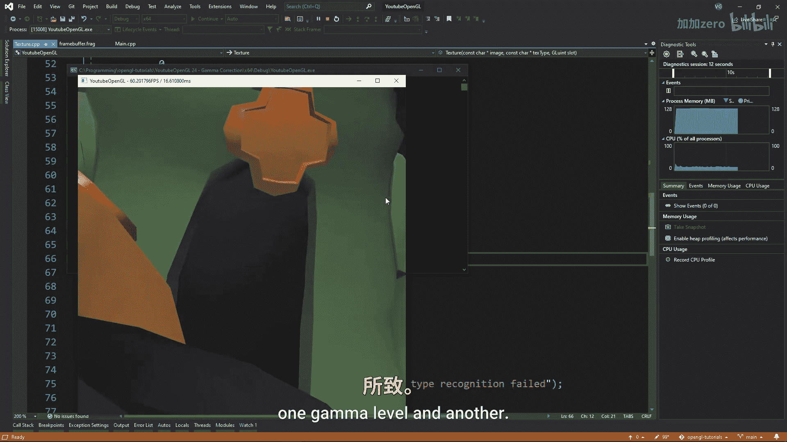

# Victor Gordan【中英⚡OpenGL教程｜OpenGL Tutorial】 p25 P25 Gamma Correction -BV1kkvTz8Egh_p25-

In this tutorial I'll explain what gamma correction is and how to implement it in your opengel project。

 So gamma is basically the sensitivity to different shades of color。

 What do I mean by that Well look at this graph where the x axis represents the input color represents in our code while the y axis represents the final color that is displayed on our screens if the graph is a line then the input will equal the output and this is good because we know that whatever color we write in code is the color that will actually see on our monitors but that is not how it works in reality at least not for monitors because of historical reasons monitors automatically have a gamma curve that looks like this so that means that if we input a color of 0。

5 which would be the perfect gray right between black and white then we would actually get a color of 0。

218 on our screens which would be a much darker gray but we don't。

we want to represent the light in a linear fashion since light in reality is linear so to do that we need to convert all of our colors to the inverse of the gamma function so that way when the gamma function is applied we get a linear function because they cancel each other out this inverse is called the gamma correction function so I hope that made sense if it did not look up some better explanations I am sure there are plenty of those on the internet Now for the actual coding a really easy way to enable gamma correction is by writing gelL enable G frame buffer is RGB The problem with this is that it gives us no control over the power of the gamma General speaking a gamma power of 2。

2 the default value where best for most monitors but we might want to be able to control it to do that we can simply apply the gamma correction function to the fragment shader of our postpro frame buffer if you run the program you'll see everything is much brighter and。

the meshes in background color are way too bright and washed out Why is this Wasn't it supposed to make the colors look better and more realistic is life just a washtop mess No when you were choosing your background color so you were most likely doing it That's right you are doing it by looking at your monitor Basically it already has gamma correction applied to it just because of how we chose it by looking at a monitor which is bad because we are now applying the correction a second time to it the same goes for the textures of the meshes which were created by fellow humans so to fix this for the background color we can simply raise each part of our color to our gamma value As for the textures when loading them in if they are GLGB we can load them in as G SGB alpha and if they are GLGB we can load them in as GSRGB this way opengelL will automatically apply the default gamma value to all textures if you want to apply a custom gamma value。

Ts you will have to do so in every fragment shader with a texture Good luck Now if you run the application you'll see that the colors look a lot better and more realistic but you might still have a problem if you look closely in certain parts of the image you might notice some stepped gradients This is due to precision errors that we get when we keep transforming the colors between one gamma level and another because remember that floats are not infinitely precise thankful this is an easy。

