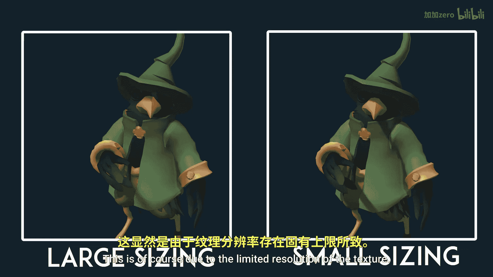
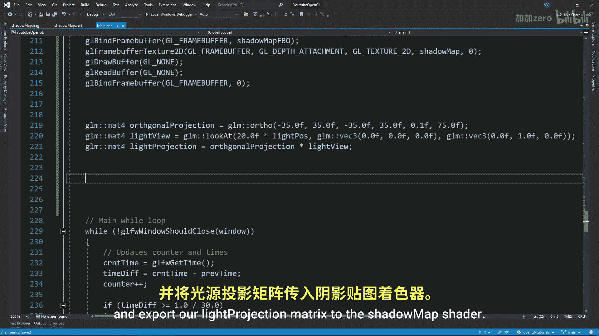

# Victor Gordan【中英⚡OpenGL教程｜OpenGL Tutorial】 p26 P26 Shadow Maps (Directional Lights) -BV1kkvTz8Egh_p26-

In this tutorial， I'll show you a shadow maps or in how you can use them to add shadows to your scenes with directional lights。

 So as you may know， shadows are simply the absence of light。

 And since the light we have implemented so far does not bones from one surface to another。

 It will only reach the surfaces that are in its direct path。

 That means that if we look from the perspective of the light the image well see we contain all the surfaces that are in light。

 So when we go over our usual fragment shader， we can shift our perspective to the perspective of the light to check if the fragment we're currently on is in light or not how do we do that Well using the perspective of the light。

 we can create the depth map called the shadow map which holds all surfaces that are in light when switching to the lights perspective we can check the depth of the current fragment we on against the depth present on the shadow map at those coordinates if the depth of the shadow map is smaller than the depth of the fragment。

 then that means that the fragment is behind the surface。

in light and so we'll get no light Thus we consider it to be in shadow if it's not smaller。

 then we consider the fragment to be in light and that's it for the theory read Now let's implement this the first thing we want to do is to create a frame buffer for the shadow map and a texture to store it in make sure the texture holds depth and not color and also make sure to clamp the texture to the borders with the white color Since the shadow map can only look at one area anything outside that area will have a depth value of0 and as's always past the shadow test we instead want everything outside the shadow map to have a value of one so that no mesh can be in shadow since we won't be using the color buffer of the frame buffer we want to specify this using gel drop buffer gelL and gelL read buffer gelL none that we have the frame buffer we next want to specify the matrices we'll use for the perspective of the light Since the ray of directional lights are parallel to one another we want to use an orthotagonal projection as opposed to a perspective projection which。

Wps these parallel lines。 Now the sizes of this projection will depend from scene to scene。

 but as a general rule of thumb， you want to start with a large size and narrow down to fit the sin。

 If the size is too big， you will still get shadows but of a lower quality the better fit it is to your scene the better the shadows will look this is of course due to the limited resolution of the texture now well want to look at matrix so to say from the position of the light the thing about directional lights though is that they are infinitely far away so we'll just have to settle for a position along the rate that goes through the origin or any other point that will keep the race parallel to the center of the view in this case I am defining my directional light using my light pose vector so I will use that for the position but I multiply it so that it is far enough to encapsulate the things I want to have shadows again keep in mind that the closer it is to your scene the better and the last step to get the transformation matrix for the light is。

the orthoal projection matrix with a light view matrix Now we'll want to create two new shaders for the rendering of the shadow map in the vertex shader we'll simply multiply the light transformation matrix by the model matrix and the vertex position As for the fragment shade we' simply leave it blank since we don't care about the color buffer and the diff gets registered automatically After that we want to create our shader program and export our light projection matrix to the shadow map shade Now we want to get that di。

