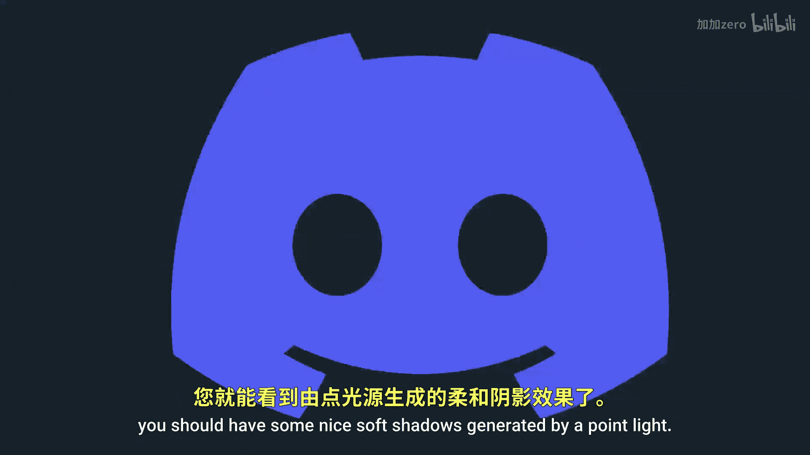

# Victor Gordan【中英⚡OpenGL教程｜OpenGL Tutorial】 p27 P27 Shadow Maps (Spotlights & Point Lights) -BV1kkvTz8Egh_p27-

In this tutorial， I'll show you how to implement shadow maps for spotlights and pointlights in openG。

 If you don't already know how to implement shadow maps for directional lights。

 then I highly recommend watching my previous tutorial since otherwise this one to make much sense So let's first implement the shadows for spotlights since there are a lot easier than pointlights All we really have to do is to replace the orographic projection with a prospective projection and then add the shadow map code to the spotlights it's essentially identical to the directional lights1。

 The only thing you might want to change is the bias limits since spotlights have a precise location and so we'll get you high quality maps as opposed to directional lights where you may end up with the low quality map if you don't fit them properly Basically you just want to increase the precision of the biases in order to get proper shadows Now for the more complicated shadow map for pointlights you could technically just use six spotlights for each side of a cube。

But then you would have six rendericles to get all the shadow maps instead of doing that we could use a cube map and a geometry shader which will allow us to render all six phases in a single drop hole so let's first create a frame buffer object and the cube map for it don't forget to attach the cube map to the frame buffer until open gel that it won't be drawing to the color buffer Now we want to create the prospective matrices for all six views so we'll sort off by creating the default perspective matrix make sure it has an FOV of 90 degrees so that it covers exactly one phase of a cube then we'll want to create an array where we store all six of our final matrices make sure your up vectors or not parallel with the direction you look towards Now we'll want to create three shaders for the shadow maps for the vertex shader will simply want to output the position of all vertices for the geometric shader we want to input and output six triangles at the same time one for each side of the cube map Also make sure you import those matrices。

We just made then you'll want to look over all six faces and for each one。

 transform all vertices to the respective face and create a triangle and for the last shader。

 the fragment shader， you want to import the light position and the value of the far plane then manually calculate the depth and linearerate it between0 and1 don't forget to also create a shader program for these three shaders and then export all the uniforms they need。

 The next step is to draw the cube map mind it and export it right before drawinging the scene normally make sure to use gel texture cube map and not gel texture 2D like last time be sure to import the texture as a sampler cube uniform。

 not a sampler 2 d uniform As for the shadow algorithm itself we'll do something extremely similar to last time we'll start off with a shadow of0 and then calculate the vector from the fragment to the position of the light by taking the length of this vector we get a current depth。

 then we want to create a bias just like last time。

AndKeep in mind this will likely be more similar to the directional one rather than the spotlight one Now in order to get nice soft shadows。

 you want to loop over all nearby coordinates of the Cub mapap and check if they are in shadow or not the last step is to average the shadow and finally add the shadow variable to the return if you now run the program you should have some nice soft shadows generated by a point light Don't forget to check out my Discord channel and Patreon and as always the source code。

