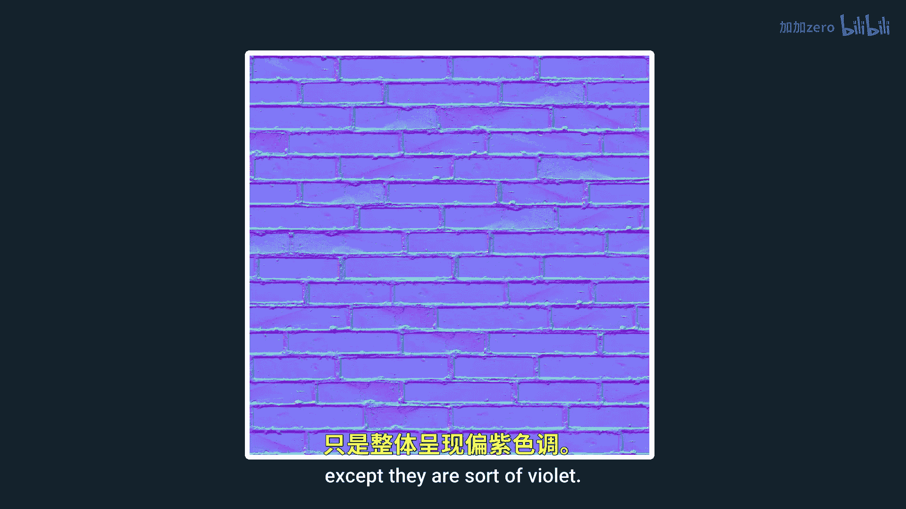
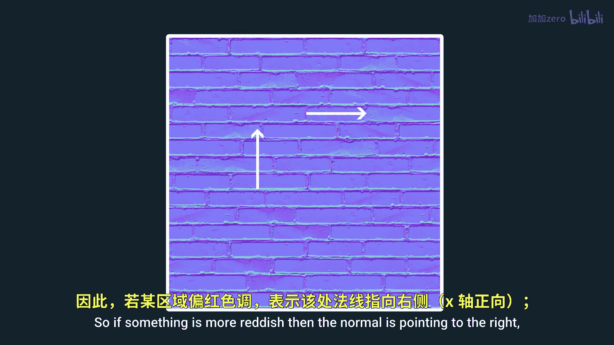
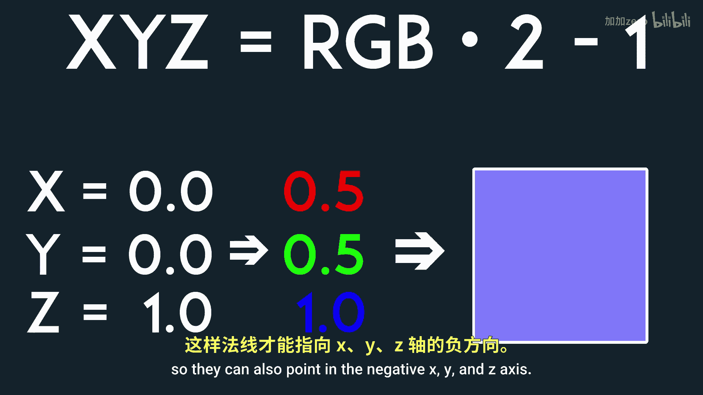
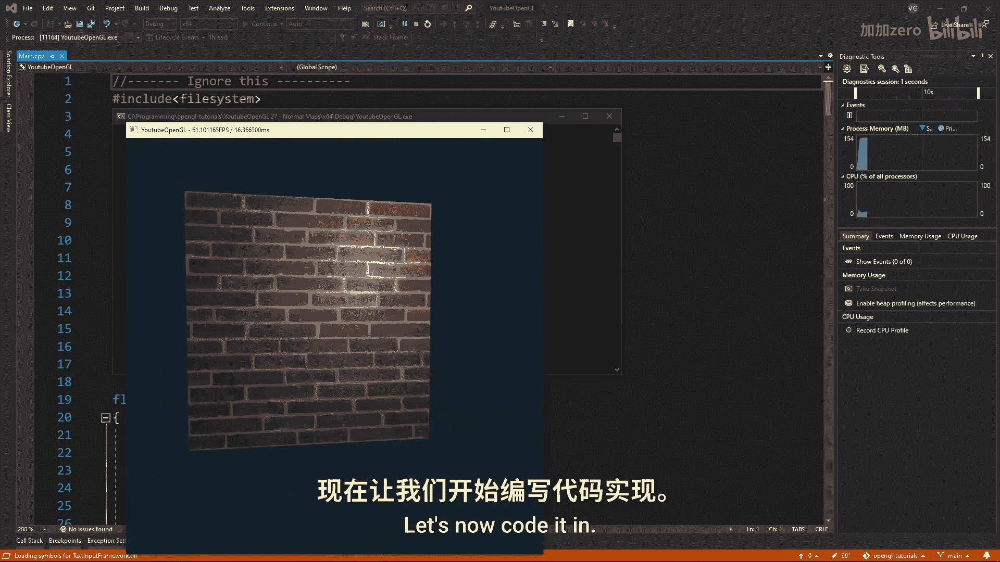
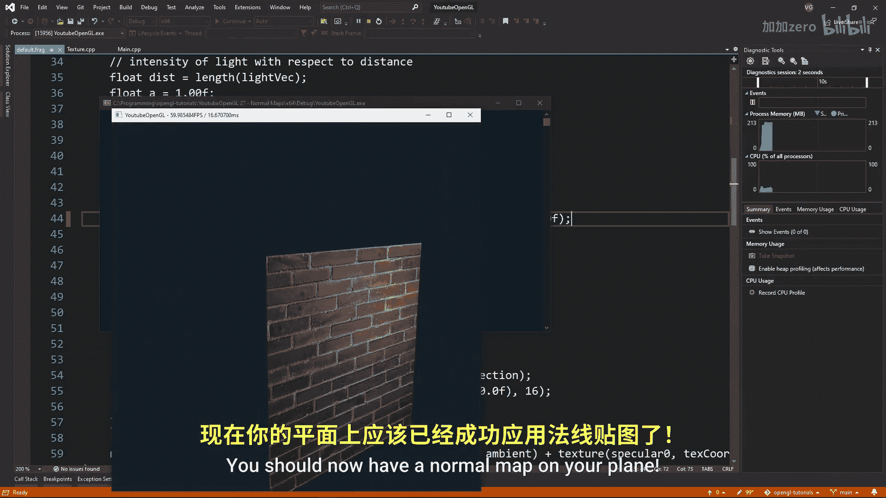
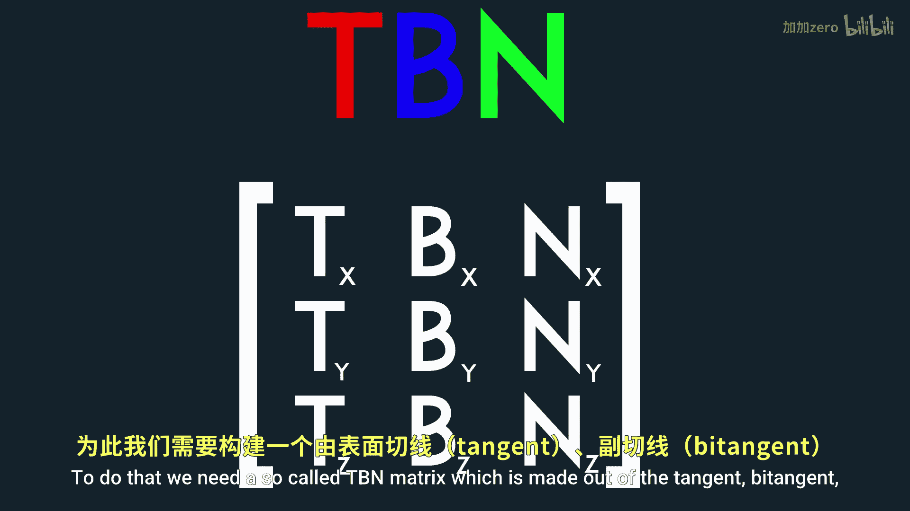
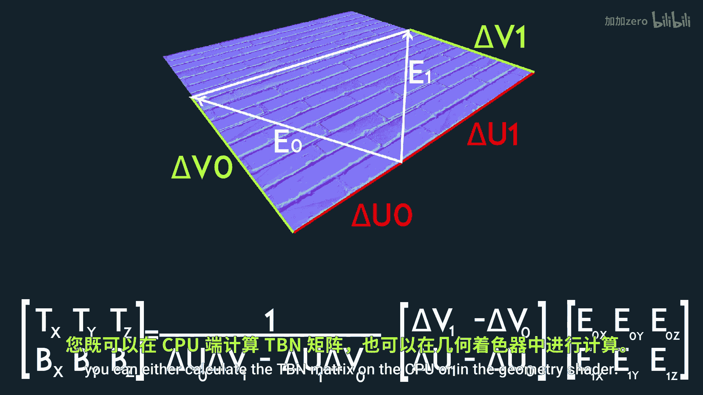

# Victor Gordan【中英⚡OpenGL教程｜OpenGL Tutorial】 p28 P28 Normal Maps -BV1kkvTz8Egh_p28-

In this tutorial， I'll show you what normal maps are and how you can use them to add a lot of detail to our meshes。

 So let's say we have a surface made of triangles， and we want to add more detail to it。

 a good way to increase the amount of detail it has would be to add more normals so the light can better interact with the surface。

 but we can only have normals where we have our vertices。 So to add more normals。

 we would have to increase the amount of triangles present。

 which could hit our performance pretty hard。 This is where the beauty of normal maps comes in。

 we can keep the original count of triangles。 and instead just wrap a normal map onto the surface。

 Now every pixel on this normal map will represent one normal for the surface。

 So we just improve the look of the model a lot while barely hitting the performance of our program。

 Now let's take a better look at a normal map。 As you can see。

 they are usually very similar to the diffus map except they are sort of violet。

 That is because each pixel of a normal map represents a vector。

In three dimensions So in other words， the RGB of each pixel stands for the x Y Z coordinates。

 the Z axis ak blue value comes out of the surface and since normals are usually perpendicular to the surface they are on the normal map is dominated by these violet color So if something is more reddish then the normal is pointing to the right Well if it is more greenish it is pointing up one last thing to note is that RGb is in the range 01 but we want our normals in the range minus-11 so they can also pointing the negative x Y and z axis。

 So you just need to apply a small transformation when retrieving them。

 let's now code it in you want to sort off with the plane that faces the positive Z axis Now we'll slightly modify our texture class to accept normal maps the thing about normal maps and basically any sort of texture besides diffused textures is that we don't want gamma correction on them。

 So we need to load normal maps as RGB not。

GB don't forget to also load in the texture and send it off to the fragment shader。

 Now all that have to do is to read the normals of the normal map。

 transform them to the negative11 range and or done you should not have a normal map on your plane this is nice but you' notice that if I move the plane from its position the normal map will be suddenly wrong That's because the normal map always points towards the positive z direction while in this case our plane is flat on the ground and pointing in the positive y direction。

 this discrepancy causes the error we see we want the normal map and lighting variables to be in the same space to do that we need a so-called TBBn matrix which is made out of the tangent by tangent and normal of the surface to get this we can use this formula If you're interested in its derivation I left some links in the description to some articles on it Now since we need all three vertices of a triangle for the formula you can either calculate the TBBn matrix。

On the CPU or in the geometry shader I will do it in the geometry shader。

 So in the default geometry shader that changes nothing we want to sort of by calculating the two edges into delta texture coordinate values from the formula then we calculate the division float and finally the tangent and by tangent Now we want to import the model matrix into the geometry shader so we can multiply the tangent and by tangent As for the normal we want it to be perpendicular to the triangle but usually。

