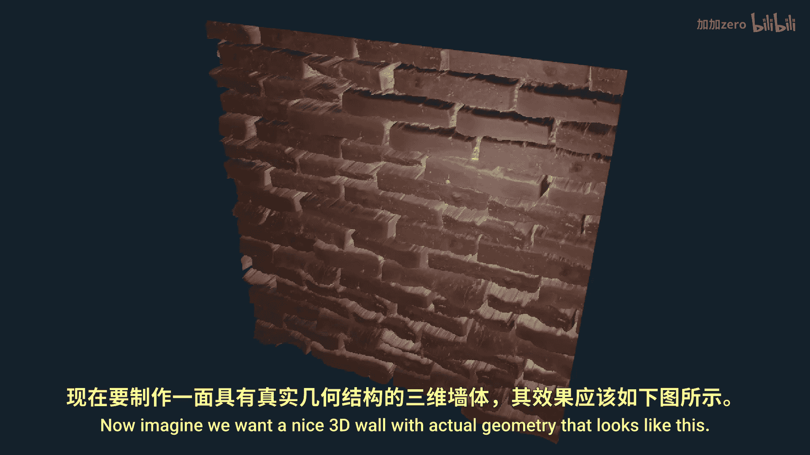
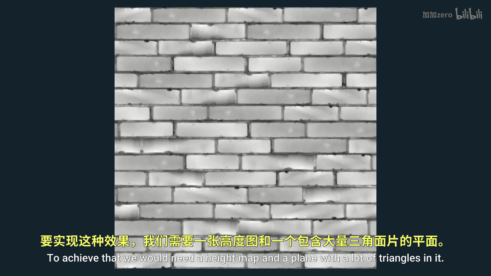
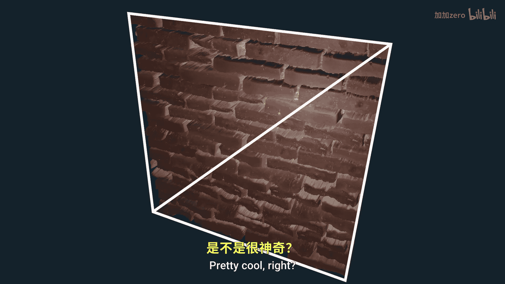
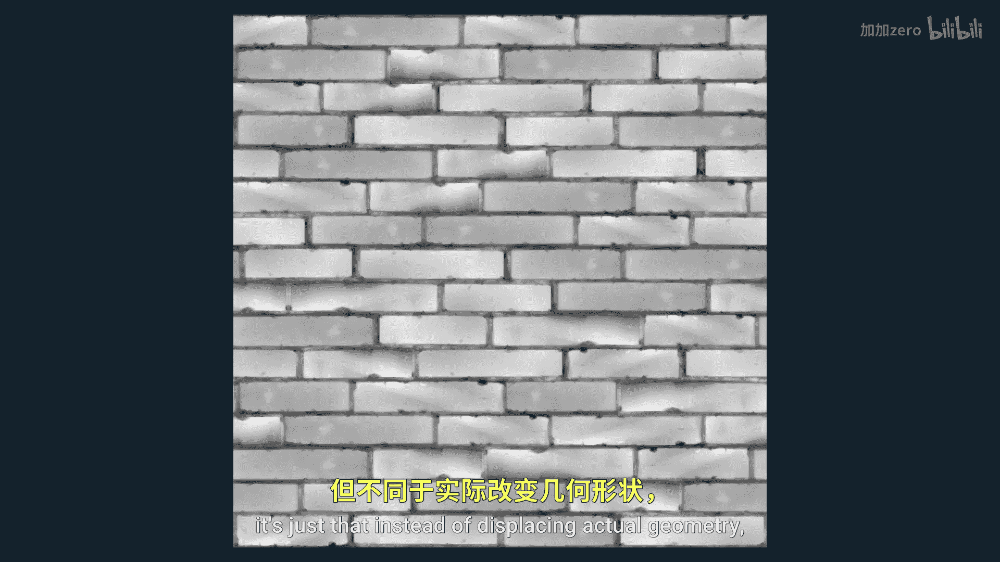
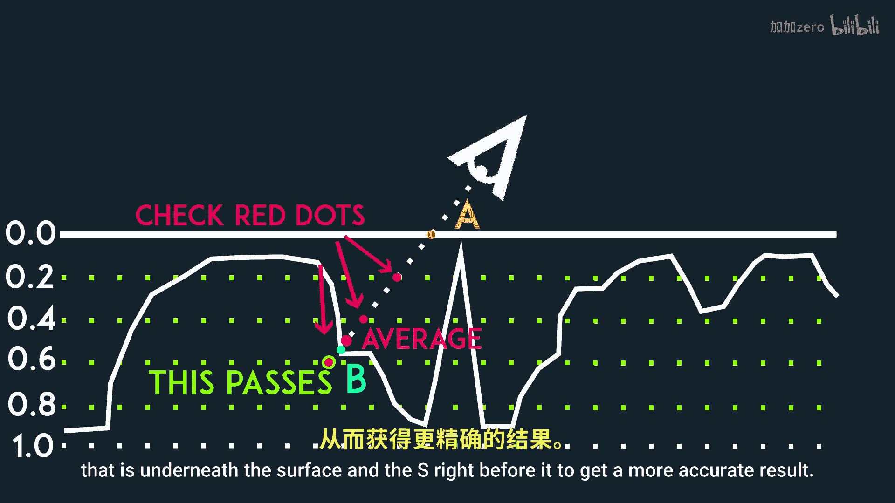
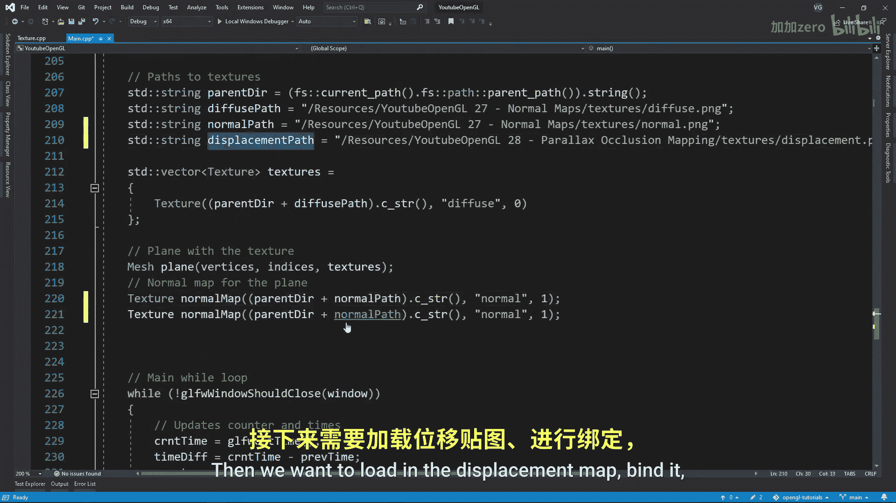

# Victor Gordan【中英⚡OpenGL教程｜OpenGL Tutorial】 p29 P29 Parallax Occlusion Mapping -BV1kkvTz8Egh_p29-

In this tutorial， I'll show you what parallax mapping is and how you can use it in combination with normal maps in order to get some really nice details out of your surfaces。

 Now， imagine we want a nice 3d well with actual geometry that looks like this to achieve that we would need a height map in a plane with a lot of triangles in it。

 The problem with that is that we might need thousands or tens of thousands of triangles for this one single plane。

 but we can't really have that since it would tank our performance。

 So what if I told you that the brick wall you're looking at right now is made out of just two triangles。

 pretty cool right so here's how parallax mapping works。 First of all。

 we still need a height map for this is just that instead of displacing actual geometry will simply fake it in the fragment shader。

 Now you'd initially think of faking it above the surface。 The problem with that though。

 is that this plane。

Only display things on its own surface。 So areas like this would yet cut off and ruin the illusion。

 so we will instead be inverting the height map and fake the dev behind the plane。

 Now how do we do this Well here at dev0 we have our plane then underneath it we have our theoretical height map。

 meaning you can't actually see it it's there just in the mats。 We are currently sampling point a。

 but what we really want to sample is point B since that's the height we're supposed to see。

 The problem is we can't just calculate B using a formula or something like that。

 We need to somehow get an approximation for it to do that we can simply take the height were currently at and multiply that by the inverse of our view of vector calling this vector S Since most height maps don't have insanely drastic changes in their height from1 point to the next this gets us somewhat close to our point of。

this also means that if we do have a steep displacement。

 then we will be way off with our guess and things will look weird。

 The problem is that this technique will have inconsistent results depending on the height map especially if you look at it from a small angle because then point A is really far away from point B and so assuming they are somewhat close in height is not going to work。

 So we actually need to modify this a bit。 What if instead of getting the height of a and multiplying that with the inverse of B we simply have multiple levels of height we check we are essentially going to scale the s vector from a small length to a larger one until we get it underneath the surface at which point we will sample that pixel to get the color in all that stuff we can further improve this by averaging the height of the s that is underneath the surface and the s right before it to get a more accurate result。

Also use geolinear instead of geone when loading the textures to get even smoother results Now let's put this in practice。

 We'll continue off from the normal mapps tutorial since we need a TB and matrices to work in the texture space we first want to add the displacement type of texture to our texture class then we want to load in the displacement map。

 bind it and send it off to the fragment shader Now in the fragment shade。

