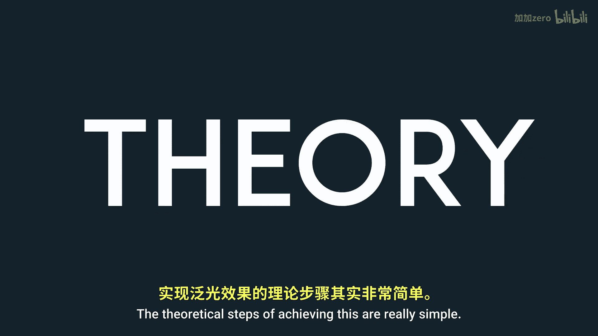

# Victor Gordan【中英⚡OpenGL教程｜OpenGL Tutorial】 p31 P31 Bloom -BV1kkvTz8Egh_p31-

In this tutorial I show you what bloom is and how you can add it to your renders so they look nicer to get good results with your bloom。

 I recommend having HD colors enabled so that you can get more variation in your bloom effects。

 So if you don't know what bloom is。 Here it is as you can see。

 bloom is that auralike color around bright lights that gives them the appearance of being brighter than they really are in reality。

 that your radical steps of achieving this are really simple。

 What you want to do is to render your image as you usually do。

 except you'll also render all the bright spots of your image in another texture。

 Now that these two are separated， we want to blur the second texture。

 The algorithm you use to blur the texture and the steps you take in doing。

 So we'll define the quality and look of your bloom。 Once that is done。

 you simply slap the second texture onto the first one and you're done to start off。 You want to。

Create a second texture for your post processing buffer。

 Make sure you attach it to the second spot of the frame buffer using gel color attachment 1。

 Now to tell open gel that will want to draw to above textures will have to use gel drop buffers passing an array with the attachments used。

 Then we need to specify to the fragment shader that we are outputting to two textures and assign their fragment colors like so here。

 I first multiply the red fragments because I want those lava lines to pop out more。

 then I compute the brightness by looking at a grayk value of the fragment which can be obtained draw a dot product like so。

 And finally， I decide whether or not to accept the fragment to the second texture based on its brightness。

 at this point of the tutorial， if you bind the second texture。 it should look something like this。

 The next step is to blur this image。 And this tutorial I will use Gaussian blur since it's often used for bloom effects。

I'll start by making a shader program for the blur and sending it the texture we wish to modify Now for the shader itself we'll basically first calculate the horizontal blur of all pixels and then in another run will calculate the vertical blur This is done in order to improve the performance of the program If you want a more detailed explanation go to learn opengel。

 co or Google the specifics of the twopa Gaussian blur method Once your shader is ready you need to create two frame buffer each with one texture these two frame buffer will be used to run the two blur passes mentioned earlier they are called pinkponk frame buffers because they keep passing data from one to another Now in our main loop we want to pass the data between them the amount of times you bounce the texture will depend on how much blur you want noticeice how I check if it's the first bones Since I want to use the image generated earlier。

For that initial pass After that， all the passing is done between the textures of the pinkpk buffers Don't forget to actually tell the shader if you are doing a horizontal or vertical pass using a bull After bouncing the data around a bit you should have a blurred image similar to this all I's left to do now is to bind the color texture and the blurred texture pass them to the post processingces fragment shader and add them together as a last step don't forget to。

