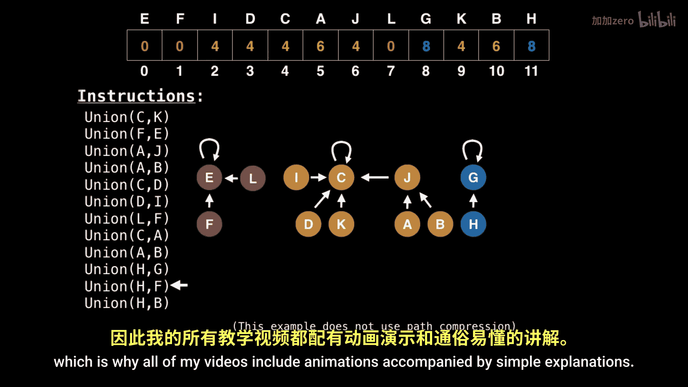
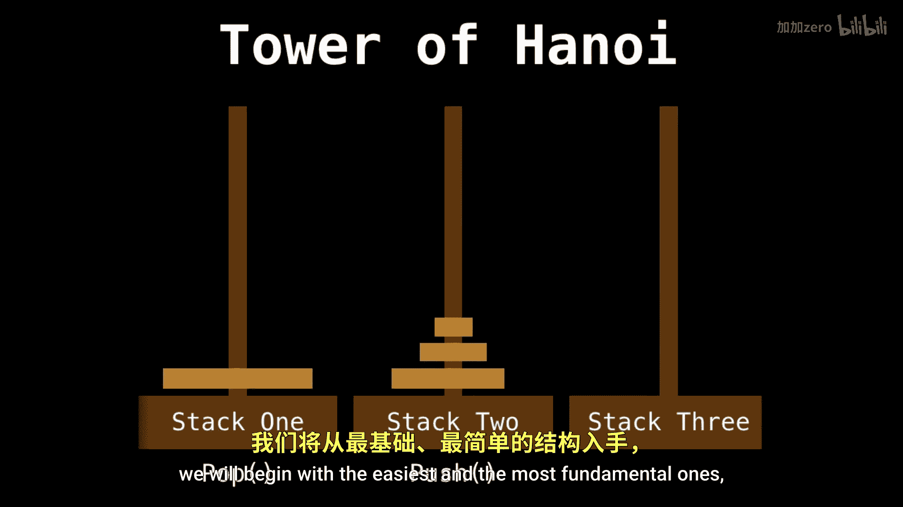
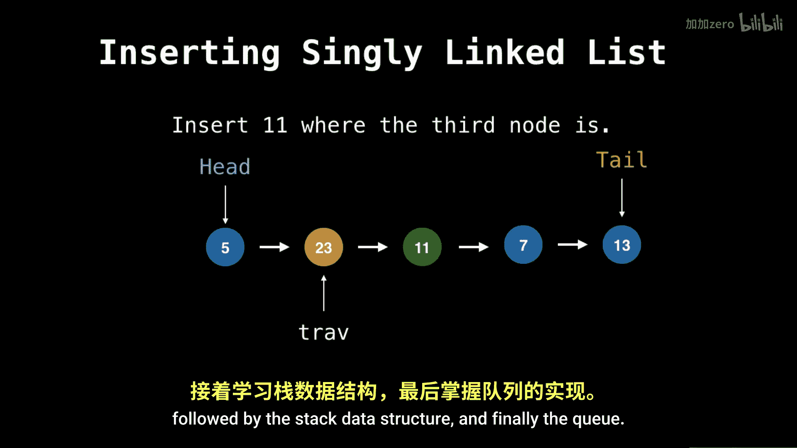

# WilliamFiset【中英⚡数据结构｜Data structures】 p01 P1 Data structures introduction -BV1M2JXzhEdp_p1-

🎼Hello and welcome to the Easy to Advd Pa Strs series。

 A complete guide to learning everything there is to know about data structuress。 My name is William。

 and I will be your instructor throughout these videos。

To begin with a little bit about myself， my passion revolves around algorithms and day structures which led me to becoming involved in lots of competitive programming in 2017 I qualified for the ACMICPC World finals Program Competition。

My current occupation today is as a software engineer for Google I am currently stationed in Mountain View California at the head office Now I want to talk to you about what you will be learning in this data structuress course First。

 you will see how data structures are represented visually through animations。

Animations are essential part of the learning experience。

 which is why all of my videos include animations accompanied by simple explanations we will learn how to code various data structures together with simple to follow step by step instructions for every data structure we will be going over some working source code to solidify understanding。

🎼I will also be posting various coding exercises and multiple choice questions to ensure that you can get some hands on experience for the data structures themselves we will begin with the easiest and the most fundamental ones and slowly start increasing the difficulty We will begin with the dynamic array and then soon move on to the linked list followed by the stack data structure and finally the queue。

Moving on to the intermediate data structures， we'll dive into the heat based priority queue followed by a personal favorite of mine。

 the Union Find and lastly， binary T and binary search。

