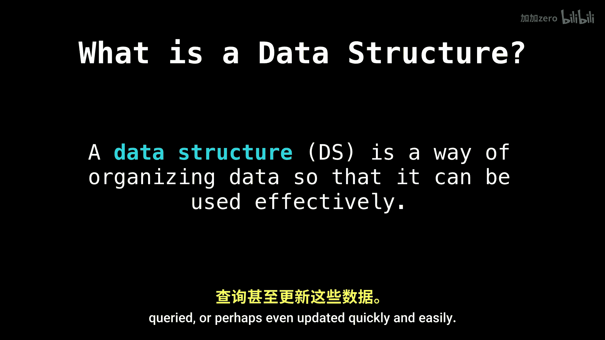

# WilliamFiset【中英⚡数据结构｜Data structures】 p02 P2 Abstract data types -BV1M2JXzhEdp_p2-

Hello and welcome to this new series on data structuress。In these first few videos。

 I want to lay the foundation of some core concepts you will need throughout these video tutorials。

Let's get started with the basics。So what is a data structure。

 One definition that I really like is a data structure is a way of organizing data so that it can be used efficiently。

And that's all a data structure really is。 It is a way of organizing data in some fashion so that later on。

 it can be accessed， queried， or perhaps even updated quickly and easily。

So why data structures， why are they important？Well。

 they are essential ingredients in creating fast and powerful algorithms。

Another good reason might be that they help us manage and organize our data in a very natural way。

And this last point is more of my own making。 and it's that it makes code cleaner and easier to understand。

As a side note， one of the major distinctions that I have noticed from bad mediocre to excellent programmers is that the ones who really excel are the ones who fundamentally understand how and when to use the appropriate data structure for the task they are trying to finish。

Data structures can make the difference between having an O K product and an outstanding one。

 It's no wonder that。

