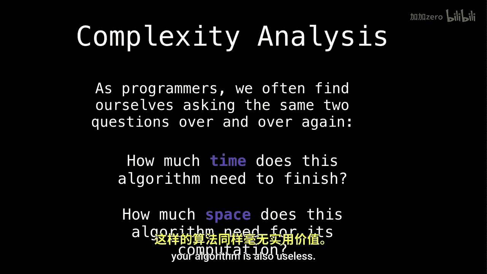
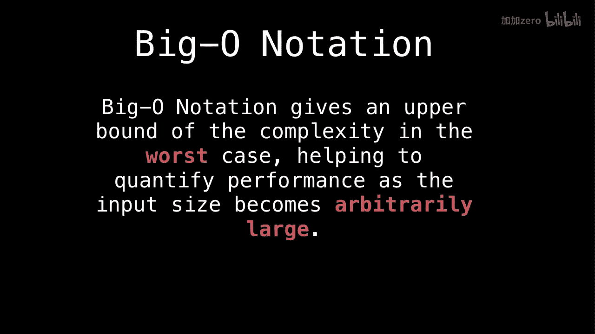

# WilliamFiset【中英⚡数据结构｜Data structures】 p03 P3 Introduction to Big-O -BV1M2JXzhEdp_p3-

Alright， now that we were're done with abstract data types。

 we need to have a quick look at the wild world of computational complexity to understand the performance that our data structures are providing。

So as programmers， we often find ourselves asking the same two questions over and over and over again。

That is， how much time does this algorithm need to finish and also how much space。

Does this algorithm need for my computation？So if your program takes a lifetime of the universe to finish。

 then it's no good。Similarly， if your program runs in constant time。

 but requires a space equal to the sum of all the bytes of all the files on the internet internet。

 your algorithm is also useless。

So to standardize a way of talking about how much time and how much space is required for an algorithm to run。

 theoretical computer scientists have invented big O notation amongst other things like big theta。

 big omega， and so on， but we're interested in big O because it tells us about the worst case。

Big O notation only cares about the worst case， so if your algorithm sorts numbers。

 imagine the input is the worst possible arrangement of numbers for your particular sorting algorithm。

Or as a concrete example， suppose have an unordered list。Of unique numbers。

 And you're searching for the number 7 or the position where。

