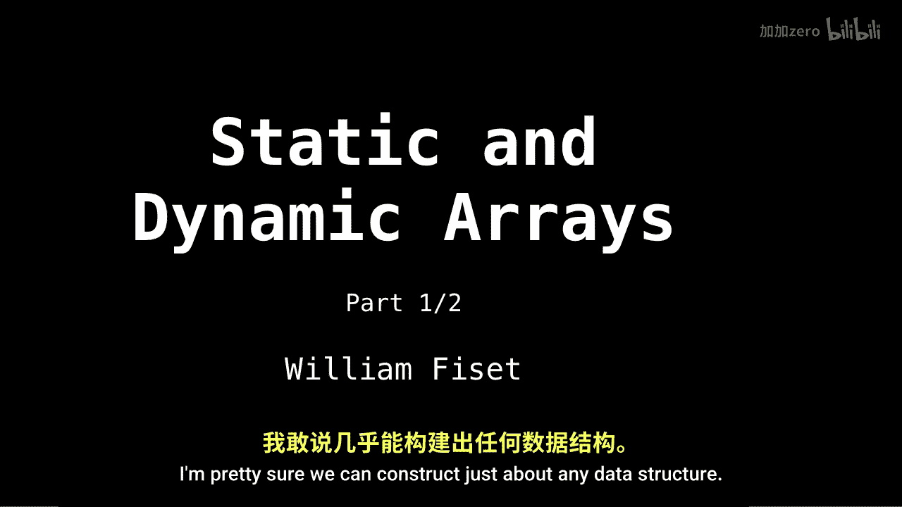
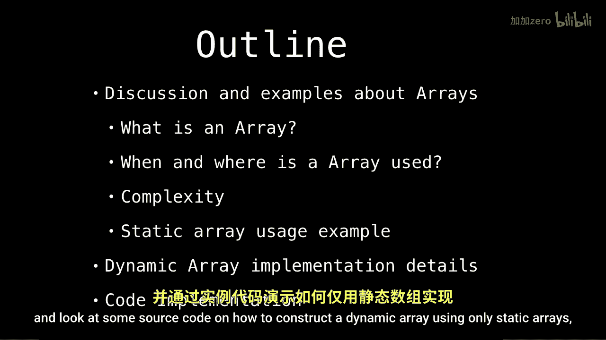

# WilliamFiset【中英⚡数据结构｜Data structures】 p04 P4 Dynamic and Static Arrays -BV1M2JXzhEdp_p4-

Alright， let's talk about arrays。 Probably the most used data structure。

 This is part one of two in the array videos。 The reason the array is used so much is because it forms a fundamental building block for all other data structures。

 so we end up seeing everywhere with arrays and pointers alone。

 I'm pretty sure we can construct just about any data structure。

So an outline for today's video， first， we're going to begin by having a discussion about arrays and answer some fundamental questions such as what。

 where and how are arrays used。Next， I will explain the basic structure of an array and the common operations we are able to perform on them。

Lastly， we will go over some complexity complexity analysis and look at some source code on how to construct a dynamic array using only static arrays。

 discussion and examples。

So what is a static array So a static array is a fixed length container containing n elements which are indexable。

 usually on the range of0 inclusive to n minus1， also inclusive。So a follow up question is。

 what is meant by being indexable？So answer to this is this means that each slot or index in the array can be referenced with a number。

Furthermore， I would like to add that styleylic array。

