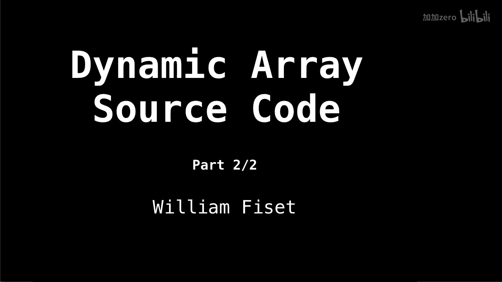
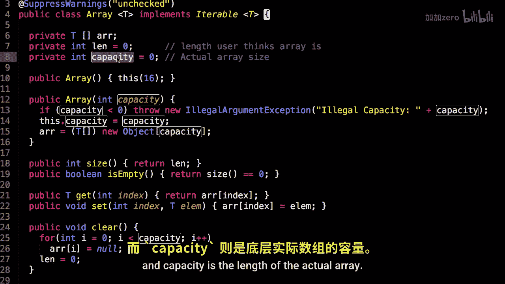
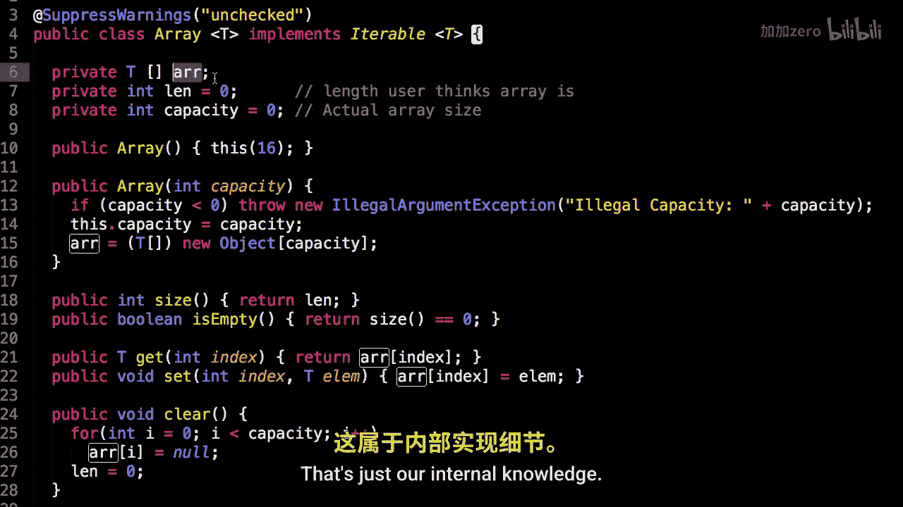
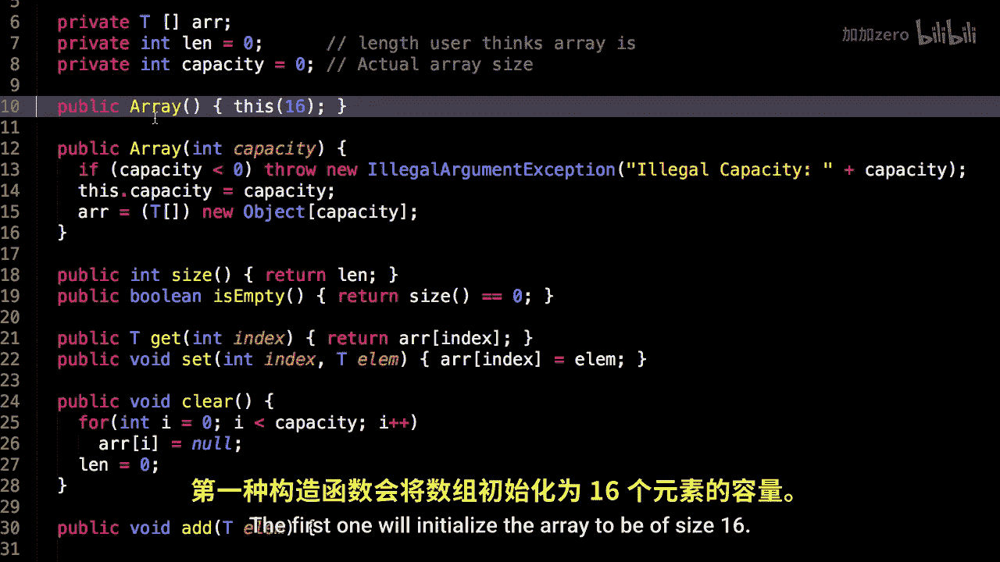
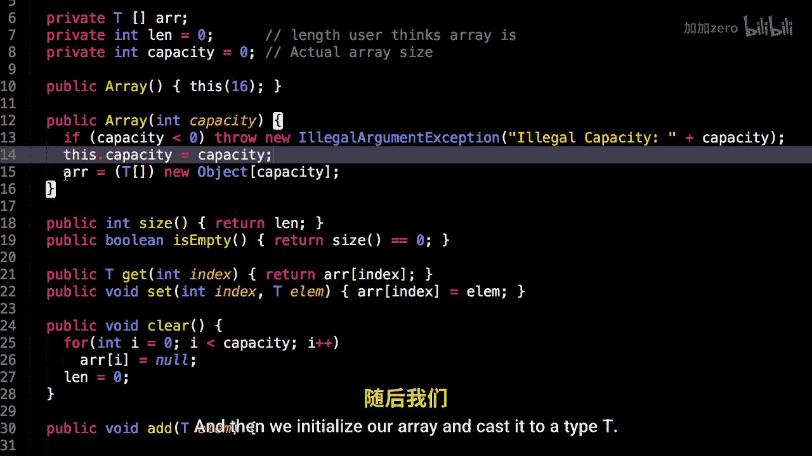

# WilliamFiset【中英⚡数据结构｜Data structures】 p05 P5 Dynamic Array Code -BV1M2JXzhEdp_p5-

All right， time to look at the dynamic array source code。This is part two of two in the array series。

So the source code for this video can be found at the following link Github。

 co smyusname s data dashstructure。 Also make sure you saw the last video so you know what's going on with this array implementation。

 Allright， here we are in the array class。 So I've designed an array class to support generics of type T。

 So whatever type of data we want in this array。 that's fine。

So， here are our three。Instance variables that we care about are， which is our internal static array。

Len， which is the length the user thinks the array is。And capacity is the length of the actual array。

 because sometimes our array might have more free slots。

 and we don't want to tell the user that there's extra free slots that are available less just our internal knowledge。

So there's two constructors。 the first one will initialize the。

Aray be of size 16。 The other one， you give it a capacity。 The capacity， of course。

 has to be greater than equal to 0。

And then， we initialize our array。

And cast it to a type T。 Also notice I need to put this suppress。

