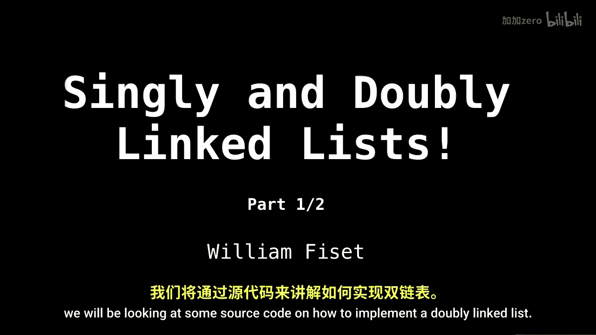
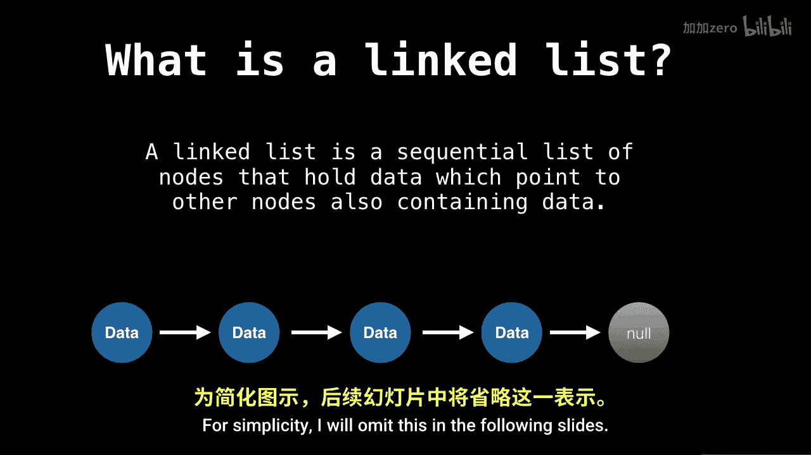
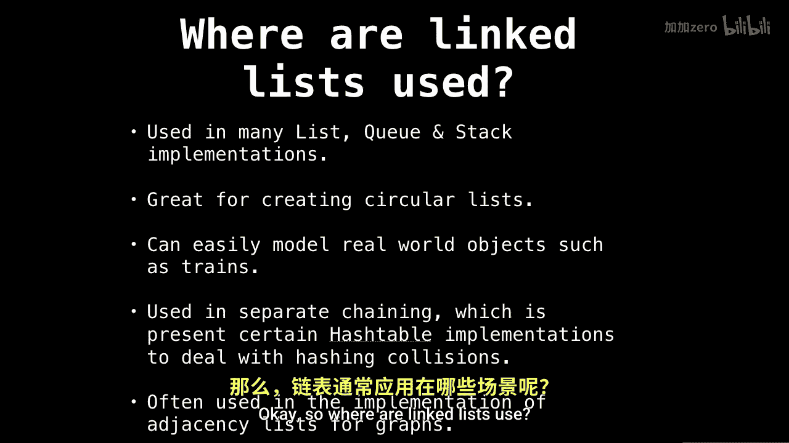

# WilliamFiset【中英⚡数据结构｜Data structures】 p06 P6 Linked Lists Introduction -BV1M2JXzhEdp_p6-

Welcome back Today we're going to talk about Sly and doubly linked lists。

 one of the most useful data structures out there。This is part one of two。

 and the second part we will be looking at some source code on how to implement a doubly linked list。

So forward today's outline。In the first section， we're going to answer some basic questions concerning Singly and W linked lists。

 namely what are they and where are they used？Next。

 we' cover some terminology concerning the linked lists so everyone knows what I mean when I say ahead of linked list versus the tail of the linked list。

Then last in the discussion， we'll talk about the pros and cons of using singly and doubly linked lists。

Then how to insert and remove elements from both Sly and a link list as well as some source code。

 so stay tuned。

All right， discussion。So what is a link， linked list is a sequential list of nodes that hold data which point to other nodes also containing data。

So below is an example of a singlely linked list containing some arbitrary data。

Notice that every node has a pointer to the next node。Also， notice that the last node points to no。

 meaning that there are no more nodes at this point。the last node always has a no reference。

To the next node。For simplicity， I will omit this in the following slides。

Okay， so where are linked list use？

One of the places that get used the most is。