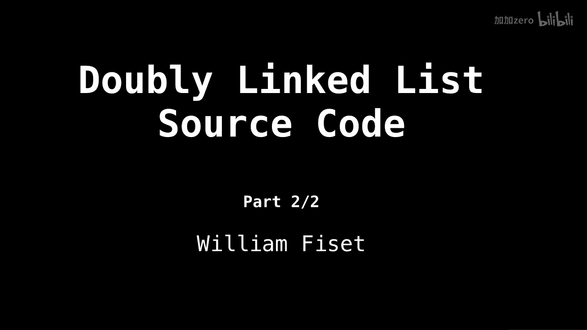
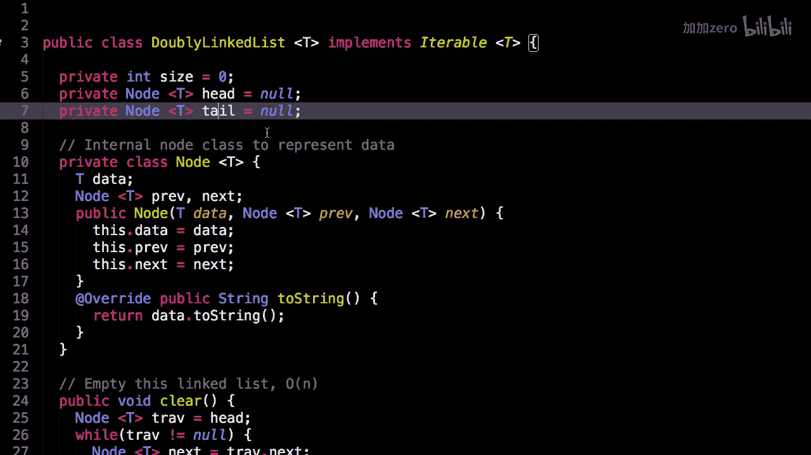
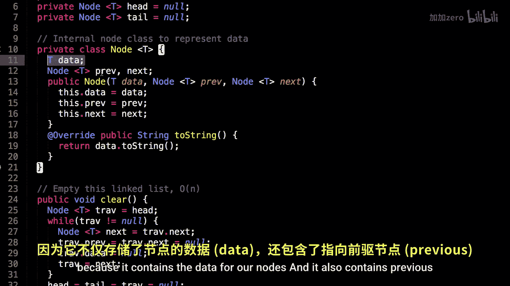
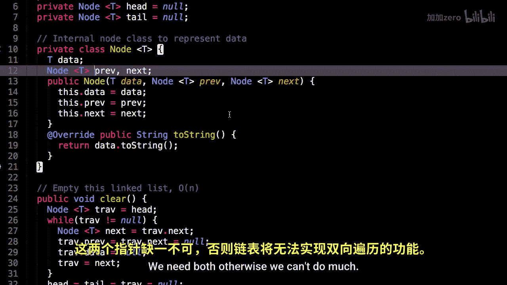
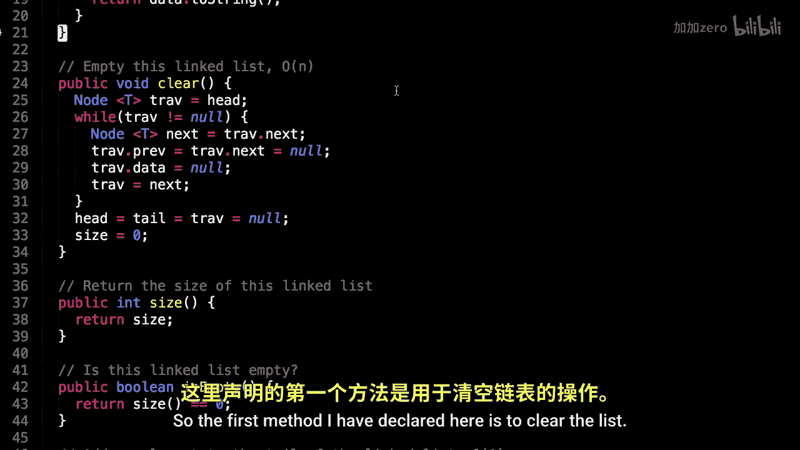
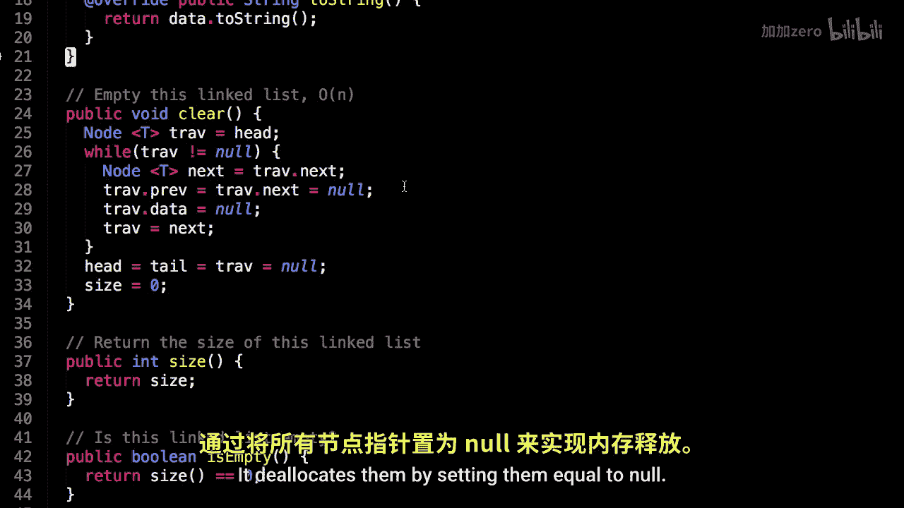

# WilliamFiset【中英⚡数据结构｜Data structures】 p07 P7 Doubly Linked List Code -BV1M2JXzhEdp_p7-

Alright， time to look at some doubly linked list source code。

 This is part2 of2 in the linked list series， so the link for the source code can be found on Github at Github。

 co/willmfisa/ data structures， please star this repository if you find the source code helpful so that others may also find it and also make sure you watch the first part of the linked list series before continuing。

Here we are in the source code， we're looking at the implementation of a doubly linked list in Java。

So first notice that I have declared a few instance variables。

 so we are keeping track of the size of the linked list。

 as well as what the head and the tail currently are， to begin with the head and the tail are null。

 meaning linked list is empty。

Furthermore， we will be using this internal node class quite excessively because it contains the data for our nodes。

And it also contains previous and next pointers for each node， since this is a doubly linked list。

So we have one constructor for the node， namely the data and the previous and the next pointers themselves。

We need both。 otherwise， we can't do much。

This first method I have declared here is to clear the list。

 it does so in linear time by going through all the elements and delocating them one at a time。

 it des them by setting them equal to null。

