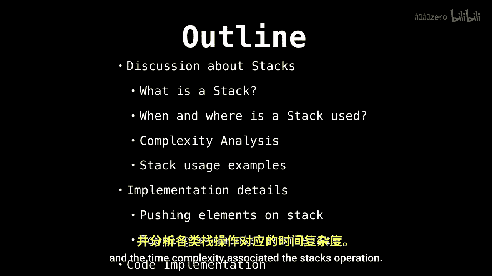
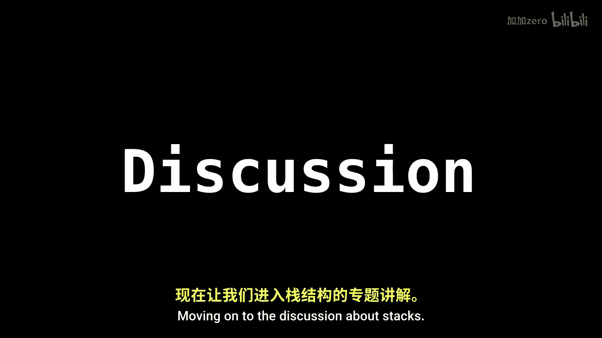
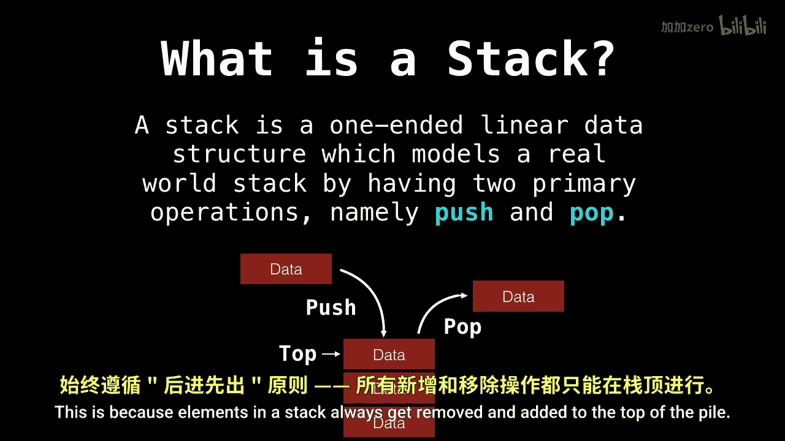

# WilliamFiset【中英⚡数据结构｜Data structures】 p08 P8 Stack Introduction -BV1M2JXzhEdp_p8-

May I begin by saying that the stack is a remarkable， absolutely remarkable data structure。

 one of my favorites， in fact。🤢，This is part one of three in the stack videos。

 Part 2 will consist of looking at a stack implementation。

 and part 3 will be some source code for how a stack is implemented using a linked list。

So here are the topics we'll be covering in this video as well as the others first we will answer the question about what is a stack and where is it used。

Then we will see some really， really cool examples of how to solve problems using stacks。Afterwards。

 we will briefly look at how stacks are implemented internally and the time complexity associated the stack's operation and lastly。

 of course， some source code。

Moving on to the discussion about stacks。

So what is a stack？A stack is a one ended linear data structure。

 which models a real world stack by having two primary operations namely push and pop。Below。

 you can see an image of a stack I have constructed。

There is one data member getting poppedpped off the top of the stack and another data member getting added to the stack。

Notice that there is a top pointer pointing to the。To the block at the top of the stack。

This is because elements in a stack always get removed and added to the top of the pile。

 This behavior is commonly known。

