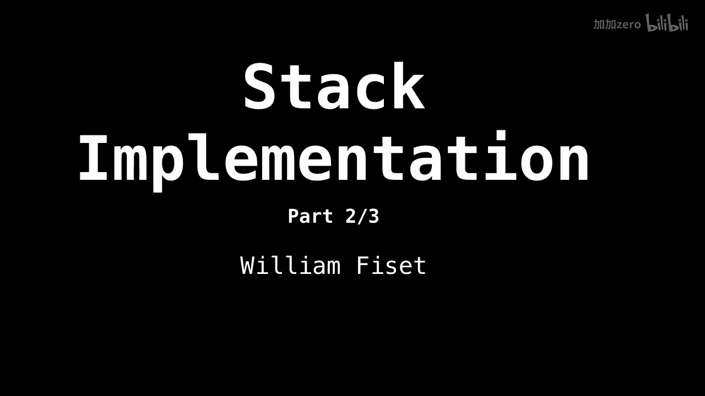
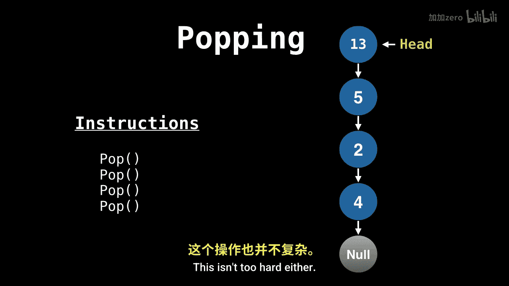

# WilliamFiset【中英⚡数据结构｜Data structures】 p09 P9 Stack Implementation -BV1M2JXzhEdp_p9-

Welcome to part two of three in the stack series。 this is going to be a short video on one way to implement a stack。

So those stacks are often implemented as either arrays singlely linked lists or even sometimes doubleubly linked lists。

Here I will cover how to push nodes onto a stack with a singlely linked list。Later on。

 we will look at the source code， which is actually written using a doubly linked list。Okay。

 to begin with， we need somewhere to start to be in our linked list。

 so we're going to point the head to a null node。🤢，This means that the stack is initially empty。

Then the trick to creating a stack using a singlely linked list is to insert the new elements before the head and not at the tail of the list。

 This way， we have pointers pointing in the correct direction when we need to pop。

Elements off the stack。As we will soon see the next element， however。

 we need to push onto the stack is it two， So let's do that。So we create a new node。

 adjust the head pointer to be the newest node， and then hook on the nodes next pointer to where the head was before。

And we use the same idea for five and also 13。Now， let's have a look at popping elements。

 This isn't too hard either。 Just move the head pointer to the next node and。

