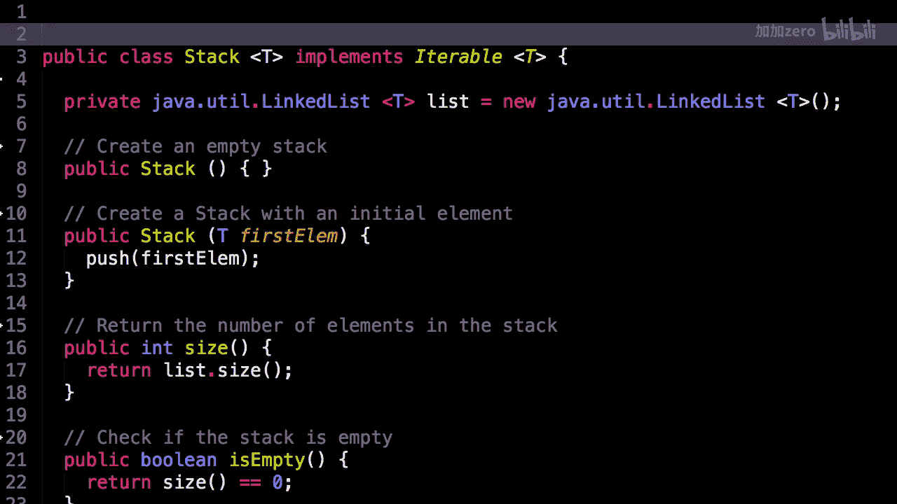
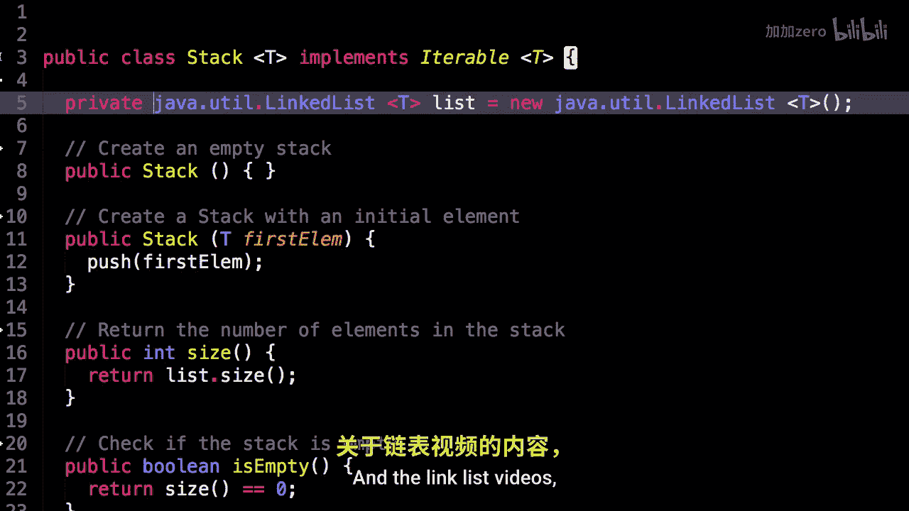
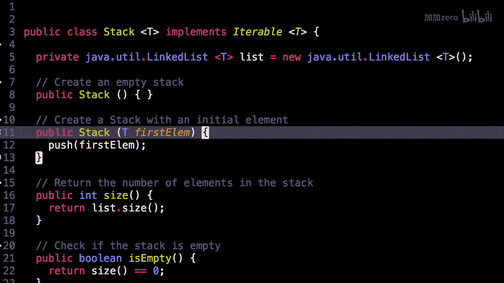

# WilliamFiset【中英⚡数据结构｜Data structures】 p10 P10 Stack Code -BV1M2JXzhEdp_p10-

Welcome to part three of three in the Sta series videos。

 today we'll be looking at some source code for a very simple stack。

So the source code can be found at Github。com/williamfiizz/dastructures。

Make sure you understood part1 and two of the stack series before continuing so you actually know how we implement a stack using a linked list also if you like this video series and the implementation of the stack data structure。

I am about to present to you， then please start this repository on GitHub so that others can have an easier time finding as well。

Here we are in the stack source code。 This is an implementation in the Java programming language。

So the first thing you may notice is here I have an instance variable of a linked list。

 This is the linked list provided by Java。 In fact， it's a doubly linked list provided by Java。

This is the linked list they provide in their package Java。

ut that I will be using today instead of the one that I created in the linked list videos。

 this is just reportability in case you want to use this stack for whatever reason。

 so we have two constructors we can create an empty stack or we can create a stack with one initial element。

 this is occasionally useful。

First method， we can get the size of the stack， so to do that， we return the size。

