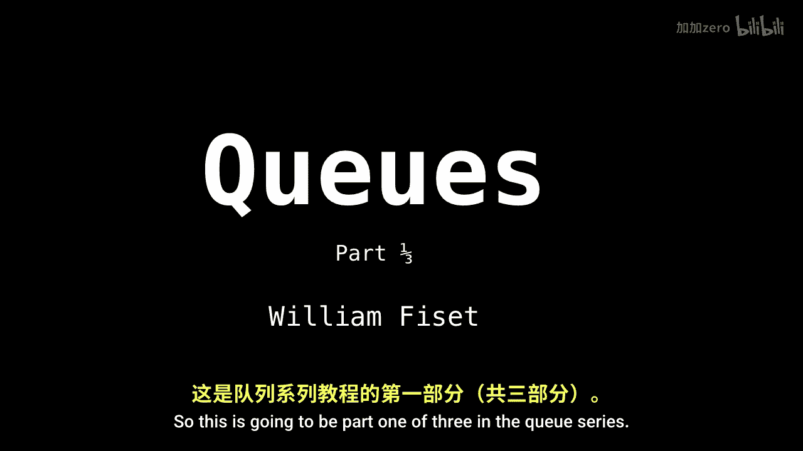
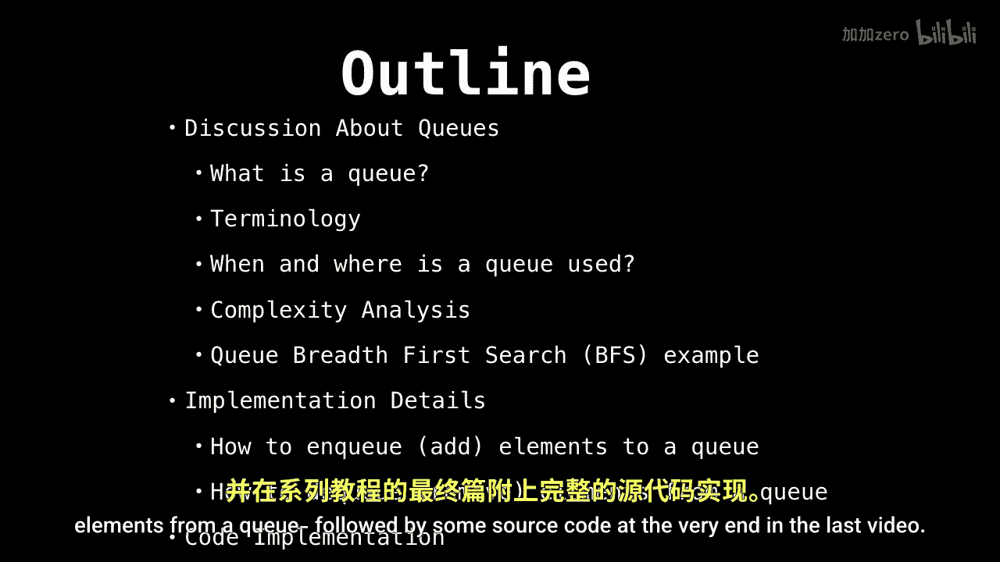
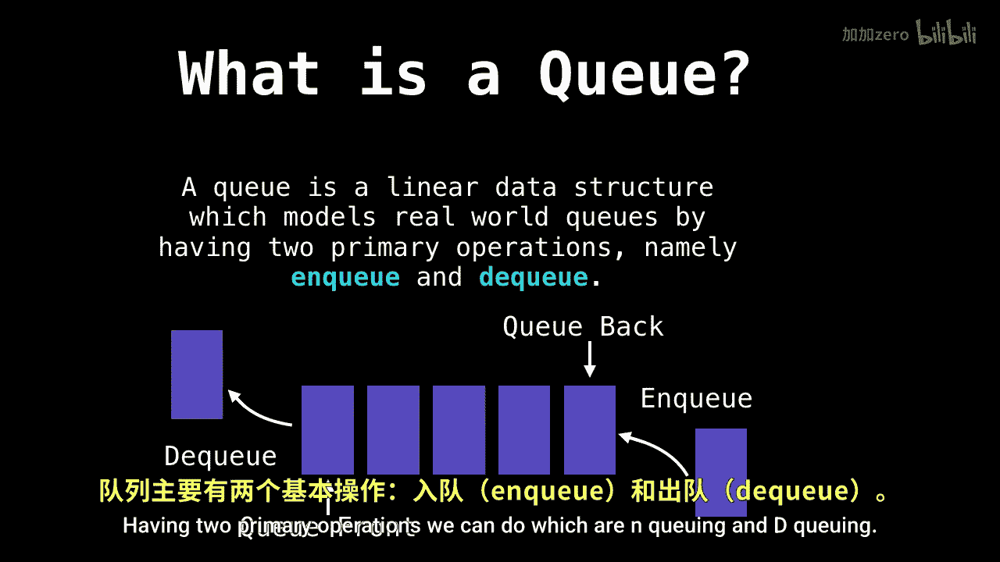

# WilliamFiset【中英⚡数据结构｜Data structures】 p11 P11 Queue Introduction -BV1M2JXzhEdp_p11-

Let's talk about cues， probably one of the most useful data structures in computer science。

So this is going to be part one of three in the Q series。

So the outline of things we'll be looking at。First we're going to begin by talking about cues and what they are。

 then we're going to go into some complexity analysis concerning cues that will discuss the implementation details of Nqueuing and dequeuing elements from a queue followed by some source code at the very end in the last video。

So a discussion about cues。 So what exactly is a cu。

So below you can see an image of a queue， but a queue is just a linear data structure that models a real world queue。

Having two primary operations we can do， which are Nqueuing and decoqueuing。

So every Q has a front and a back end。We insert elements through the back and remove through the front。

 adding elements to the back of the Q is called Nqueuing and removing elements from the front of the queue is called Dqueuing。

However， there's a bit of terminology surrounding queuees because there's not really any。Consistency。

When we refer to inqueuing and decoqueuing， many people will use multiple different terms。

 so andqueuing is also called adding but also offering。

A similar type of thing happens when we're talking about decoqueuing。

So this is when we remove things from the front of the。

