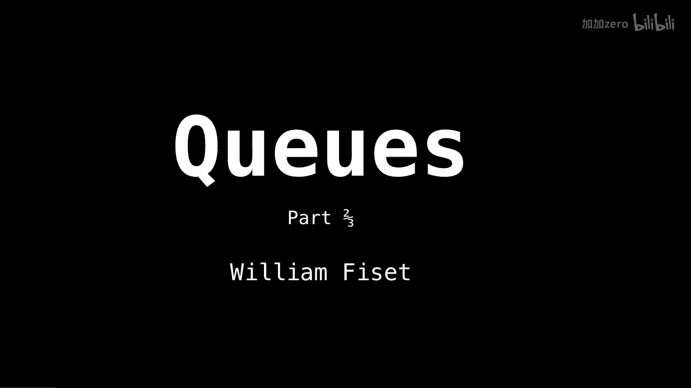
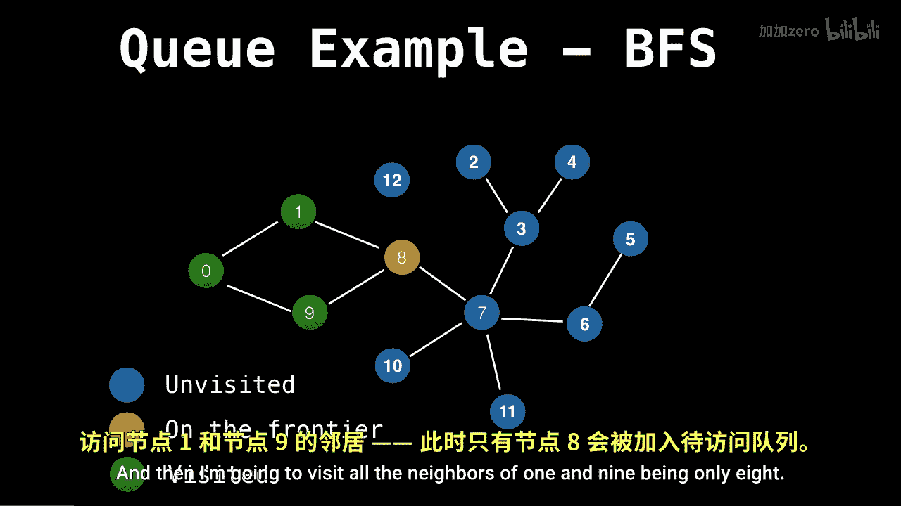

# WilliamFiset【中英⚡数据结构｜Data structures】 p12 P12 Queue Implementation -BV1M2JXzhEdp_p12-

In this video， we're going to have a look at how cues are used to do a breath first search。

 and then we're going to look at the actual implementation details of how Nqueuing and decoqueing elements works。

Okay， on the breath first search example。So a breath for search is an operation we can do on a graph to do a graph traversal。

If you don't know what I mean when I say graph， I mean a network。

 not a bar graph or a line graph or anything like that。But first。

 I should explain the breathth for search in the breathth for search。

 the objective is to start a node and traverse the entire graph。 First。

 by visiting all the neighbors of the starting node and then visiting all the neighbors of the first node you visited。

 and then all the neighbors or the second node you visited and so on so forth。

Expanding to all the neighbors as you go。So you can think of each iteration of the breath for search as expanding the frontier from one node outwards at each iteration as you go on。

So let's begin our breakfast search at node 0。 So I'm going to label node 0 as。

Yellow and put it in the frontier or the visiting group。

And now I'm going to visit all the neighbors of zero， being one and9 and add those to the frontier。

And then I'm going to visit neighbors of one。And 9 being only 8， similarly for 8， So 7。

