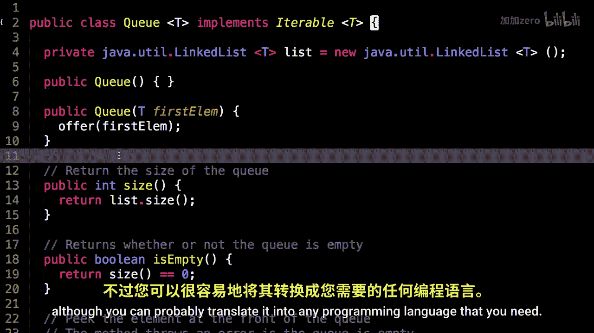
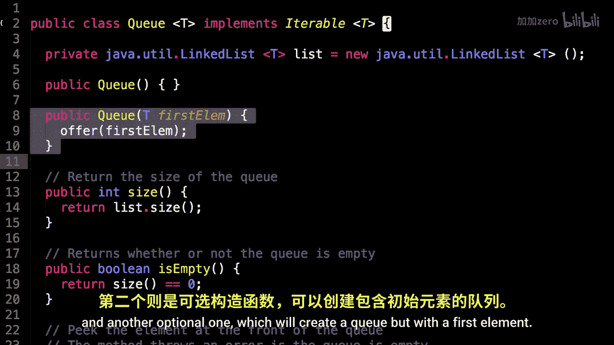
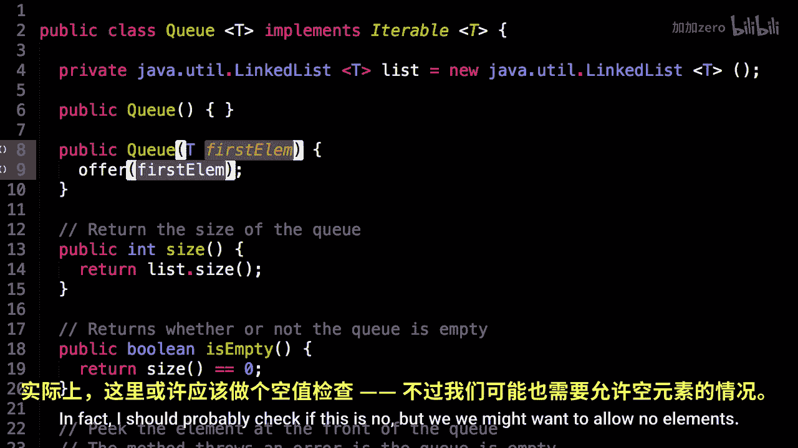
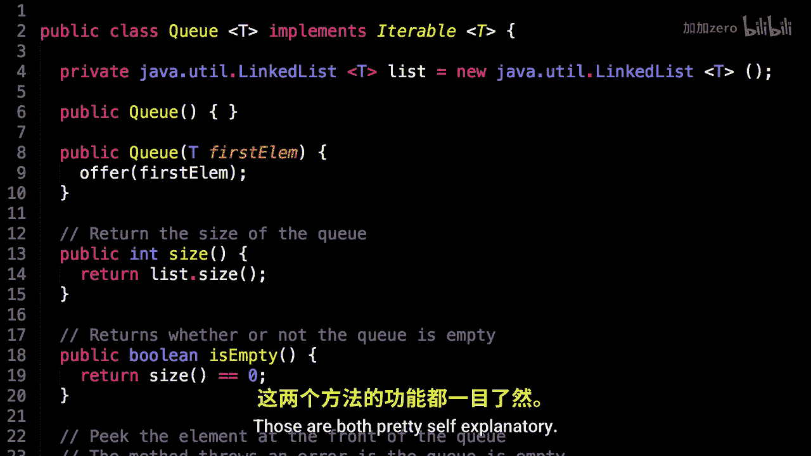

# WilliamFiset【中英⚡数据结构｜Data structures】 p13 P13 Queue Code -BV1M2JXzhEdp_p13-

Alright， now it's time to have a look at some source code for Q。

So I implemented a queue and you can find the source code at the following link on Github。

com/myusname/dastructures， also make sure you have watched and understood parts one and two from the Q series before continuing。

Alright， here we are looking at some source code for a Q。 So this source code is。

In the Java programming language， although you can probably translate it into any programming language that you need。

So the first thing to remark is I have an instance variable here of a linked list。

 so this is Java implementation of a doubly linked list。We also use this in the stack implementation。

 as you'll see， the Q and the stack implementations are very， very similar。

So here I have two constructors， one to create。

Just an empty queue and another optional one， which Ill create a queue， but with a first element。

In fact， I should probably check if this is no， but we。We might want to allow nu elements。

 so let's just leave it like that。

So the next method is the size， it just gets the size of the linked list and similarly。

 this checks if the linked list is empty， those are both pretty self explanatory。

Okay， next interesting method is the peak method。