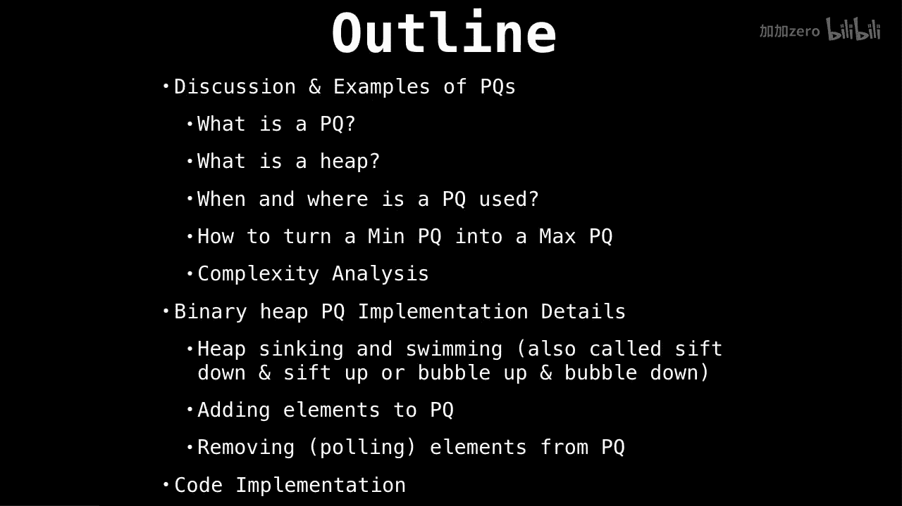

# WilliamFiset【中英⚡数据结构｜Data structures】 p14 P14 Priority Queue Introduction -BV1M2JXzhEdp_p14-

Alright， welcome back。 today we're going to talk about everything to do with prior cus from where they're used to how they're implemented and towards the end we'll also have a look at some source code。

Along with all the priority queue staff， we're also going to talk about heEaps since both topics are closely related。

 although not the same。

So the outline for the priority QCEs。Is we're going to start with the basics talking about。

What are priority cues and why they're useful？Then we'll move on to some common operations we do on priority cues and also discuss how we can turn min priority cues into max priority cues。

 followed by some complexity analysis。Then we'll talk about common ways we implement priority cues。

Most people think heaps are the only way if we can implement a priority queuee or that priority cues somehow are heaps。

 I want to dispel that confusion。Next， we're going to go into some great detail about how to implement the primary queue using a binary heap there we'll look at methods of sinking and swimming nodes up and down our heap。

These terms are used to again shuffle around elements in a binary heap。

As part the implementation explanation， I also go over how to poll and add elements。

So there's a lot to cover， so let's get started。

Discussion and examples， this is going only to be part one of five。

