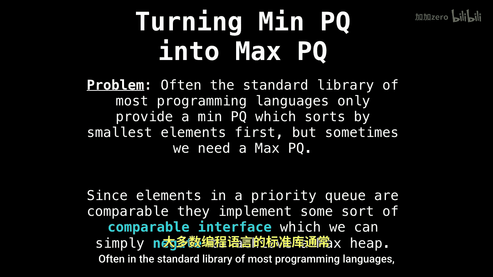
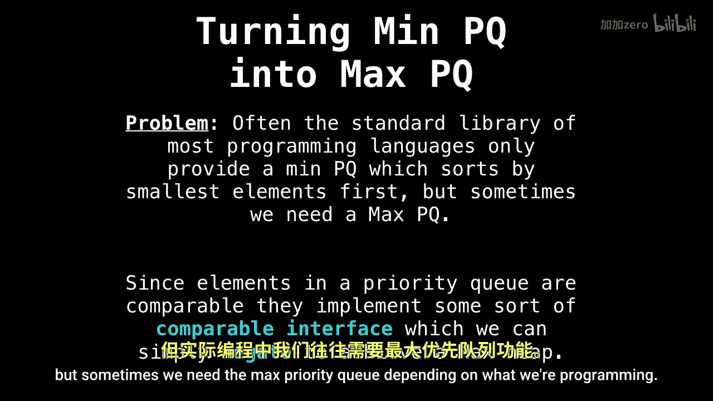
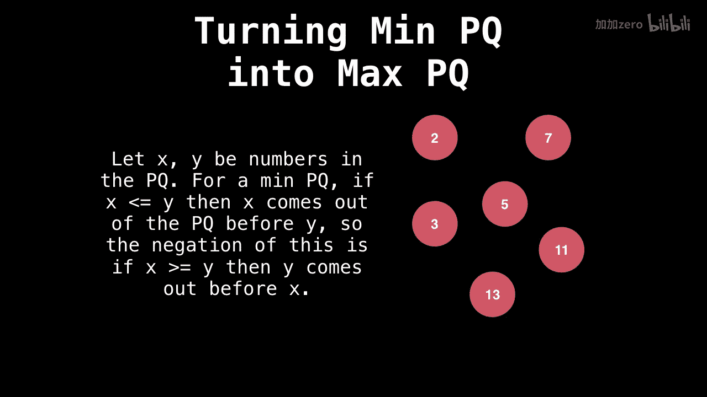

# WilliamFiset【中英⚡数据结构｜Data structures】 p15 P15 Priority Queue Min Heaps and Max Heaps -BV1M2JXzhEdp_p15-

Welcome back today we're going to talk about turning Min Pri cues into Max Pri cues。

 this is Part 2 a5 in the Pri Q series。

So you may already be asking yourself， why is it important that I know how to convert a min priority queue into a max priority queue？

Well， here's the problem， often in the standard library of most programming languages。

 they will only provide you with either a max priority queue or a min Pri queue。

 usually it's a min priority queue， which sorts elements。

Byy the smallest element first， but sometimes we need the max prior queue depending on what we're programming。

So how do we do this， how do we convert one type prior queue into another type？Well。

 a hack we can use is to abuse the fact that all elements in a prior cube must implement some sort of comparable interface。

Which we can simply negate or invert to get the other type of heap。 Let's look at some examples。

Suppose for a moment that we have a priority queue consisting of elements that are on the right side of the screen。

And that these are in the min prior to queue。So if x and y are numbers in the priority Q and x is less than or equal to y。

 then x will come out of the priority queue before y。

The negation of this is x is greater than or equal to y。 And so y then comes out before。X。

 because all these elements are still in the priority queue。

Wait a moment， you say， isn't the negation of x is less。

