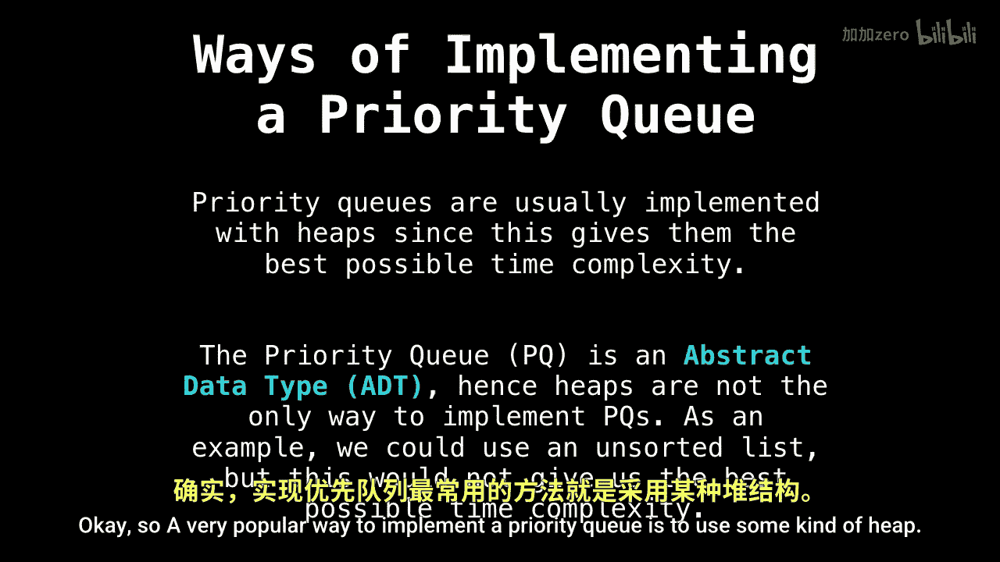

# WilliamFiset【中英⚡数据结构｜Data structures】 p16 P16 Priority Queue Inserting Elements -BV1M2JXzhEdp_p16-

Welcome back Today we're going to talk about adding elements to a binary heap。

 This is part 3 of5 in the Pri Q series。 We'll get to adding elements to our binary heap shortly。

 but first， theres some important terminology and concepts leading to that which we need to go over prior to。

Add elements effectively to our parute。

Okay， so。A very popular way to implement a priority queue is to use some kind of heap。

This is because heaps are the data structure， which give us the best possible time complexity for the operations we need to perform with a priority queue。

However， I want to make this clear a priority queue is not a heap。

 A priority queuee is an abstract data type that defines the behavior a priority Q should have。

The heap just lets us actually implement that behavior As an example。

 we could use an unordered list to achieve the same behavior we want for a priority queue。

 but this would not give us the best possible time complexity。

So concerning heaps。There are many different types of heaps， including binary heaps， Fibonacci heaps。

 binomial heaps， pairing heaps， and so on， and so on。

but for simplicity we're just going to use the binary heap。

ABary heap is a binary tree that supports the heap invariant。In a binary tree。

 every node has exactly two children。 So the following。

