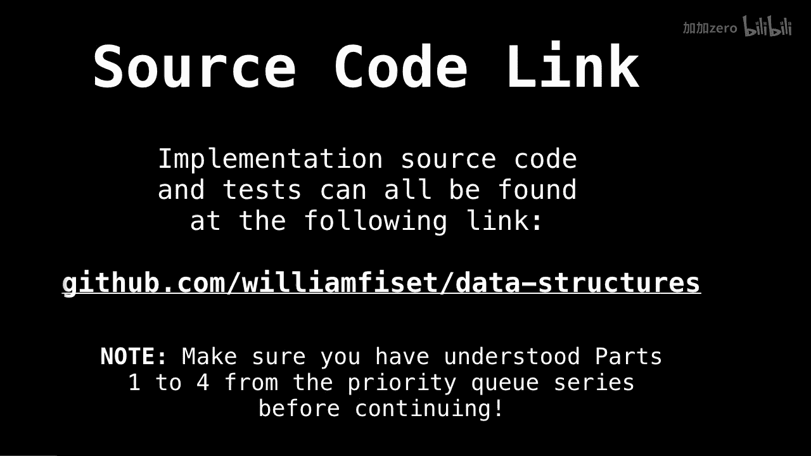
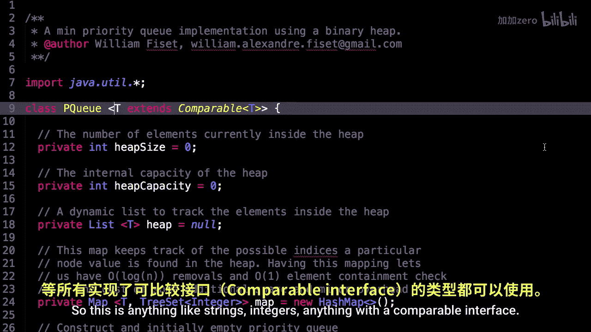
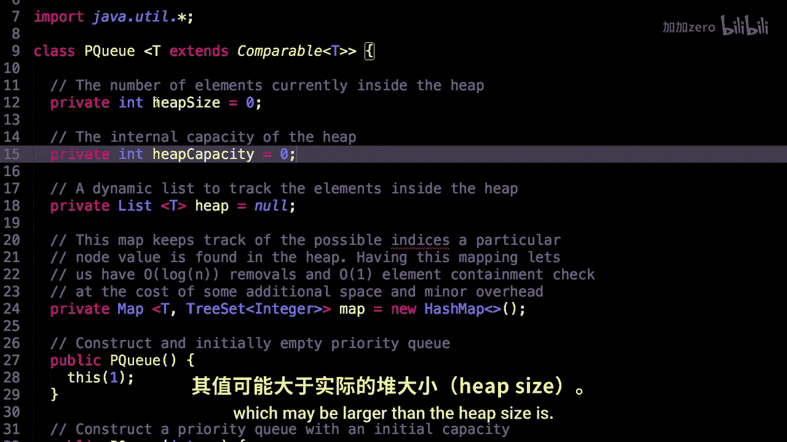
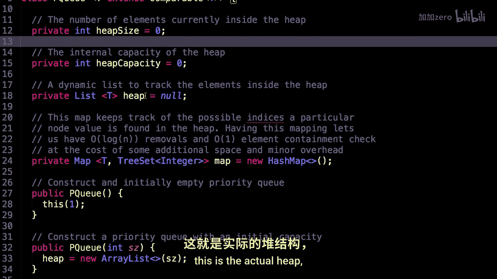
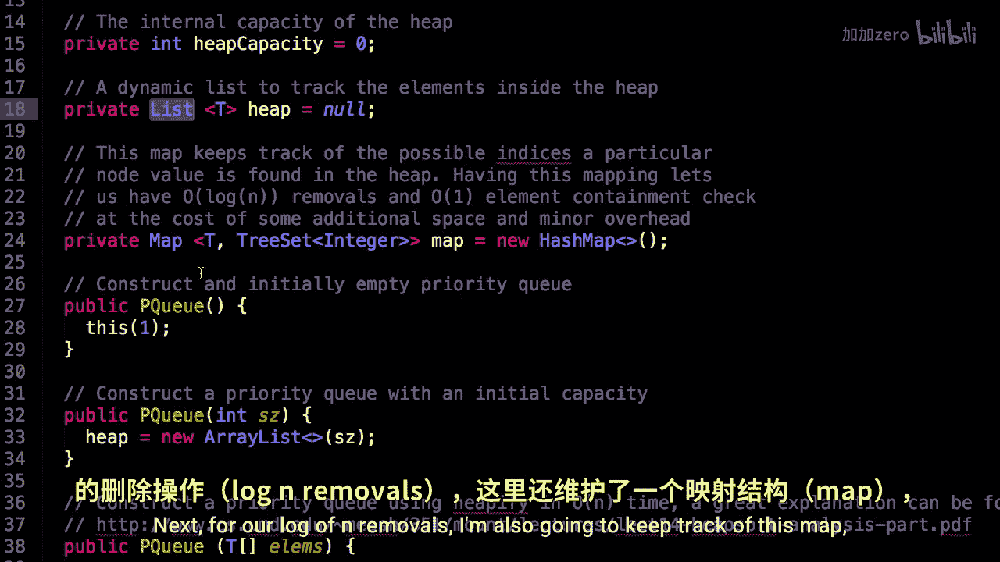

# WilliamFiset【中英⚡数据结构｜Data structures】 p18 P18 Priority Queue Code -BV1M2JXzhEdp_p18-

Alright， welcome back everybody。 This is part 505 in the Pri Q series and we're going to have a look at some source code for the priority queue today。

So if you want the source code， here's the GiHub link with all the data structures in the series。

 the Priory Q is one of them， also make sure you've watched parts one to4 so you can actually understand what's going on。

Alright， let's dive into the code。

Alright， here we are inside the source code。So。Notice that inside my priority queue。

 the types of elements I'm allowing inside my priority queue have to be comparable elements as we talked about。

So if they implement the comparable interface， then we are going to allow them inside our queue。

 so this is anything like strings， integers。

Anything with a compatible interface。So let's have a look at some of the instance variables。

So I have the heap size。 So this is the number of elements currently inside the heap。

 But then I also have another instance variable， which is the heat capacity。

So this is want to be the size of the list。That we have for our elements。

 which may be larger than the heap size is。

AndThis is the actual heat。 and we're going be maintaining it as a dynamic list of elements using Java's list。

Next， for our log of end removals， I'm also going to keep track of this map。

And so we're going to map an element to a tree。