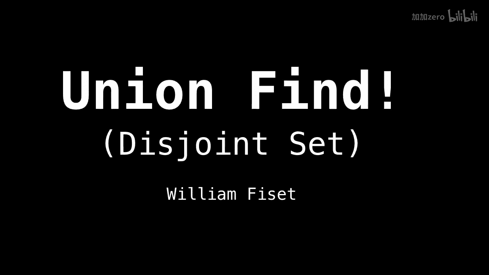
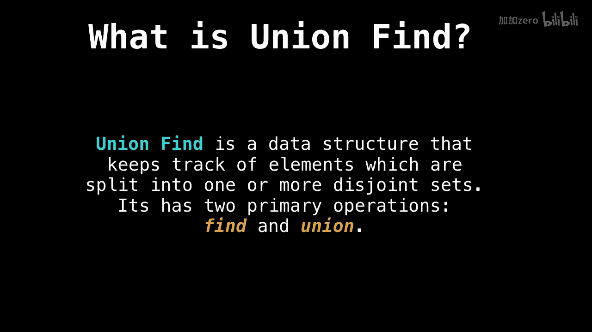

# WilliamFiset【中英⚡数据结构｜Data structures】 p19 P19 Union Find Introduction -BV1M2JXzhEdp_p19-

Alright， time to talk about the Union find， also sometimes called the disjoint set。

 this is my favorite data structure， so let's get started。

So an outline of things we'll be covering about the Union find。

 first I'll be going over a motivating example magnets just to illustrate how useful the Union find can be。

 then we'll go over a classic example of an algorithm which uses the union find。

 specifically Cruucicals minimum spanning tri algorithm。Which is very elegant。

 and you'll see why it needs the union find to get the complexity it has。

Then we're going go into some detail concerning the find and the Union operations。

 the two core operations the Union F uses， and finally we'll have a look at path compression。

 what gives us the really nice amortized constant time the Union find provides。

Okay， let's dive into some discussion examples concerning the union find。

 So what what is the union find， So the union find is a data structure that tracks elements which are split into one or more disjoint sets and the union find has two primary operations find and union。

What find does is given an element， the Union find will tell you what group that element belongs to。

 and union merges two groups together。

So if we have this example with magnets。