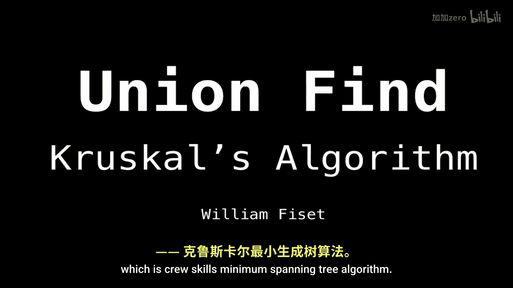

# WilliamFiset【中英⚡数据结构｜Data structures】 p20 P20 Union Find Kruskal's Algorithm -BV1M2JXzhEdp_p20-

Okay， let's talk about a really neat application of the Union find。

 which is Crukis minimum spanning tree algorithm。

So you might be asking yourself what is a minimum span tree。 So if we're given some graph。

With some vertices and some edges。The minimum span tree is a subset of the edges。

 which connects to all the vertices and does so at a minimal cost。

So if this is our graph with some edges and some vertices。

 then a possible minimum span tree is the following and has edge weight 14。

 well total edge weight 14。Note that the minimum span tree is not necessarily unique。

 So if there is another minimum span tree， it will also have a total weight of 14。

So how does it work。So。We can break it up into three steps， essentially。

 so the first step is easy to take all our edges and sort them by ascending edge edge weight。

 Next thing we want to do is we want to walk through the sortded edges and compare the two nodes that the edge belongs to。

 And if the nodes already belong to the same group。

Then we want to ignore it because it'll create a cycle in our minimum span， which we don't want。

 Otherwise， we want to unify the the。The two groups those nodes belong to。And keep going。

And we keep doing this process until either we run out of edges or all the vertices have been unified。

