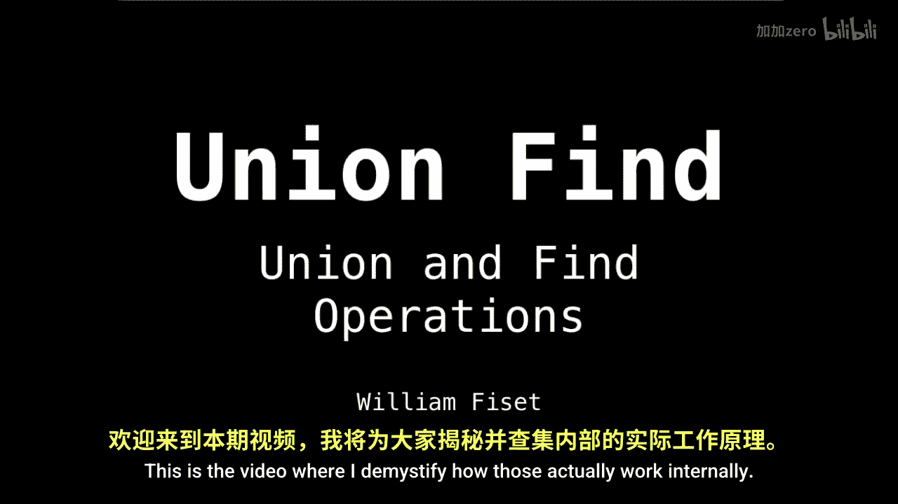
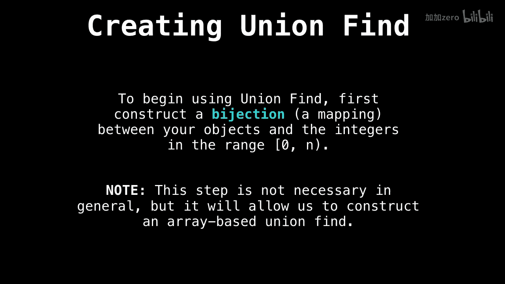
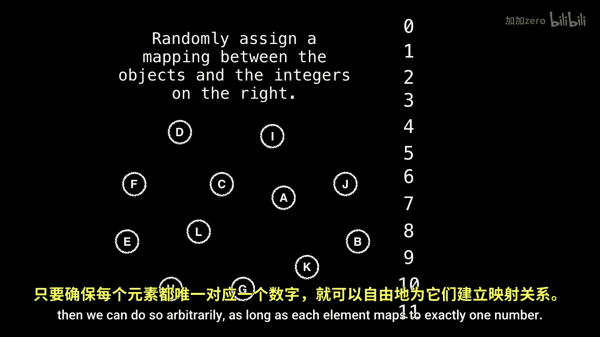
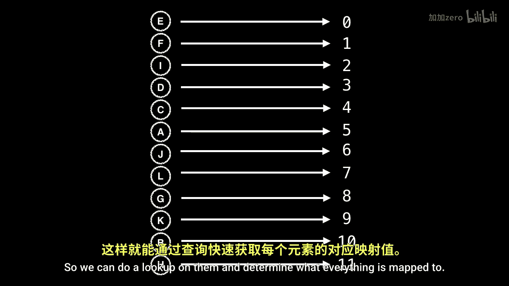
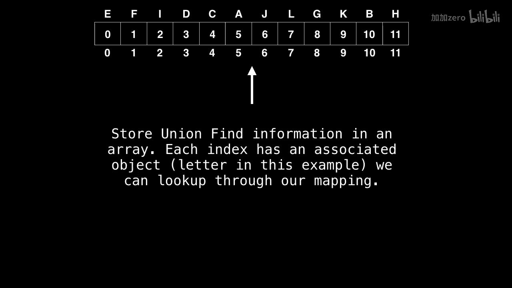
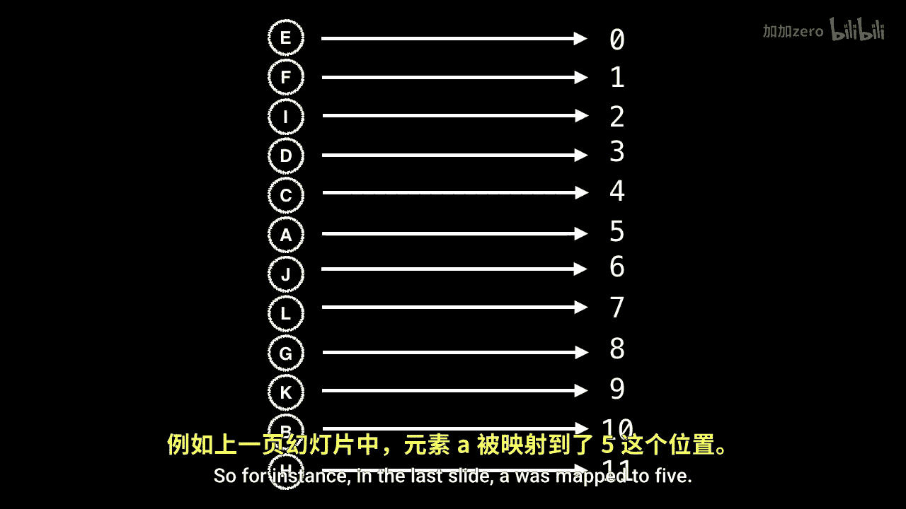

# WilliamFiset【中英⚡数据结构｜Data structures】 p21 P21 Union Find - Union and Find Operations -BV1M2JXzhEdp_p21-

Okay， so now we're going to talk about the union and find operations we can do on the union find or the disjoint set。

 This is the video where I demystify how those actually work internally。

So to create our union find， the first thing we're going to do is we're going to construct a bijection or simply a mapping between our objects and the integers in the range zero inclusive to n noninclusive。

 assuming we have n elements。So this step in general is actually not necessary。

 but it's going to allow us to create an array based unified。

 which is very efficient and also very easy to work with。

So if we have some random objects。And if we want to assign a mapping to them。

 then we can do so arbitrarily as long as each element maps to exactly one number。

So that is my random byjection。 And we want to store these mappings。

 perhaps in the hash table so we can do a look up on them and determine what。

Everything is mapped， to。Next， we're going to construct an array。

And each index is going to have an associated object。 And this is possible through our mapping。

So， for instance， in the last slide， a was mapped to 5。 So slot。

5 or index。