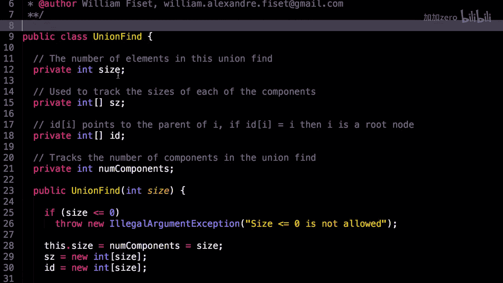
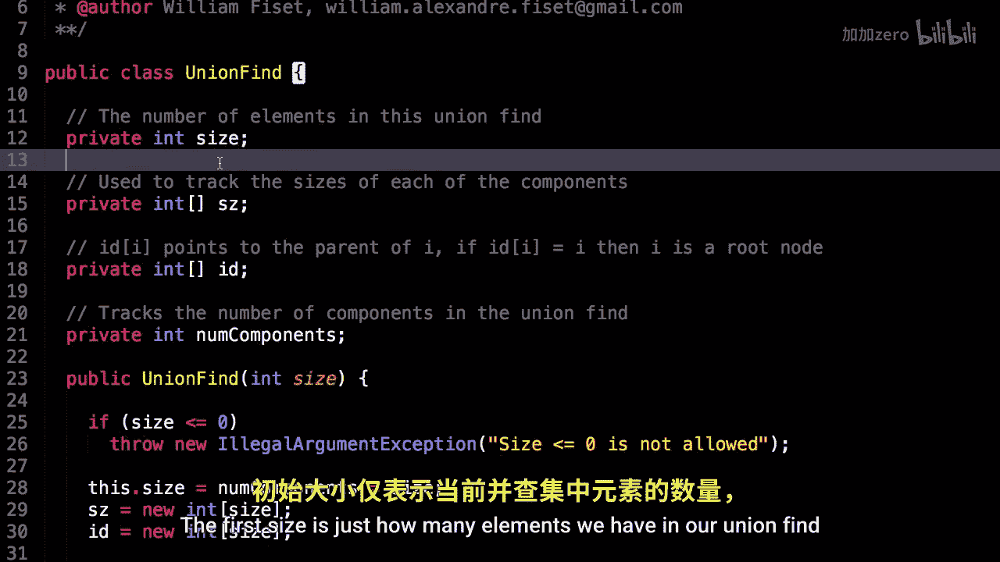
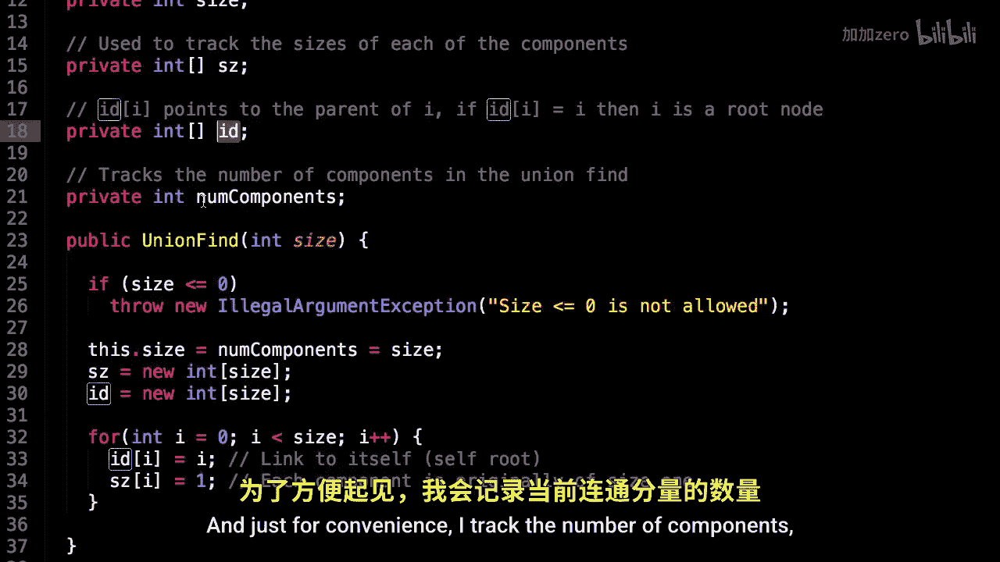

# WilliamFiset【中英⚡数据结构｜Data structures】 p23 P23 Union Find Code -BV1M2JXzhEdp_p23-

Let's have a look at some of the union find source code。

So。Here's a link to the source code。 You can find it on my Github repository at Github。

 co/willmphysa/da structures。 I also have a bunch of other data structures from past videos and before we dive into the code。

 make sure you watch the other videos pertaining to the Union find。

 as I will be making some references to them。

Okay， let's dig in。Here we are inside the code， and。

I have a class called Union Find and so have few instance variables， so let's go over them。

The first size is just how many elements we have in our union find。

Then I have these two arrays， one called ID， and one called size。

So the interest， well， the more interesting one is ID and ID D at I is that array I talked about。

 which at index I points to the parent node of I。And if I D at I is equal to I。

 then we know that I is a root node。So we're essentially keeping track of all these like tree like structures right inside in the array。

 which is practical。And also， because we create a bijection between our elements and some numbers。

 this is how we're able to access them through this idea array。

And just for convenience， I track the number of components that sometimes。

