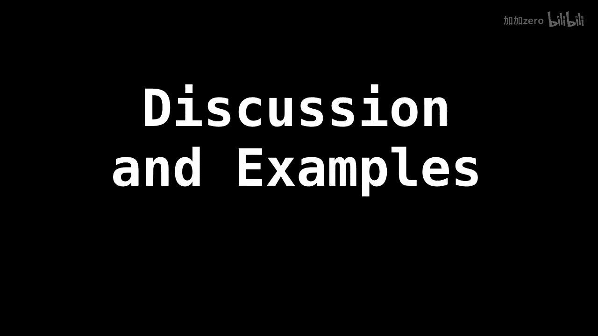

# WilliamFiset【中英⚡数据结构｜Data structures】 p24 P24 Binary Search Tree Introduction -BV1M2JXzhEdp_p24-

Alright， I want to start talking about a very exciting topic and that is trees and you'll soon start to realize that there are tons and tons and tons of tree data structures。

But today， I want to focus on a very popular kind of tree。 and that has binary trees。

And with binary trees， we must talk about binary search trees as well。

So today's tutorial is going to focus on binary trees and binary search trees where they're used and what they are。

And in later tutorials， we'm going to cover how to insert nodes into binaryer search trees。

 remove nodes， and also do some of the more popular tree traversals。

Which can apply to other general trees also， not just binary trees。

Okay。So I'm going to give you guys a quick crash course on trees before we get started。

 so we say a tree is an undirected graph which can satisfy either of the following definitions。

 so there are actually multiple definitions， but these are the most popular ones。

So a tree is an undirected graph。Which is connected and acyclic。Acyclic means there are no cycles。

Another definition is we have n nodes， but we have n -1 edges。And lastly。For any two vertices。

 there's only one path between those two vertices， you can't have two different paths。

er。🤢。