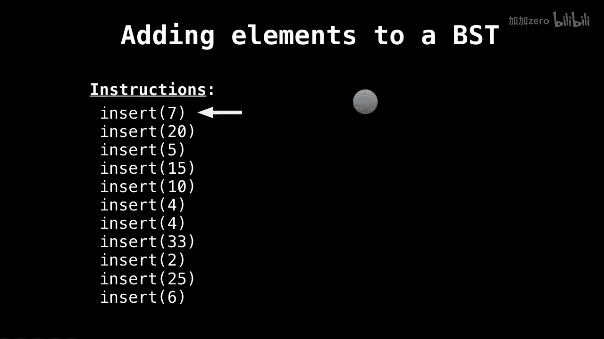

# WilliamFiset【中英⚡数据结构｜Data structures】 p25 P25 Binary Search Tree Insertion -BV1M2JXzhEdp_p25-

Okay， let's have a look at how to insert some elements into a binary search tree。

So let's dive right in。 so first to add elements to our binary search tree。

 we need to make sure that the elements we're adding are actually comparable。

 meaning that we can order them in some way inside the tree。😔，Meaning at every step。

 we know whether we need to place the element in the left subt or the right subt。

And we're going to encounter essentially four cases。So when inserting an element？

We want to compare the value to the value of the current node we're considering to do one of the following things。

 either we're going to recurse down the left sub because our element is smaller than the current element or we're going to recurse down the right sub because our element is greater than the current element。

Or it might be the case that the current element has the same value as。

The one we're considering and so we need to handle duplicate values if we're deciding to add duplicate values to a tree or just ignoring that。

And lastly， we have the case that we've hit a null node in which case it's time to create a new node and insert in our tree。

Let's look at some animation now。So on the left I have a bunch of insert instructions。

 so we have all these values you want to insert into our binary search tree and currently the search tree or the binary search tree is empty。

