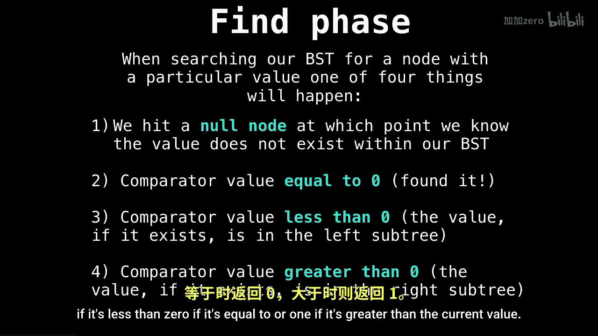

# WilliamFiset【中英⚡数据结构｜Data structures】 p26 P26 Binary Search Tree Removal -BV1M2JXzhEdp_p26-

Alright， now that we know how to insert elements into a binary search tree。

 we might also want to remove elements from a binary search tree。

 and this is slightly more complicated， but I'm going to make it very simple for you guys。

So when we're moving elements from a binary search tree， you can think of it as a two step process。

First， we have to find the element we wish to remove within the binary search tree if it exists at all。

 and in the second stage we want to replace the node we're removing with its successor if one exists in order to maintain the binary search tree in variant。

NowLet me remind you where the binary search invariant is。

It's that the left subre has smaller elements than the current node and the right subre has larger elements than the current node。

Okay， so let's dive into phase one， the fine phase。

So if we're searching for an element inside our binary search tree。

One of four things is going to happen。The first thing is we hit a null node。

 meaning we've went all the way down our binary search tree and have not found the value we want。

 so the value does not exist inside our binary search tree。Another thing that can happen is。

The compator value is equal to 0。 And what I mean by comparator is。

It's a function that will return minus1 if it's less than 0， if it's equal to or1。

 if it's greater than the current value。

