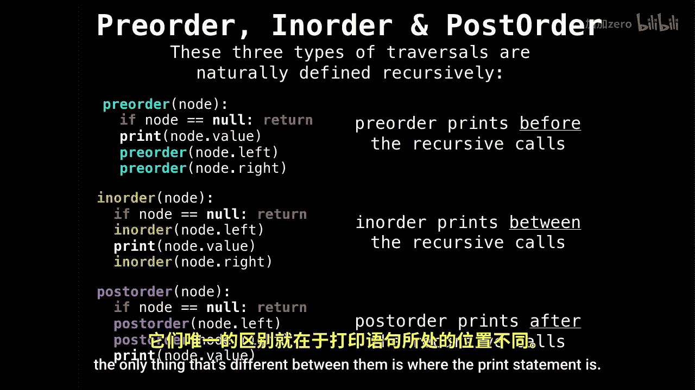

# WilliamFiset【中英⚡数据结构｜Data structures】 p27 P27 Binary Search Tree Traversals -BV1M2JXzhEdp_p27-

All right， I want to finish off binary trees and binary search trees with some tree traversals in particular preor in order post order and level order you see these tree traversals come。

Up now and again。 So they're good to know。I want to focus on preor in order and post order to begin with because they're very similar。

They're also。Naturally defined recursively。 And you can sort get a feel for。

Why they have their certain names that they do so pre order。Prince before the two recursive calls。

In order， we'll print between recursive calls and post order will print after the recursive calls。

So if you look at the three functions on the left， the only thing that's different between them is where the print statement is。

So let's go into some detail on how preorder works。So on the right。

 I'm going to maintain a call stack of what gets called。 So when we're recursing back up。

 we know what called us to know what node to go to。And what you need to know about pre order is that。

We print the value of the current node， and then we traverse the left sub tree。

 followed by the right subre。So for our order， what we're going to do is going to start a。

 print A then。

Then we go left。You to B， and we go down to D。