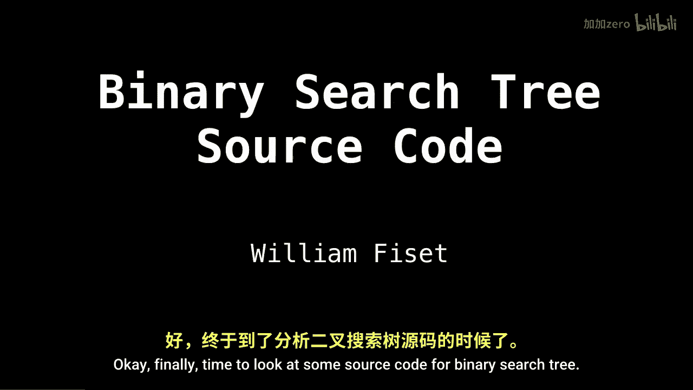
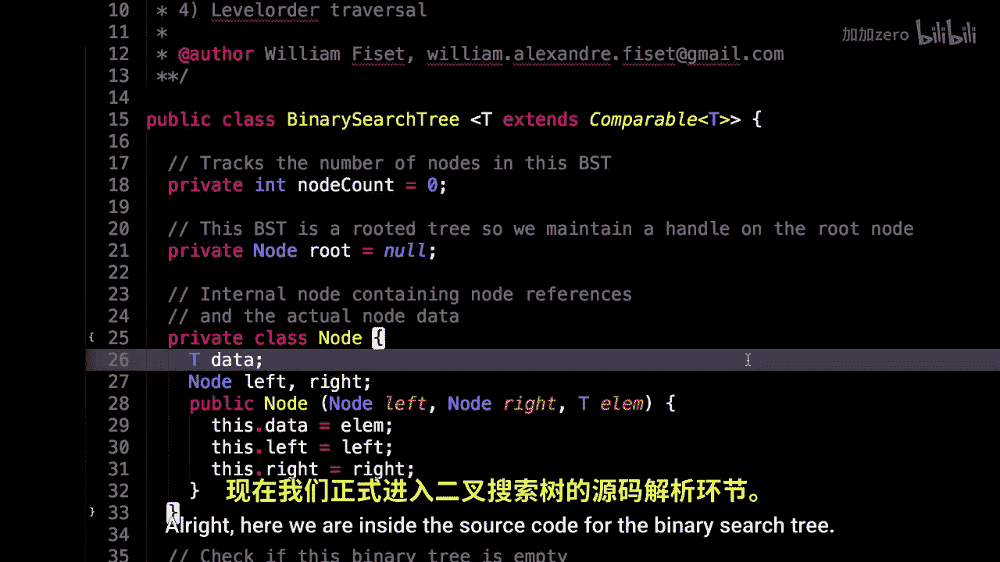
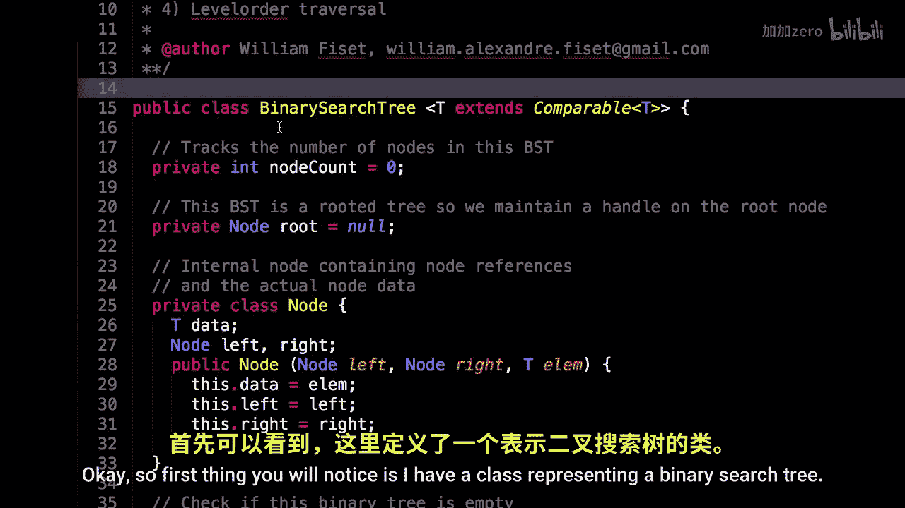
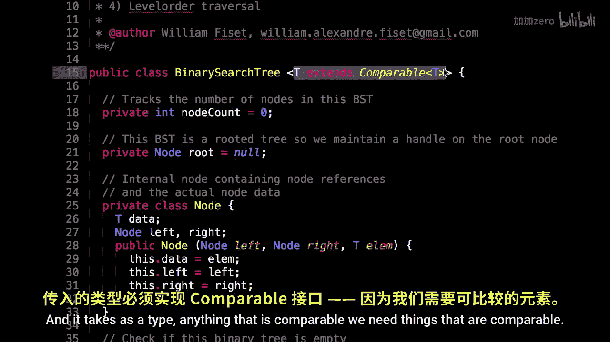
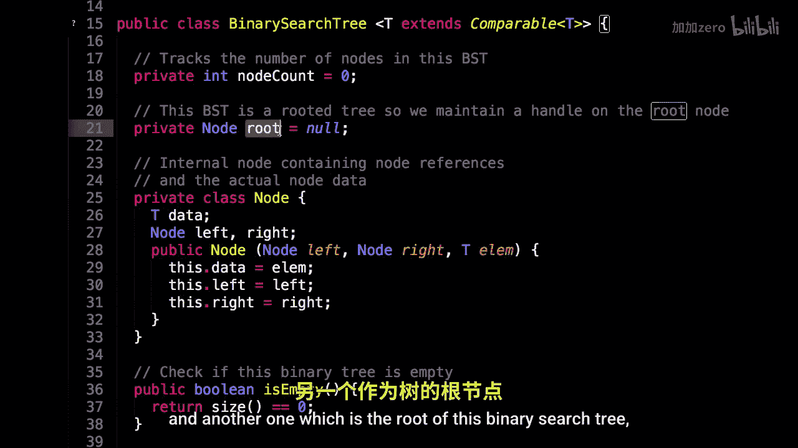
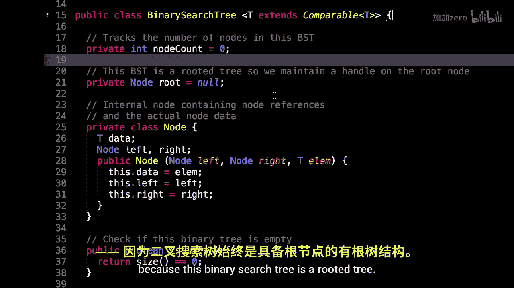
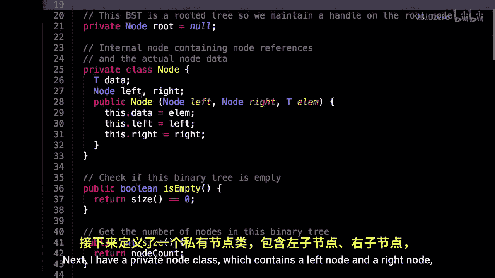

# WilliamFiset【中英⚡数据结构｜Data structures】 p28 P28 Binary Search Tree Code -BV1M2JXzhEdp_p28-

Okay， finally time to look at some source code for a binary search tree。

 So the source code that I'm about to show you can be found at the following link。

 The link should also be in the description at the bottom of this video。

 Please like the repository so that other people can also find it more easily。 And now let's dive in。

Alright， here we are inside the source code for the binary search tree。

 This source code is written in Java。

Okay， so first thing you will notice is I have a class representing a binary search tree and。

It takes as a type。Anything that is comparable。

We need things that are comparable， so we know how to insert them accordingly within the binary search tree。

So to start us off， I have a few instance variables。

Actually， only two， in fact， one to keep track of the number of nodes in the binary search tree and another one。

 which is the root of this binary search tree because this binary search tree is a rooted tree。

Next， I have a private note class。

Which contains。

A left node and a right node， as well as some data of type T。 and that type T comes from here。

 So it's some comparable type T。

