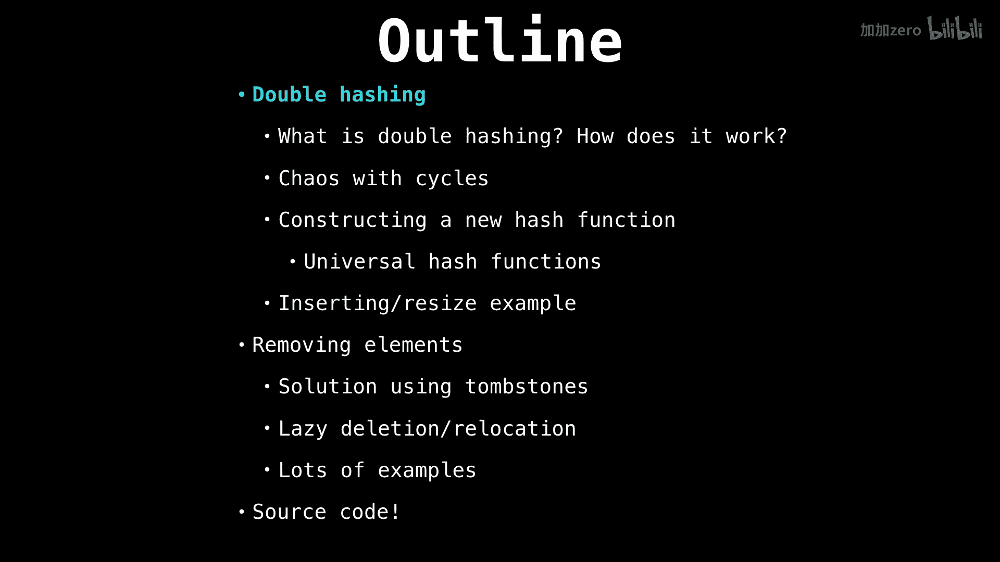
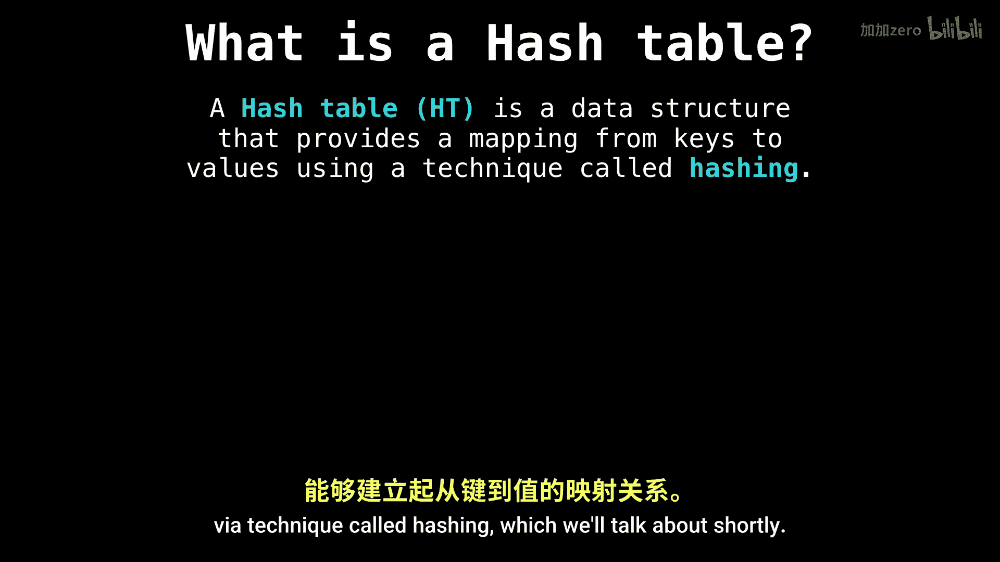
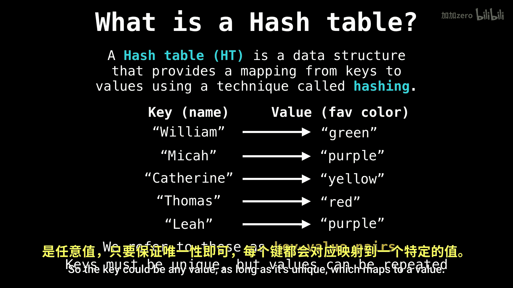

# WilliamFiset【中英⚡数据结构｜Data structures】 p29 P29 Hash table hash function -BV1M2JXzhEdp_p29-

Alright， welcome everybody Today we're going to be talking about hash tables。

 one of the most remarkable data structures of all times。 If I had a subtitle。

 it would be one data structure to rule them all。

So let's get started， there's going to be a lot of things to cover in the hash table series。

 we're going to start off with what's a hash table and what the heck is a hash function and why do we need one。

Then we're going to talk about some popular collision resolution methods in particular separate chaining。

 open addressing， those are the two most popular ones， although there's a ton more。

Then we're going to separate chaining with linked list just because it's a really popular implementation and there's a ton of stuff in open addressing that needs to get covered。

 so we're going to be talking about linear probing and quadratic probing how that's done I'm going be giving lots and lots of examples for those just because it's not super obvious how they work and to finish off we're going to be going over double hashing and finally removing elements from the open addressing scheme because that's not so obvious either。

All right。

So to begin with what is a hash table。So the Hah table is a data structure that lets us construct a mapping from some keys to some values via a technique called hashing。

Which we'll talk about shortly。So the key could be any value as long as it's unique。

Which maps to a value。 So， for instance， keys could be。

