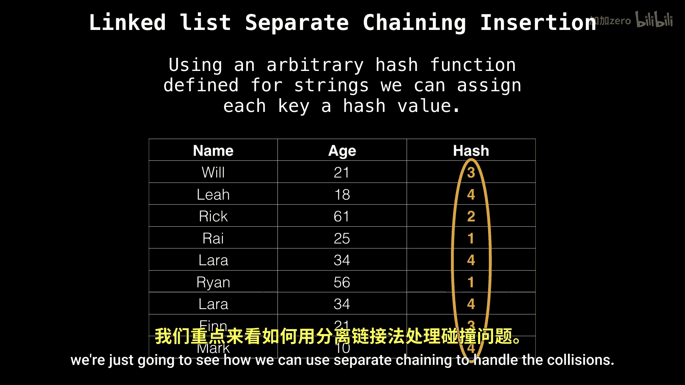

# WilliamFiset【中英⚡数据结构｜Data structures】 p30 P30 Hash table separate chaining -BV1M2JXzhEdp_p30-

Okay， let's talk about something super， super cool。 and that is hash tables and separate chaining。

All right， let's dive right in。 What is separate chaining？

So separatepar chaining is just one of many， many hash collision resolution techniques and how it works is when there's a hash collision。

 meaning two keys hash to the same value， we need to have some sort of way of handling that within our hash table so that's still functional or what separate chaining does is it maintains an auxiliary data structure。

To。Essentially， hold all the collisions。 And so we can go back and look up。

Inside that bucket or that data structure of values。For the item we're looking for。

And usually we use a linked list for this， but it's not limited to only linked lists。

 we can use arrays， binary trees， self balancing trees， or even a hybrid approach。

Okay， so suppose we have the following hash table， which is just a fancy name for an array。

Of key value pairs of age and names。And we associate an arbitrary hash value that has been computed with some hash function。

 So those are our hash values they don't really matter for now。

 We're just going to see how we can use separate chaining to handle the collisions。

Okay， so on the left is our hash table， so our array。

And I'm going to be inserting。