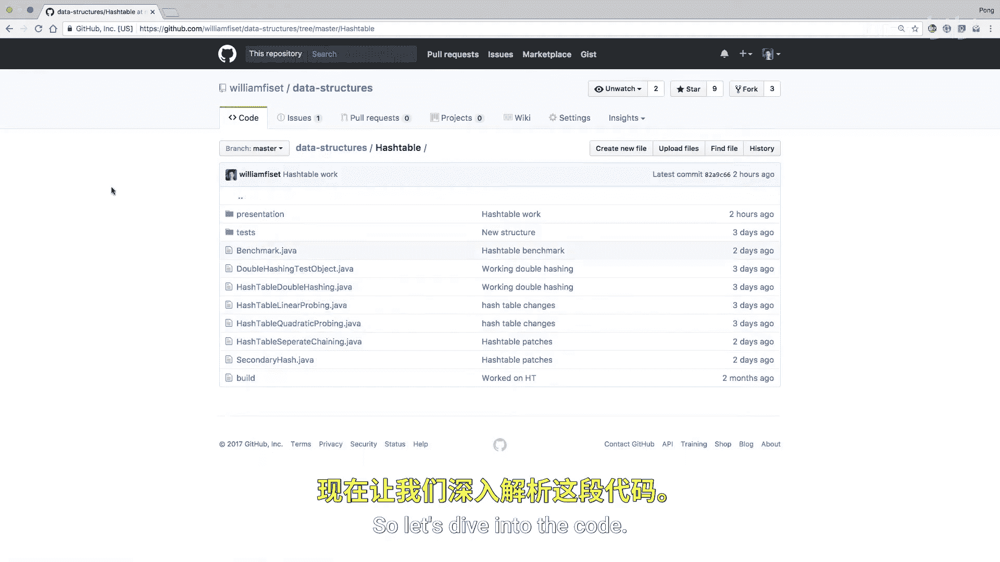
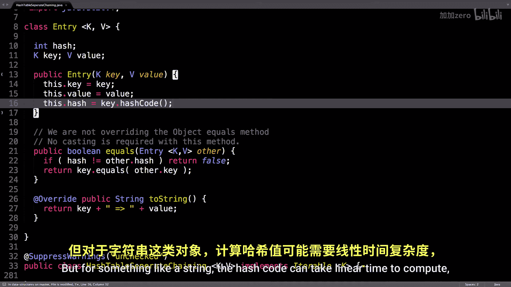

# WilliamFiset【中英⚡数据结构｜Data structures】 p31 P31 Hash table separate chaining source code -BV1M2JXzhEdp_p31-

Allright， It's time to have a look at some separate chaining source code for the hash table。

 So here I am on my Github repository。 Will a s data dash structures and you can find the source code here under the hash table folder。

 and I have multiple implementations of the hash table today we're gonna be looking at the hash table with separate chaining and in the later videos。

 probably one of these three I haven't figured out which one yet。 So let's dive into the code。

 I have it here on my computer。 So let's get going。 Alright， So first things first。

 I have two classes one of them。

Called entry， the other one， just separate chaining hash table。

So let's have a look at the entry class first， and these entries represent individual items or key value pairs you would want to be inserting into the hash table。

So in Java we have generics， so a generic key， which has to be hasable and some value。

So when I create an entry， I give it the key value pairs and I also compute the hash code。

So there's a built in method in Java to compute the hash code for a particular object。

 and you can overwrite it to specify the hash code for your particular object。

 which is really convenient。So compute the hash code and cache it you absolutely want to cache it so you don't have to recompute this thing multiple times。

 it should be cheap to compute， but for something like a string。

 the hash code can take linear your time to compute， which is not good。

