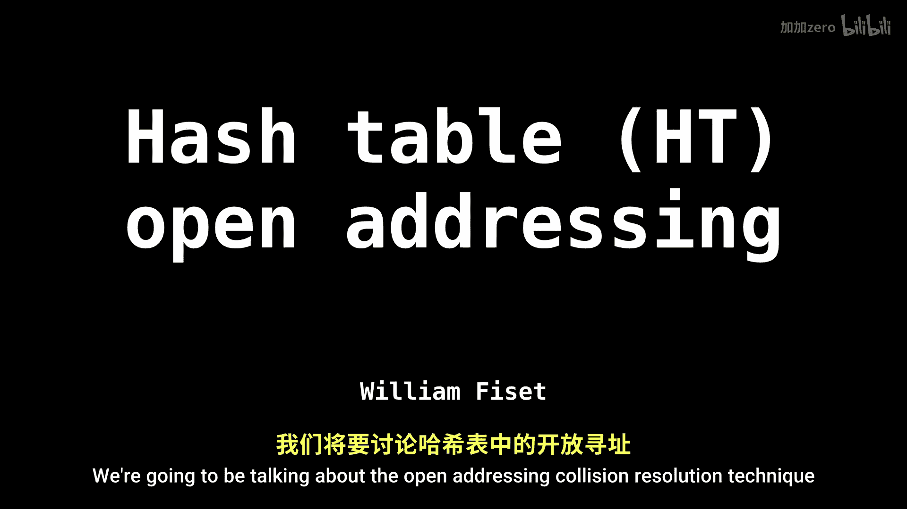
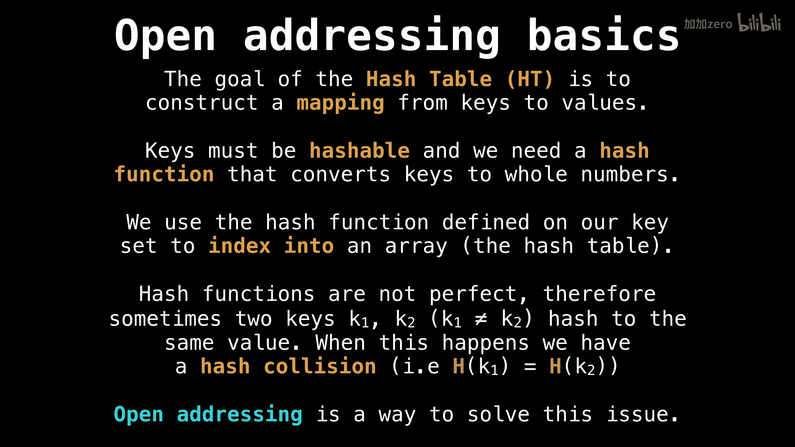

# WilliamFiset【中英⚡数据结构｜Data structures】 p32 P32 Hash table open addressing -BV1M2JXzhEdp_p32-

I'm pretty excited we're going to be talking about the open addressing collision resolution technique for hash tables。

 so let's get going。

First， let's just do a quick recap on hash tables so that everyone's on the same page。

 So the goal of the hash table is to construct a mapping from。A set of keys to a set of values。

 and the keys need to be hashable。Now， what we do is we define a hash function on the keys to convert them into numbers。

Then we use the number obtained through the hash function as a way to index into the array or the hash table。

However， this isn't a foolproof method because from time to time we're going to have hash collisions that is two keys that hash to the same value。

 so we need a way to resolve this and open addressing is a solution for that。

Alright， so when we're going to be using the open addressing collision and resolution technique。

 the one thing you need to keep in mind is the actual key value pairs themselves are going to be stored in the table itself。

 so as opposed to say an auxiliary data structure like in the separate chaining method we saw in the last video。

So this means that we care a great deal about。The size of the hash tables and how many elements are currently in the hash table。

 because once there are too many elements inside the hash table。

 well it's going to be really hard to find an open slot or a position to place our elements。

So。