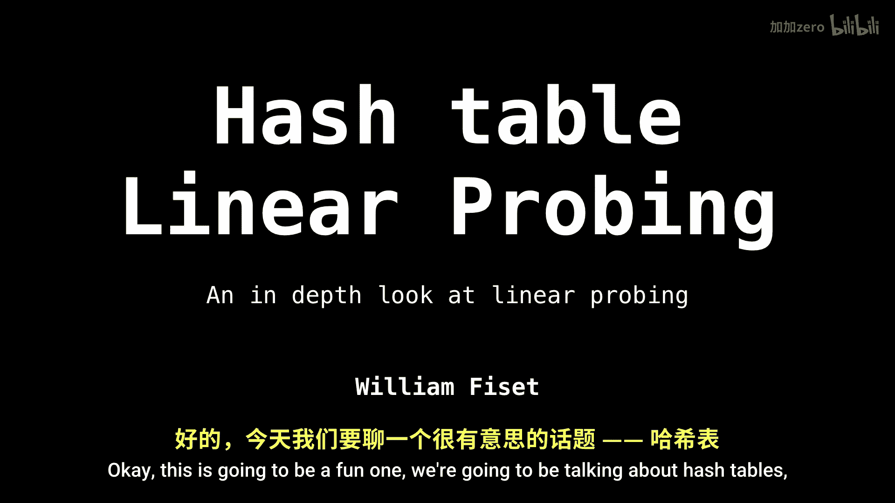
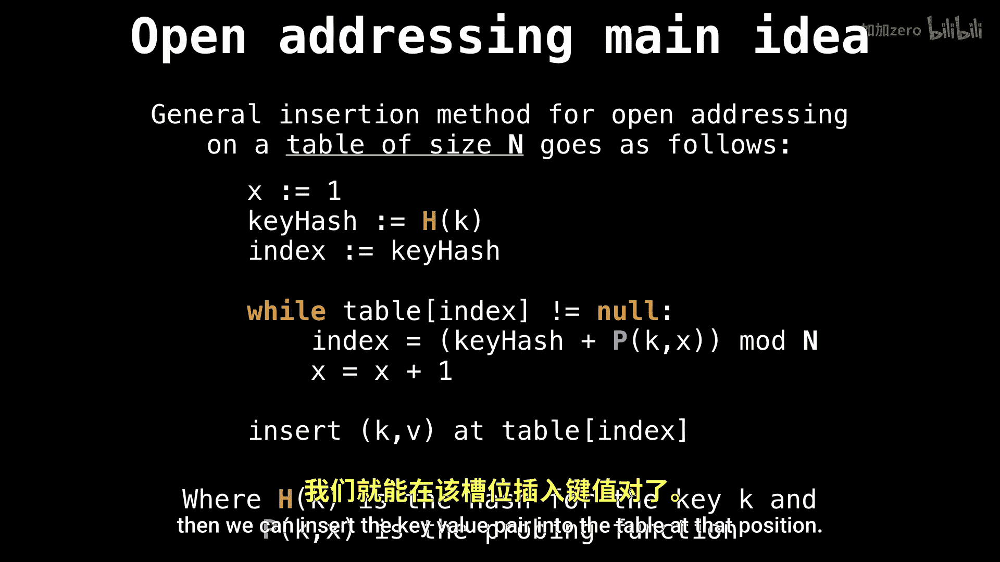

# WilliamFiset【中英⚡数据结构｜Data structures】 p33 P33 Hash table linear probing -BV1M2JXzhEdp_p33-

Okay， this is going to be a fun one， we're going to be talking about hash tables and the linear probing technique To get started。

 let's recap how open addressing works。

So in general， if we have a table of size n， here's how we do open addressing。

 no matter what your probing function is， so we start our constant or sorry variable x at1。

The key hash is just going to be whatever a hash function gives us for our key。

 and our first index we're going to check is going to be the original hash position。

And while the table at the index now equal to null， meaning that position is already occupied。

 then we're going to offset the index by where the key hash is plus the probing function mod n。

every time we do this， we increment the variable X so that our probing function pushes us along one extra position。

 and then once we found a position， then we can insert the key value pair into the table at that position。

Alright， so what is linear probing so linear probing is simply a probing method which probes according to some linear formula。

 specifically the linear function p of x equals a of x plus B。

 and we have to make sure that a is not equal to zero。

 otherwise we're just adding a constant which does nothing。Now a small note right here。

 which says that the constant B is obsolete。

And if you know why。