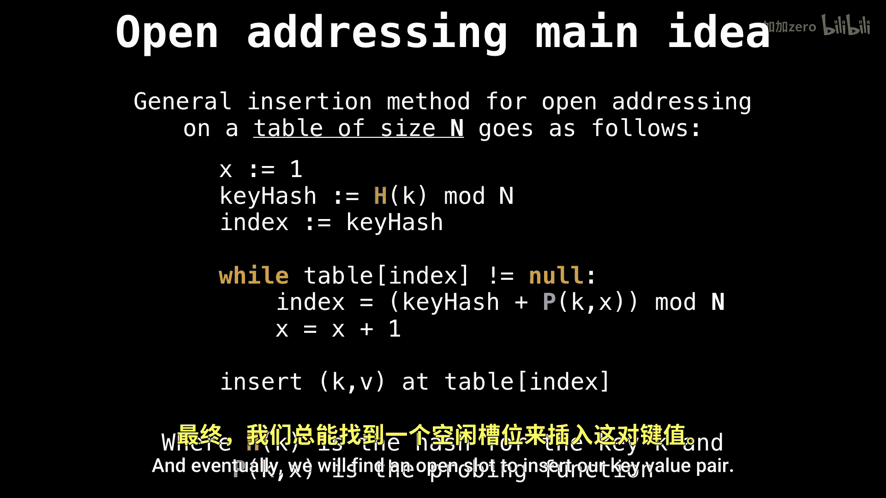

# WilliamFiset【中英⚡数据结构｜Data structures】 p34 P34 Hash table quadratic probing -BV1M2JXzhEdp_p34-

All right， let's talk about hash tables and how quadratic probing works。 Let's dive right in。

So let's recall how we insert key value pairs into a table of sites and using the open addressing collision resolution schema。

So first， we initialize a variable called x to be 1。

 which we're going to increment every time we're unable to find a free slot。

Then we compute the key hash。And that's going to be our first index we're going to check and we're going to loop while we're unable to find a free slot。

 meaning the table at that index is not equal to nu so it's already occupied。Every time that happens。

 we're going to offset the key hash using our probing function。Our probing function in our case。

 is going to be a quadratic function。And then we also increment X。

 and eventually we will find an open slot to insert our key value pair。

So what is the idea behind quadratic probing so quadratic probing is simply probing according to a quadratic formula。

 or specifically when our probing function looks something like P of x equals AX squared plus B x plus C and a B。

And see are all constants and we don't want a equal to0， otherwise we degrade to linear probing。

But as we saw in the previous videos。

Not all quadraig functions are viable because they don't produce us。

