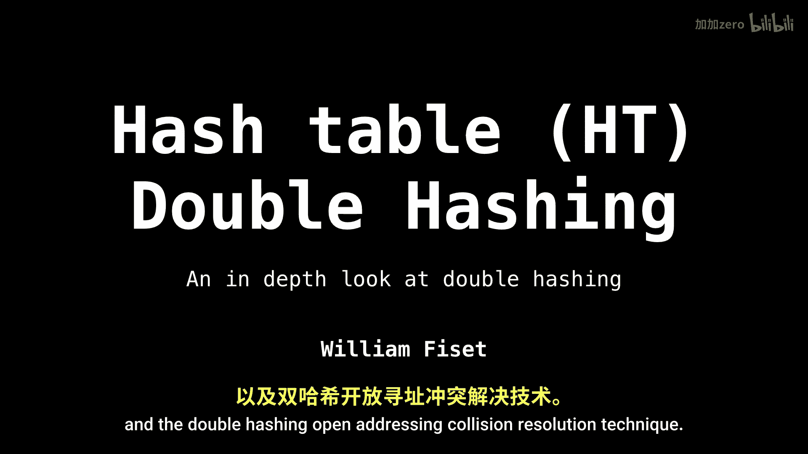
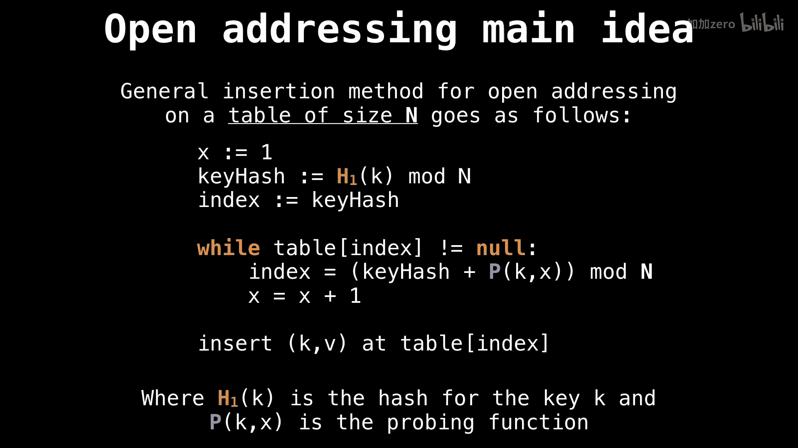
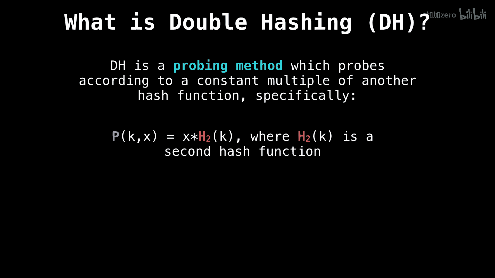

# WilliamFiset【中英⚡数据结构｜Data structures】 p35 P35 Hash table double hashing -BV1M2JXzhEdp_p35-

All right， let's talk about hash tables and the double hashing open addressing collision resolution technique。

So just a quick recap。For those of you who don't know how we do insertions into。

Hash tables for open addressing， we start with a variable X initialized to one。

 we compute the hash value of the key。We set that to be the first index that we're going to check in our hash table to see if it's not nu。

So the goal is to find an empty slot。 so we're going to loop while we。

arere still hitting spots where there are already keys and every time that happens。

 we're going to offset our key hash using a probing function。

 in our case is going to be the double hashing probing function。

And we're also going to increment our value of x so that we keep probing along further and further。

 once we find a free slot， then we can insert our key value pair into the hash table。

Okay， so what's the deal with double hashing so double hashing is just a probing method like any other。

 but what's special about it is that we probe according to a constant multiple of another hash function so specifically our probing function looks something like this we give it as input the key which is a constant and the variable x and then we compute x times h sub2 of k where H。

