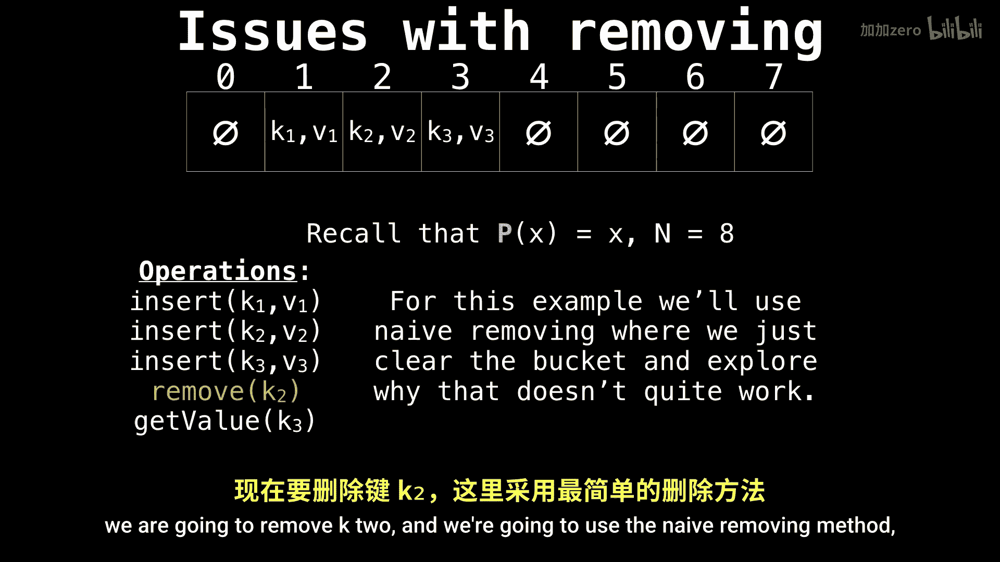

# WilliamFiset【中英⚡数据结构｜Data structures】 p36 P36 Hash table open addressing removing -BV1M2JXzhEdp_p36-

All right， I know a lot of you have been anticipating the remove video for how we remove elements from a hash table using the open addressing scheme。

So let's have a look first at what issues there are when we remove elements， if we do it naively。

 I think this is valuable。 So suppose that we have an originally empty hash table。

 and we're using a linear probing function。 So P of x is simply going to be equal to X。

And we want to。Perform the following operations。 We want to insert three keys。K1， K2 and K3。

 and then remove K2 and then get the value of K3 after。And for the sake of argument。

 let's assume that we have a hash collision between K1， K2 and K3， all equal to1。

 this is a possible scenario。So let's insert them。 So K1 hashes to1。

So we're going to insert it at position1， so let's insert K2， so it has a hash collision with K1。

 which is already in the table， so we're going to linearly probe， so insert it in the next slot over。

Let's insert K3， it also hashees to1。So let's probe， okay， another hash collision。

 so let's keep probing and finally we insert it in position three。

Now we are going to remove K2 and we're going to use the naive removing method。

